# **C_Tutorial(Windows)**

## 1. Install Arduino IDE and Driver

### 1.1. Installing Arduino IDE

When you get control board, you need to download Arduino IDE and driver firstly.

You could download Arduino IDE from the official website: [https://www.arduino.cc/](https://www.arduino.cc/), click the **SOFTWARE** on the browse bar, click“DOWNLOADS”to enter download page, as shown below:


There are two versions of IDE for WINDOWS system. You can choose between the installer (.exe) and the Zip file. For installer, it can be directly downloaded, without the need of installing it manually. However, for Zip package, you will need to install the driver manually.


Click JUST DOWNLOAD.

### 1.2. Setting Arduino IDE

Clickicon，and open Arduino IDE.


A- Used to verify whether there is any compiling mistakes or not.

B- Used to upload the sketch to your Arduino board.

C- Used to create shortcut window of a new sketch.

D- Used to directly open an example sketch.

E- Used to save the sketch.

F- Used to send the serial data received from board to the serial monitor.

Set pico environment: ([https://github.com/earlephilhower/arduino-pico](https://github.com/earlephilhower/arduino-pico))

Select(File) → (Preferences)


Copy the following URL in the Additional Boards Manager URLs page

[https://github.com/earlephilhower/arduino-pico/releases/download/global/package_rp2040_index.json](https://github.com/earlephilhower/arduino-pico/releases/download/global/package_rp2040_index.json)

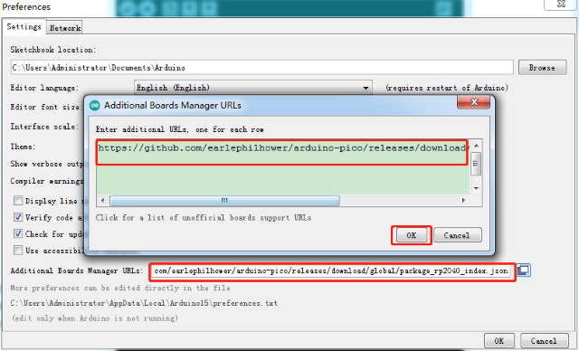

Click OK and return the mange page.

Select (Tools)→ (Board) → (Board Manager)


Enter pico in the searching bar, as shown below.

Then click Install.

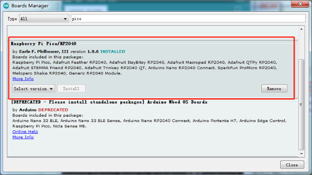

The IDE is installed.

Then return the main page to select (Tools)→(Board) → Raspberry Pi RP2040 Boards(1.9.6) → Raspberry Pi Pico

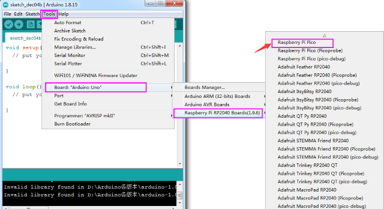

Select the development board and the port connected to Pico.

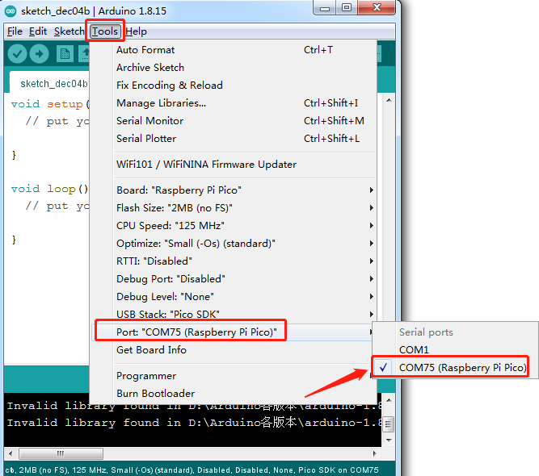

We can make on-board LED show changes of light brightness:

Select(File)→ (Examples)→ rp2040→ Fade.

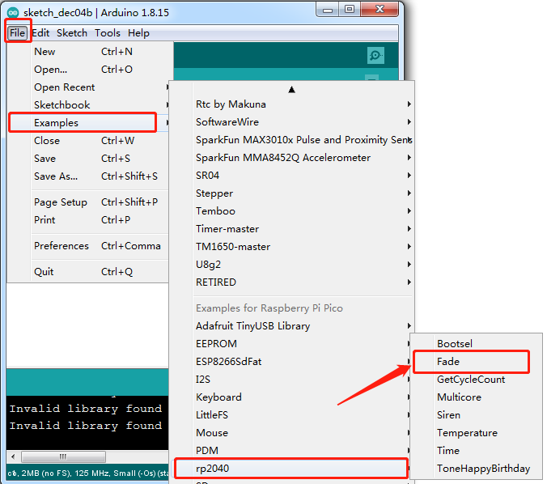


**How to upload the test code**

1)  Power off the Pi Pico board.

2)  Press and hold the white BOOTSEL button on the development board, then interface a power supply via a USB cable.

3)  Click  to upload and compile.

4)  Wait until the "Compiling sketch..." is compiled, and the following prompt message appears "Uploading...", then release the **BOOTSEL** button.

5)  Release the BOOTSEL button if the information box shows “Uploading...”. The code won’t be uploaded successfully until “Done uploading.” appears.

After uploading the test code, select the corresponding port and click **upload** directly. Then you can see that the LED on the development board become from dark to bright, then from bright to dark, like human breathe.

### 1.3. Add Libraries

Right-click **Arduino** and enter libraries folder of Arduino


Then copy libraries you need in the libraries of Arduino.

## 2. Keyestudio Raspberry Pico IO Shield

### 2.1. Description

The Keyestudio Raspberry Pico IO shield is designed for Raspberry Pi Pico. No soldering is required. To make the connection easier, interfaces on the shield have silkscreen.

On the shield, G, V and S represent GND, the VCC interface (3.3V) and digital ports or analog ports. 

The shield comes with pin headers with 2.54mm spacing, a reset button, a PWR power indicator and four LEGO position holes.

Additionally, it boasts a variety of communication interfaces as I2C, UART, SPI, analog IO and digital IO, and a power supply port(6.5-12V).

### 2.2. Specification

- Output current: ≦500mA

- DC input voltage: 6.5 - 12V

- Output voltage: DC 3.3V/5V

- Ambient temperature(recommended): -10°C \~ 50°C

- Dimensions: 45.339MM \*83.617MM

- Pin pitch: 2.54mm


### 2.3. Schematic Diagram

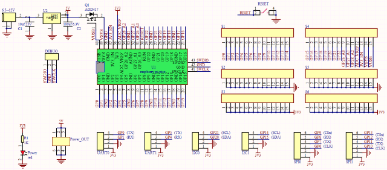

### 2.4. Pinout


As shown below, stack the Raspberry Pi Pico board onto the Raspberry Pi Pico shield.


## 3. Basic Projects

There are 37 sensors and modules in this kit. Next, we will analyze and introduce how they work step by step. Interface sensors with the Raspberry Pi Pico board and the Pico shield, run test codes and observe experimental phenomenon.

<p style="color:red;">Note: please wire up components according to the given connection diagrams.</p>

### Project 1: Lighting up LED


**Overview**

In this project, we will make an experiment to light up the white LED module. The high and low levels can be controlled by programming, then the state of the LED can be controlled.

**Working Principle**

The two circuit diagrams are given. The left one is wrong wiring-up diagram. Why? Theoretically, when the S terminal outputs high levels, LED will receive the voltage and light up. 

Due to limitation of IO ports of Pico board, weak current can’t make LED brighten.

The right one is correct wiring-up diagram. GND and VCC are powered up. When the S terminal is a high level, the triode Q1 will be connected and LED will light up(note: current passes through LED and R3 to reach GND by VCC not IO ports). Conversely, when the S terminal is a low level, the triode Q1 will be disconnected and LED will go off.

The triode Q1 is equal to a switch and R1 and R3 stand for limited resistors which can curb the size of current to prevent from burning out components.


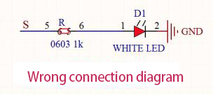

**Components**

|  |            |       |  |  |
| ------------------------- | ----------------------------------- | ------------------------------ | ------------------------- | ------------------------- |
| Raspberry Pi Pico Board*1 | Raspberry Pi Pico Expansion Board*1 | Keyestudio Purple LED Module*1 | 3P Dupont Wire*1          | MicroUSB Cable*1          |

**Wiring Diagram**

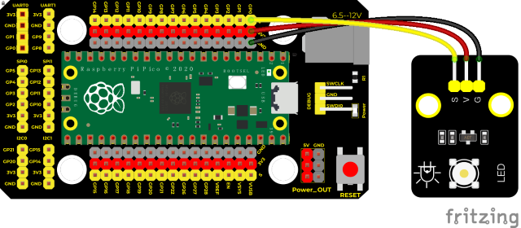

**Test Code**

**Code 1：**

```c
/* 
 * Keyestudio 37 in 1 Starter Kit for Raspberry Pi Pico
 * lesson 1.1
 * LED
 * http://www.keyestudio.com
*/
void setup() {
  pinMode(0, OUTPUT);//set GP0 pins to OUTPUT
  digitalWrite(0, HIGH); //output high levels, light up
}

void loop() {

}
```


**Code 2：**

```c
/* 
 * Keyestudio 37 in 1 Starter Kit for Raspberry Pi Pico
 * lesson 1.2
 * Blink
 * http://www.keyestudio.com
*/
int ledPin = 0; //define LED pin as GP0
void setup() {
  pinMode(ledPin, OUTPUT);//set mode to OUTPUT
}

void loop() {
  digitalWrite(ledPin, HIGH); //output high levels，light up
  delay(1000);//delay in 1000ms
  digitalWrite(ledPin, LOW); //output low levels, go off
  delay(1000);//delay in 1000ms

}
```

**Code Explanation**

**Code 1 Explanation:**

1). pinMode(pin, mode); pin is used to set the pin number of pico GPIO; mode contains INPUT, OUTPUT or INPUT_PULLUP. Here we set pin 0 to output mode.

2). digitalWrite(pin, value); pin is the pin of microcontroller GPIO, here we define it to GP0; value is the digital level you will output (HIGH or LOW). If you use pinMode() to set the pin to OUTPUT, its voltage will be set to the  corresponding value:3.3V is HIGH level and LOW level is 0V (ground). If you do not set pinMode() to OUTPUT and connect the LED to the pin, the LED may be dark when digitalWrite (HIGH) is called, for the digitalWrite() will enable the internal pull-up resistor, which acts like a large current-limiting resistor.

**Code 2 explanation:**
1). The code in Setup() is only executed once, while the code in the loop() runs continuously. delay(ms) is a delay function in which ms is the pause time in milliseconds. Data type: unsigned long (within 0~ 4,294,967,295 (2^32 - 1)).

2). With previous learning, it will be much clear for us to know the code meaning. In the first line of the code, we connect the signal terminal to the ledpin (also called GP0) to set it to a high level, so that the LED on the module will be on. In the second line, it delays 1000 ms to light LED up for 1s. Similarly, the third and fourth codes indicate to turn off the LED for 1s. These codes defaults to a loop, i.e., the LED cycles on for 1s and off for 1s, like blinking lights. Also, we can change the delay time for the LED to turn on and off by modifying some codes to show various light effects.

3). For more Arduino syntax explanations and details, please visit the official website: [https://www.arduino.cc/reference/en/](https://www.arduino.cc/reference/en/)

**Test Result**

Code 1: upload the code and power on, the purple LED on the module will light up.

Code 2: upload the code and power on, the purple LED will flash with the interval of 1s.

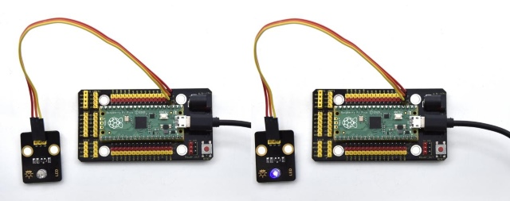

### Project 2: Traffic Light Module


**Overview**

In this lesson, we will learn how to control multiple LED lights and simulate the operation of traffic lights.

Traffic lights are signal devices positioned at road intersections, pedestrian crossings, and other locations to control flows of traffic.

In this kit, we will use the traffic light module to simulate the traffic light.

**Working Principle**

In previous lesson, we already know how to control an LED. In this part, we only need to control three separated LEDs. Output high levels to the signal R(3.3V), then the red LED will be on.


**Components**

| 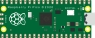 | 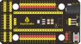  |               |  | 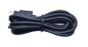 |
| ------------------------- | -------------------------- | -------------------------------------- | ------------------------- | ------------------------- |
| Raspberry Pi Pico Board*1 | Raspberry Pi Pico Shield*1 | Keyestudio DIY Traffic Lights Module*1 | 5P Dupont Wire *1         | Micro USB Cable*1         |

**Wiring Diagram**

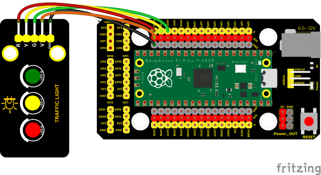

**Test Code**

```c
/* 
 * Keyestudio 37 in 1 Starter Kit for Raspberry Pi Pico
 * lesson 2
 * Traffic_Light
 * http://www.keyestudio.com
*/
int greenPin = 12;   //the green LED is connected to GP12
int yellowPin = 13; //the yellow LED is connected to GP13
int redPin = 14;   //the red LED is linked with GP14
void setup() {
  //set pins of the LED to OUTPUT
  pinMode(greenPin, OUTPUT);
  pinMode(yellowPin, OUTPUT);
  pinMode(redPin, OUTPUT);
}

void loop() {
  digitalWrite(greenPin, HIGH); //light up the green LED
  delay(5000);  //delay in 5s
  digitalWrite(greenPin, LOW); //turn off the green LED
  for (int i = 1; i <= 3; i = i + 1) {  //run three times
    digitalWrite(yellowPin, HIGH); //light up the yellow LED
    delay(500); //delay in 0.5s
    digitalWrite(yellowPin, LOW); //turn off the yellow LED
    delay(500); //delay in 0.5s
  }
  digitalWrite(redPin, HIGH); //light up the LED
  delay(5000);  //delay in 5s
  digitalWrite(redPin, LOW); //turn off the red LED

}
```

**Code Explanation**

We use the function for(). for (int i = 1; i \<= 3; i = i + 1) represents the variable i adds 1 for each time from 1 to 3.

The function for (int i = 255; i \>= 0; i = i - 1) indicates that i reduces by 1 each time. When i\<0, exit the for() loop and execute 256 times.

**Test Result**

Upload the code, the green LED will be on for 5s then off, the yellow LED will flash for 3s then go off and the red one will be on 5s then off.

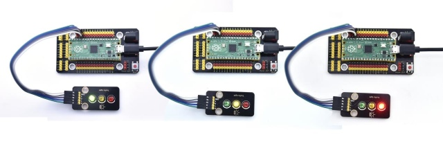

### Project 3: Laser Sensor

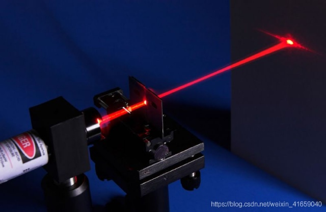

**Description**

Lasers are widely used to cut, weld, surface treat, and more on specific materials. The energy of the laser is very high. The toy laser pointer may cause glare to the human eye, and it may cause retinal damage for a long time. my country also prohibits the use of laser to illuminate the aircraft.

**Working Principle**

The laser head sensor module is mainly composed of a laser head with a light-emitting die, a condenser lens, and a copper adjustable sleeve.

We can see the circuit schematic diagram of this module which is very similar to the LED we have learned. They are all driven by triodes. A high-level digital signal is directly input at the signal end, then the sensor will start to work; if inputting low levels, the sensor won’t work.


**Components**

| 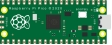 | 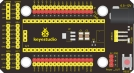           |      |  | 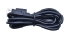 |
| ------------------------- | ----------------------------------- | ----------------------------- | ------------------------- | ------------------------- |
| Raspberry Pi Pico Board*1 | Raspberry Pi Pico Expansion Board*1 | Keyestudio White LED Module*1 | 3P Dupont Wire*1          | MicroUSB Cable*1          |

**Wiring Diagram**

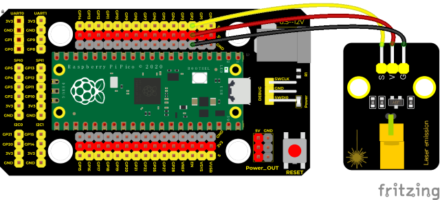

**Test Code**

```c
/* 
 * Keyestudio 37 in 1 Starter Kit for Raspberry Pi Pico
 * lesson 3
 * Laser sensor
 * http://www.keyestudio.com
*/
int laserPin = 2; //define the laser pin as 2
void setup() {
  pinMode(laserPin, OUTPUT);//set Pins to OUTPUT
}

void loop() {
  digitalWrite(laserPin, HIGH); //turn on the laser module
  delay(2000);  //delay in 2s
  digitalWrite(laserPin, LOW); //turn off laser module
  delay(2000);  //delay in 2s

}
```

**Test Results**

Upload the test code successfully and power on, the laser module will emit red laser signals for 2 seconds and stop emitting signals for 2 seconds.

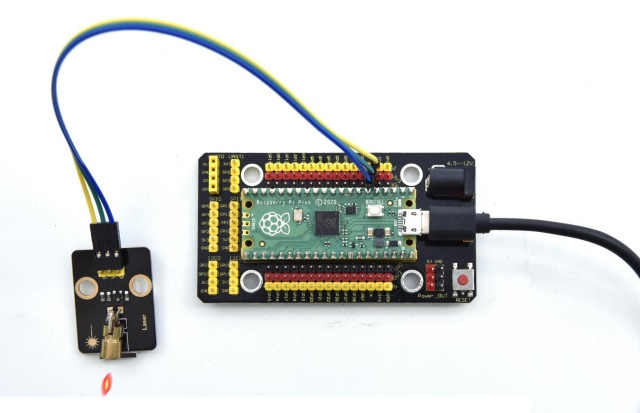

### Project 4: Button Sensor


**Overview**

In this kit, there is a Keyestudio single-channel button module, which mainly uses a tact switch and comes with a yellow button cap.

In previous lessons, we learned how to make the pins of our single-chip microcomputer output a high level or low level. In this experiment, we will read the high level (3.3V) and low level (0V).

We can determine whether the button on the sensor is pressed by reading the high and low level of the S terminal on the sensor.

**Working Principle**

The button module has four pins. The pin 1 is connected to the pin 3 and the pin 2 is linked with the pin 4. When the button is not pressed, they are disconnected. Yet, when the button is pressed, they are connected. If the button is released, the signal end is high level.


**Components**

|  | 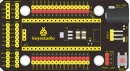  |   |  |  |
| ------------------------- | -------------------------- | -------------------------- | ------------------------- | ------------------------- |
| Raspberry Pi Pico Board*1 | Raspberry Pi Pico Shield*1 | Keyestudio Button Sensor*1 | 3P Dupont Wire*1          | Micro USB Cable*1         |

**Wiring Diagram**

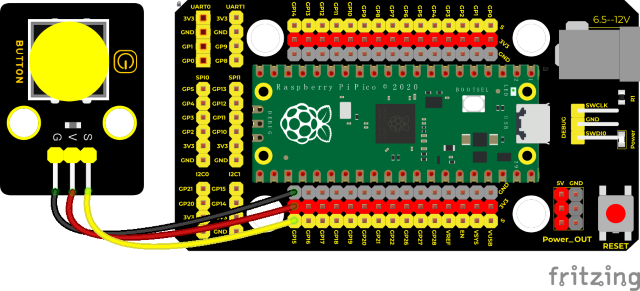

**Test Code**

```c
/* 
 * Keyestudio 37 in 1 Starter Kit for Raspberry Pi Pico
 * lesson 4
 * button
 * http://www.keyestudio.com
*/
int val = 0;  //used to save values of buttons
int button = 15; //the pin of the button is connected to GP15
void setup() {
  Serial.begin(9600); //start the serial monitor and set baud rate to 9600
  pinMode(button, INPUT); //set the pin of the button to INPUT
}

void loop() {
  val = digitalRead(button);  //read values of buttons and assign to the variable val
  Serial.print(val);  //print on the serial port
  if (val == 0) { //press the button to read low levels and print the relevant information
    Serial.print("        ");
    Serial.println("Press the botton");
    delay(100);
  }

  else {  //print the pertinent information
    Serial.print("        ");
    Serial.println("Loosen the botton");
    delay(100);
  }
```

**Code Explanation**

1)\. pinMode(button, INPUT); set the pin of the button module to GP15 and INPUT.

​	Configure INPUT through pinMode(). INPUT must use the pull-up or pull-down resistor(ours module has the pull-up resistor RI).

2)\. Serial.begin(9600):

​    Initialize serial communication and set the baud rate to 9600.

3)\. digitalRead(button): 

​	read the digital level of the button(HIGH or LOW). If this pin is not connected to pins, the digitalRead() will return HIGH or LOW.

4)\. if..else..：

​	if the logic behind () is true, execute the code of (); otherwise execute the code of **else**.

5)\. If the button is pressed, the signal end is low level, GP15 is low level and Val is 0. Then the monitor will show the corresponding value and characters; otherwise, the sensor is released, val is 1 and monitor will show 1 and other characters.

**Test Result**

Upload the test code successfully. After powering on the USB cable, open the serial monitor and set the baud rate to 9600. The serial monitor will display the corresponding data and characters. When the button is pressed, val is 0, the monitor will show“Press the button”；when the button is released, val is 1，the monitor will show“Loosen the button”; as shown below.

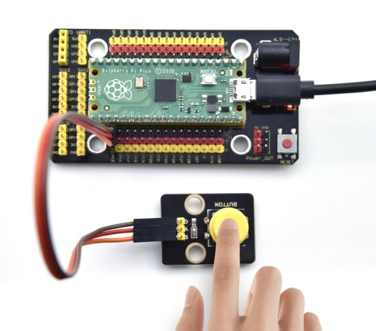


### Project 5: Capacitive Sensor


**Description**

In this kit, there is a capacitive touch module which mainly uses a TTP223-BA6 chip. It is a touch detection chip, which provides a touch button, and its function is to replace the traditional button with a variable area button. When we power on, the sensor needs about 0.5 seconds to stabilize. Do not touch the keys during this time period. At this time, all functions are disabled, and self-calibration is always performed. The calibration period is about 4 seconds. We display the test results in the shell.

**Working Principle**


When our fingers touch the module, the signal S outputs high levels, the red LED on the module flashes. We can determine if the button is pressed or not by reading high and low levels on the sensor.

**Required Components**

|  |            | 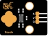          |  |  |
| ------------------------- | ----------------------------------- | ---------------------------------- | ------------------------- | ------------------------- |
| Raspberry Pi Pico Board*1 | Raspberry Pi Pico Expansion Board*1 | Keyestudio DIY Capacitive Module*1 | 3P Dupont Wire*1          | Micro USB Cable*1         |

**Connection Diagram**

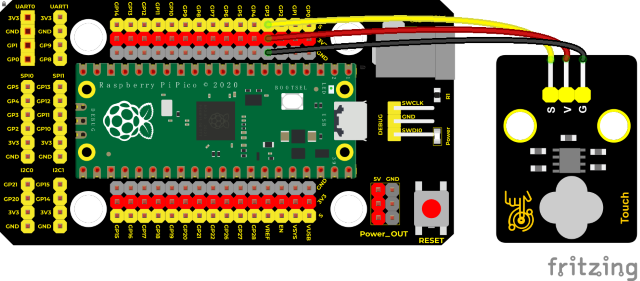

**Test Code**

```c
/* 
 * Keyestudio 37 in 1 Starter Kit for Raspberry Pi Pico
 * lesson 5
 * Touch sensor
 * http://www.keyestudio.com
*/
int val = 0;
int button = 3; //Pins of the button sensor
void setup() {
  Serial.begin(9600);//set baud to 9600
  pinMode(button, INPUT);//set to INPUT
}

void loop() {
  val = digitalRead(button);//read values of the button sensor
  Serial.print(val);//print values
  if (val == 1) {//press the button, high levels
    Serial.print("        ");
    Serial.println("Press the button");
    delay(100);
  }
  else {//release the button, low levels
    Serial.print("        ");
    Serial.println("Loosen the button");
    delay(100);
  }
}
```

**Code Explanation**

When we touch the sensor, the Shell monitor will show“You pressed the button\!”, if not,“You loosen the button\!”will be shown on the monitor.

**Test Result**

The shell monitor shows corresponding data and characters. In the experiment, when the button is pressed, the red LED lights up and val is 1.Then the shell shows “You pressed the button\!”; if the button is released, the red LED is off and val is 0;“You loosen the button\!”will be displayed.

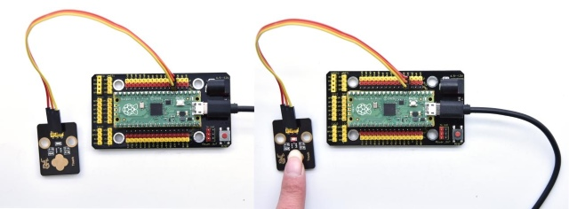

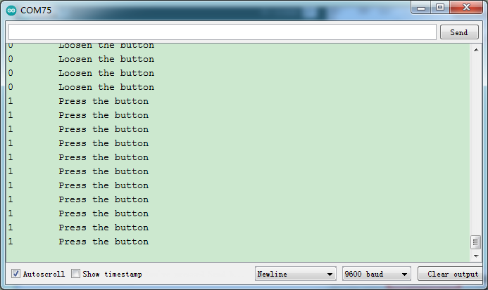

### Project 6: Obstacle Avoidance Sensor


**Overview**

In this kit, there is a Keyestudio obstacle avoidance sensor, which mainly uses an infrared emitting and a receiving tube. In the experiment, we will determine whether there is an obstacle by reading the high and low level of the S terminal on the sensor.

**Working Principle**

NE555 circuit provides IR signals with frequency to the emitter TX, then the IR signals will fade with the increase of transmission distance. If encountering the obstacle, it will be reflected back.

When the receiver RX meets the weak signals reflected back, the receiving pin will output high levels, which indicates the obstacle is far away. On the contrary, it the reflected signals are stronger, low levels will be output, which represents the obstacle is close. There are two potentiometers on the module, and one is for adjusting emission power, another one is for receiving frequency.


**Components**

|  |            |                   |  |  |
| ------------------------- | ----------------------------------- | ------------------------------------------ | ------------------------- | ------------------------- |
| Raspberry Pi Pico Board*1 | Raspberry Pi Pico Expansion Board*1 | Keyestudio DIY Obstacle Avoidance Sensor*1 | 3P Dupont Wire*1          | Micro USB Cable*1         |

**Wiring Diagram**

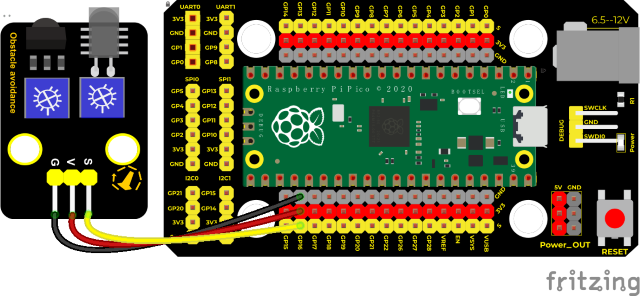

**Test Code**

```c
/* 
 * Keyestudio 37 in 1 Starter Kit for Raspberry Pi Pico
 * lesson 6
 * obstacle avoidance sensor
 * http://www.keyestudio.com
*/
int val = 0;
void setup() {
  Serial.begin(9600);//set baud rate to 9600
  pinMode(16, INPUT);//set GP16 to INPUT
}

void loop() {
  val = digitalRead(16);//read digital levels
  Serial.print(val);//print the read level signals
  if (val == 0) {//check the obstacle
    Serial.print("        ");
    Serial.println("There are obstacles");
    delay(100);
  }
  else {//the obstacle is not detected
    Serial.print("        ");
    Serial.println("All going well");
    delay(100);
  }
}
```

<span style="color: rgb(255, 76, 65);">Note:</span>

Upload the test code and wire up according to the connection diagram. After powering on, we start to adjust the two potentiometers to sense distance.

1)\. Adjust the potentiometer transmitting power. Make the P LED at the critical point of ON and OFF states.

2)\. Adjust the potentiometer receiving frequency. Rotate it clockwise, the frequency will increase. Make the S LED at the critical point of ON and OFF states, then the 38KHz square wave can be produced.

**Test Result**

Upload the code power up by a USB cable, open the serial monitor and set baud rate to 9600. When the sensor detects the obstacle, the monitor will show“There are obstacles”; if the obstacle is not detected, “All going well” will be shown.

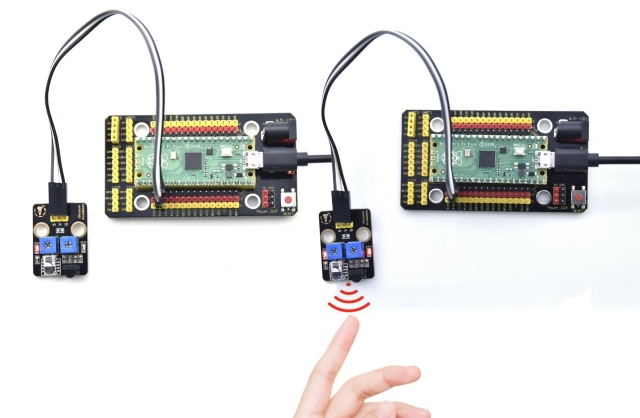

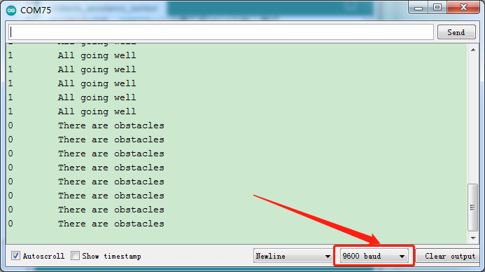

### Project 7: Line Tracking Sensor


**Description**

In this kit, there is a DIY electronic building block single-channel line tracking sensor which mainly uses a TCRT5000 reflective black and white line recognition sensor element. 

In the experiment, we judge the color (black and white) of the object detected by the sensor by reading the high and low levels of the S terminal on the module; and display the test results on the shell.

**Working Principle**

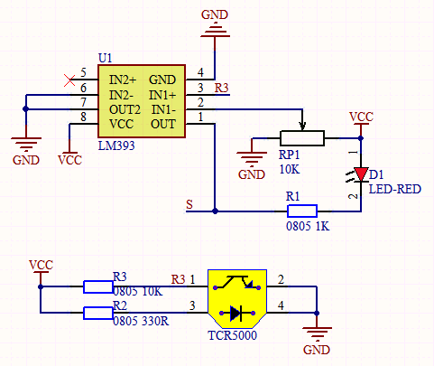

When a black or no object is detected, the signal terminal will output high levels; when white object is detected, the signal terminal is low level; its detection height is 0-3cm. We can adjust the sensitivity by rotating the potentiometer on the sensor. When the potentiometer is rotated, the sensitivity is best when the red LED on the sensor is at the critical point between off and on.

**Required Components**

|  |            | 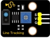             |  |  |
| ------------------------- | ----------------------------------- | ------------------------------------- | ------------------------- | ------------------------- |
| Raspberry Pi Pico Board*1 | Raspberry Pi Pico Expansion Board*1 | Keyestudio DIY Line Tracking Sensor*1 | 3P Dupont Wire*1          | Micro USB Cable*1         |

**Wiring Diagram**

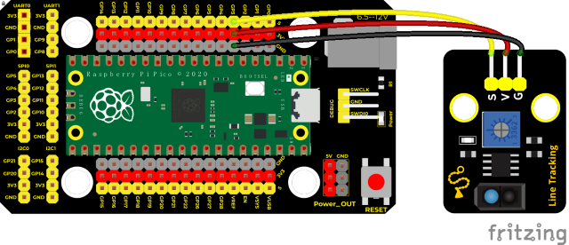

**Test Code**

```c
/* 
 * Keyestudio 37 in 1 Starter Kit for Raspberry Pi Pico
 * lesson 7
 * line tracking
 * http://www.keyestudio.com
*/
int val = 0;
void setup() {
  Serial.begin(9600);//set baud rate to 9600
  pinMode(3, INPUT);//set pins of the sensor to INPUT
}

void loop() {
  val = digitalRead(3);//read digital levels of the sensor
  Serial.print(val);//serial port prints
  if (val == 0) {//detect white val(0)
    Serial.print("        ");
    Serial.println("White");
    delay(100);
  }
  else {//detect black val (1)
    Serial.print("        ");
    Serial.println("Black");
    delay(100);
  }
}
```

**Test Result**

Upload test code, wire up, open the monitor and set baud rate to 9600. 

In the experiment, when the sensor doesn’t detect an object or detects a black object, the val is 1, and the monitor will display "1 Black" ; when a white object (can reflect light) is detected, the val is 0, and the monitor will display "0 White" ;

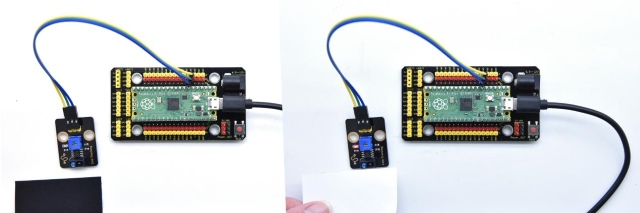

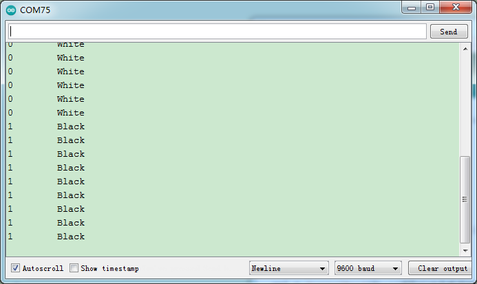

### Project 8: Photo Interrupter


**Description**

This kit contains a photo interrupter which mainly uses 1 ITR-9608 photoelectric switch. It is a photoelectric switch optical switch sensor.

**Working Principle**

When the paper is put in the slot, C is connected with VCC and the signal end S of the sensor are high levels; then the red LED will be off. Otherwise, the red LED will be on.


**Required Components**

|  |            | 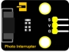          |  |  |
| ------------------------- | ----------------------------------- | ---------------------------------- | ------------------------- | ------------------------- |
| Raspberry Pi Pico Board*1 | Raspberry Pi Pico Expansion Board*1 | Keyestudio DIY Photo Interrupter*1 | 3P Dupont Wire*1          | Micro USB Cable*1         |

**Wiring Diagram**

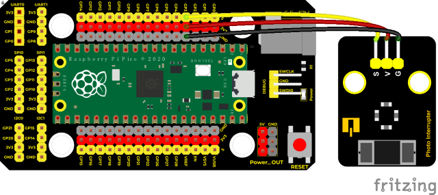

**Test Code**

```c
/* 
 * Keyestudio 37 in 1 Starter Kit for Raspberry Pi Pico
 * lesson 8
 * Photo_Interrupt
 * http://www.keyestudio.com
*/
int PushCounter = 0; //push counter variable
int State = 0; //output the current state
int lastState = 0; //output state of the sensor saved

void setup() {
  Serial.begin(9600);//set baud rate to 9600
  pinMode(3, INPUT);//set pins of the sensor to INPUT
}

void loop() {
  State = digitalRead(3);//read the current state
  if (State != lastState) {//if the state is different from the previous
    if (State == 1) {//block light
      PushCounter = PushCounter + 1;//counter plus 1
      Serial.println(PushCounter);//print counters
    }
  }
  lastState = State;//update
}
```

**Code Explanation**

Logic setting:

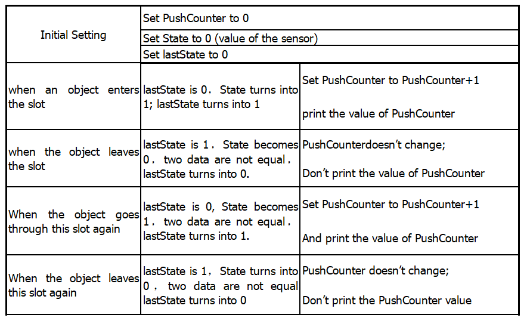

**Test Result**

Wire up, upload test code, and the shell displays the PushCounter data. Every time when the object passes through the slot of the sensor, the PushCounter data will increase by 1 continuously, as shown below;

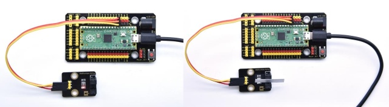

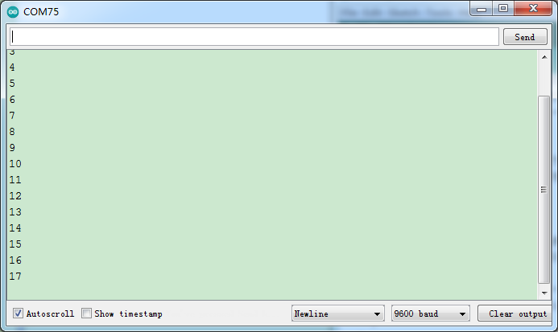

### Project 9: Tilt Module


**Overview**

In this kit, there is a Keyestudio tilt sensor. The tilt switch can output signals of different levels according to whether the module is tilted. There is a ball inside. When the switch is higher than the horizontal level, the switch is turned on, and when it is lower than the horizontal level, the switch is turned off. This tilt module can be used for tilt detection, alarm or other detection. 

**Working Principle**


The working principle is pretty simple. When pin 1 and 2 of the ball switch P1 are connected, the signal S is low level and the red LED will light up; when they are disconnected, the pin will be pulled up by the 4.7K R1 and make S a high level, then LED will be off.

**Components**

|  |   | 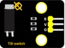 |  |  |
| ------------------------- | -------------------------- | ------------------------- | ------------------------- | ------------------------- |
| Raspberry Pi Pico Board*1 | Raspberry Pi Pico Shield*1 | KeyestudioTilt Sensor*1   | 3P Dupont Wire*1          | Micro USB Cable*1         |

**Wiring Diagram**

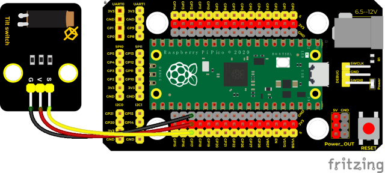

**Test Code**

```c
/* 
 * Keyestudio 37 in 1 Starter Kit for Raspberry Pi Pico
 * lesson 9
 * Tilt switch
 * http://www.keyestudio.com
*/
int val; //save the output level value of tilt sensor

void setup() {
  Serial.begin(9600);
  pinMode(17, INPUT);  //Connect the tilt sensor pin to GP17, set GP17 to input
}

void loop() {
  val = digitalRead(17); //read level signals of the module
  Serial.println(val);  //
  delay(100); //delay in 100ms

}
```

**Test Result**

Upload the code power up by a USB cable, open the serial monitor and set baud rate to 9600.

Make the tilt module incline to one side, the red LED on the module will be off and the monitor will display“1”. In contrast, if you make it incline the other side, the red LED will light up and the monitor will display“0”.

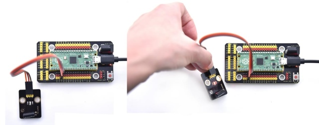


### Project 10: Hall Sensor


**Description**

In this kit, there is a Hall sensor which mainly adopts a A3144 linear Hall element. The element P1 is composed of a voltage regulator, a Hall voltage generator, a differential amplifier, a Schmitt trigger, a temperature compensation circuit and an open-collector output stage. In the experiment, we use the Hall sensor to detect the magnetic field and display the test results on the shell.

**Working Principle**

When the sensor detects no magnetic field or a north pole magnetic field, the signal terminal will be high level; when it senses a south pole magnetic field, the signal terminal will be low levels.

The stronger the magnetic field strength is, induction distance is longer.

**Required Components**

|  | 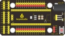           | 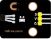    |  | 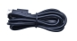 |
| ------------------------- | ----------------------------------- | ---------------------------- | ------------------------- | ------------------------- |
| Raspberry Pi Pico Board*1 | Raspberry Pi Pico Expansion Board*1 | Keyestudio DIY Hall Sensor*1 | 3P Dupont Wire*1          | Micro USB Cable*1         |

**Wiring Diagram**

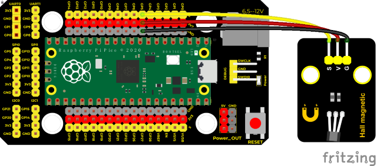

**Test Code**

```c
/* 
 * Keyestudio 37 in 1 Starter Kit for Raspberry Pi Pico
 * lesson 10
 * Hall magnetic
 * http://www.keyestudio.com
*/
int val = 0;
int hallPin = 5;  //the pin of the hall sensor is connected to port 5
void setup() {
  Serial.begin(9600);//set baud rate to 9600
  pinMode(hallPin, INPUT);//set pins to INPUT
}

void loop() {
  val = digitalRead(hallPin);//read level values of the hall sensor
  Serial.print(val);//print val
  if (val == 0) {//South Pole Magnetic Field
    Serial.println("      The magnetic field at the South Pole!");
  }
  else {//or
    Serial.println("      Just be all normal!");
  }
delay(100);
}
```

**Test Result**

Upload the test code, open the monitor and set baud rate to 9600. When the sensor detects no magnetic fields or the north pole magnetic field, the monitor l will show“1 Just be all normal\!”and the LED on the sensor will be off; When it detects the south pole magnetic field, “0 The magnetic field at the South Pole\!”and the LED on the sensor will be on.

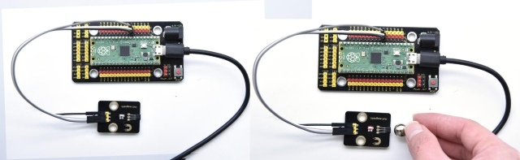

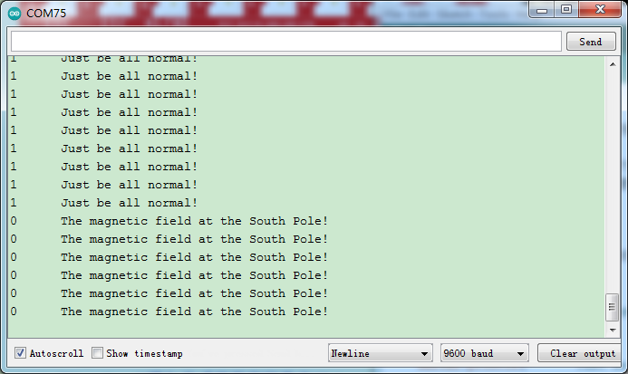

### Project 11: Reed Switch Module


**Overview**

In this kit, there is a Keyestudio reed switch module, which mainly uses a MKA10110 green reed component.

The reed switch is the abbreviation of the dry reed switch. It is a passive electronic switch element with contacts.

It has the advantages of simple structure, small size and easy control.

Its shell is a sealed glass tube with two iron elastic reed electric plates.

In the experiment, we will determine whether there is a magnetic field near the module by reading the high and low level of the S terminal on the module; and, we display the test result in the shell.


**Working Principle**

Reed switch is an abbreviation of the dry reed contacts a passive.

electronic switching elements, and has the advantages of simple structure, small size and ease of control, its shell is a sealed glass tube, the tubes are installed two iron elastic reed plate, but also filling called rhodium metal inert gas. In peacetime, the glass tube in the two reeds made of special materials are separated. When a magnetic substance close to the glass tube, in the role of the magnetic field lines, the pipe within the two reeds are magnetized to attract each other in contact, the reed will suck together, so that the junction point of the connected circuit communication. After the disappearance of the outer magnetic reed because of their flexibility and separate, the line is disconnected. Therefore, as a use of the magnetic field signals to control the line switching device, reed tube can be used as a sensor for counting the number, spacing, etc., and also are widely used in a variety of communication devices.

**Components**

|  | 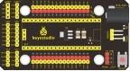  |         |  |  |
| ------------------------- | -------------------------- | -------------------------------- | ------------------------- | -------------------------- |
| Raspberry Pi Pico Board*1 | Raspberry Pi Pico Shield*1 | Keyestudio  Reed Switch Module*1 | 3P Dupont Wire*1          | MicroUSB Cable*1           |

**Wiring Diagram**


**Test Code**

```c
/* 
 * Keyestudio 37 in 1 Starter Kit for Raspberry Pi Pico
 * lesson 11
 * Reed Switch
 * http://www.keyestudio.com
*/
int val = 0;
int reedPin = 18; ///the signal pin of reed switch module is GP18
void setup() {
  Serial.begin(9600);//Set baud rate to 9600
  pinMode(reedPin, INPUT);//set to INPUT
}

void loop() {
  val = digitalRead(reedPin);//read digital levels
  Serial.print(val);

  if (val == 0) {//magnetic field nearby
    Serial.print("        ");
    Serial.println("A magnetic  field");
    delay(100);
  }
  else {//no magnetic field
    Serial.print("        ");
    Serial.println("There is no magnetic field");
    delay(100);
  }
}
```

**Test Result**

Upload the code power up by a USB cable, open the serial monitor and set baud rate to 9600. When the sensor detects a magnetic field, val is 0 and the red LED of the module lights up, "A magnetic field" will be displayed; when no magnetic field is detected, val is 1, and the LED on the module goes out, "There is no magnetic field" will be shown, as shown below.


### Project 12: PIR Motion Sensor


**Overview**

In this kit, there is a Keyestudio PIR motion sensor, which mainly uses an RE200B-P sensor elements. It is a human body pyroelectric motion sensor based on pyroelectric effect, which can detect infrared rays emitted by humans or animals, and the Fresnel lens can make the sensor's detection range farther and wider.

In the experiment, we determine if there is someone moving nearby by reading the high and low levels of the S terminal on the module. The detected results will be displayed on the Shell.

**Working Principle**

The upper left part is voltage conversion(VCC to 3.3V). The working voltage of sensors we use is 3.3V, therefore we can’t use 5V directly. The voltage conversion circuit is needed.

When no person is detected or no infrared signal is received, and pin 1 of the sensor outputs low level. At this time, the LED on the module will light up and the MOS tube Q1 will be connected and the signal terminal S will detect Low levels. 

When one is detected or an infrared signal is received, and pin 1 of the sensor outputs a high level. Then LED on the module will go off, the MOS tube Q1 is disconnected and the signal terminal S will detect high levels.


**Components**

|  |  |      |  |  |
| -------------------------- | -------------------------- | ------------------------------ | -------------------------- | -------------------------- |
| Raspberry Pi Pico Board*1  | Raspberry Pi Pico Shield*1 | Keyestudio PIR Motion Sensor*1 | 3P Dupont Wire*1           | MicroUSB Cable*1           |

**Wiring Diagram**


**Test Code**

```c
/* 
 * Keyestudio 37 in 1 Starter Kit for Raspberry Pi Pico
 * lesson 12
 * PIR motion
 * http://www.keyestudio.com
*/
int val = 0;
int pirPin = 19; //set the pin of PIR motion sensor to GP19
void setup() {
  Serial.begin(9600); //Set baud rate to 9600
  pinMode(pirPin, INPUT);  //set the sensor to INPUT
}

void loop() {
  val = digitalRead(pirPin);  //read the value of the sensor
  Serial.print(val);//print val
  if (val == 1) {//if there are people nearby, high levels will output
    Serial.print("        ");
    Serial.println("Some body is in this area!");
    delay(100);
  }
  else {//if not detecting people, low levels will output
    Serial.print("        ");
    Serial.println("No one!");
    delay(100);
  }
}
```

**Test Result**

Upload the code power up by a USB cable, open the serial monitor and set baud rate to 9600. When the sensor detects someone nearby, value is 1, the LED will go off and the monitor will show “Somebody is in this area\!”. In contrast, the value is 0, the LED will go up and “0 No one\!” will be shown.


### Project 13: Active Buzzer


**Overview**

In this kit, it contains an active buzzer module and a power amplifier module (the principle is equivalent to a passive buzzer). 

In this experiment, we control the active buzzer to emit sounds. Since it has its own oscillating circuit, the buzzer will automatically sound if given large voltage.

**Working Principle**


From the schematic diagram, the pin of buzzer is connected to a resistor R2 and another port is linked with a NPN triode Q1. So, if this triode Q1 is powered, the buzzer will sound.

If the base electrode of the triode connected to the R1 resistor is a high level, the triode Q1 will be connected.If the base electrode is pulled down by the resistor R3, the triode is disconnected. 

When we output a high level from the IO port to the triode, the buzzer will emit sounds; if outputting low levels, the buzzer won’t emit sounds.

**Components**

|  |  |  |  |  |
| -------------------------- | -------------------------- | -------------------------- | -------------------------- | -------------------------- |
| Raspberry Pi Pico Board*1  | Raspberry Pi Pico Shield*1 | Keyestudio Active Buzzer*1 | 3P Dupont Wire*1           | Micro USB Cable*1          |

**Wiring Diagram**


**Test Code**

```c
/* 
 * Keyestudio 37 in 1 Starter Kit for Raspberry Pi Pico
 * lesson 13
 * Active buzzer
 * http://www.keyestudio.com
*/
int buzzer = 20; 
void setup() {
  pinMode(buzzer, OUTPUT);
}

void loop() {
  digitalWrite(buzzer, HIGH);
  delay(1000);
  digitalWrite(buzzer, LOW);
  delay(1000);
}
```

**Code Explanation**

In the experiment, we set the pin number to 20. When setting to high, the active buzzer will beep; when setting to low, the active buzzer will stop emitting sounds.

**Test Result**

Upload the code and power on. The active buzzer will emit sound for 1 second, and stop for 1 second.


### Project 14: 8002b Audio Power Amplifier


**Overview**

In this kit, there is a Keyestudio 8002b audio power amplifier. The main components of this module are an adjustable potentiometer, a speaker, and an audio amplifier chip;

The main function of this module is: it can amplify the output audio signal, with a magnification of 8.5 times, and play sound or music through the built-in low-power speaker, as an external amplifying device for some music playing equipment.

In the experiment, we used the 8002b power amplifier speaker module to emit sounds of various frequencies. 

**Working Principle**

In fact, it is similar to a passive buzzer. The active buzzer has its own oscillation source.Yet, the passive buzzer does not have internal oscillation. When controlling the circuit, we need to input square waves of different frequencies to the positive pole of the component and ground the negative pole to control the buzzer to chime sounds of different frequencies.


**Components**

|  |  |                |  |  |
| -------------------------- | -------------------------- | ---------------------------------------- | -------------------------- | -------------------------- |
| Raspberry Pi Pico Board*1  | Raspberry Pi Pico Shield*1 | Keyestudio 8002b Audio Power Amplifier*1 | 3P Dupont Wire*1           | MicroUSB Cable*1           |

**Wiring Diagram**


**Test Code**

```c
/* 
 * Keyestudio 37 in 1 Starter Kit for Raspberry Pi Pico
 * lesson 14
 * Passive buzzer
 * http://www.keyestudio.com
*/
int beeppin = 21; //set the pin of the power amplifier to GP21
void setup() {
  pinMode(beeppin, OUTPUT);//set the digital port of the power amplifier to OUTPUT
}

void loop() {
  tone(beeppin, 262);//emit DO for 1000mss
  delay(1000);
  tone(beeppin, 294);//emit Re for 750ms
  delay(750);
  tone(beeppin, 330);//emit Mi for 625ms
  delay(625);
  tone(beeppin, 349);//emit Fa for 500ms
  delay(500);
  tone(beeppin, 392);//emit So for 375ms
  delay(375);
  tone(beeppin, 440);//emit La for 250ms
  delay(250);
  tone(beeppin, 494);//emit Si for 125ms
  delay(125);
  noTone(beeppin);//stop playing for 100ms
  delay(1000);
}
```

**Code Explanation**

In the experiment, we use the function tone(). We set pin to 21. Function tone generates waves of frequency.

**Test Result**

Upload the test code successfully and power on.The power amplifier module will emit the sound of the corresponding frequency corresponding to the beat:

DO for one beat, Re for 0.75 beat, Mi for 0.625, Fa for 1/2 beat, So for 0.375 beat, La for 1/4 beat and Si for 0.125 beat


### Project 15: 130 Motor 


**Description**

The 130 motor driver module is compatible with servo motors, which has high efficiency and good quality fans. 

It adopts a HR1124S motor control chip. HR1124S is a single-channel H-bridge driver chip for DC motor solutions. In addition, this chip has low standby current and low quiescent current.

The module is compatible with various single-chip control boards. In the experiment, we can control the rotation direction of the motor by outputting the voltage directions of the two signal terminals IN+ and IN- to make the motor rotate. 

**Working Principle**

The chip is used to help drive the motor. 

We can’t drive it with a triode or an IO port due to its a large current of need. It is very simple to make the motor rotate. Just apply voltage to both ends of the motor. The direction of the motor is different in different voltage directions. Within the rated voltage, the higher the voltage, the faster the motor rotates; on the contrary, the lower the voltage, the slower the motor rotates, or even unable to rotate. 

So we can use the PWM port to control the speed of the motor. We haven't learned PWM here, so we use the high and low levels to control the motor first.


**Components**

|  |           |  |  |  |
| -------------------------- | ----------------------------------- | -------------------------- | -------------------------- | -------------------------- |
| Raspberry Pi Pico Board*1  | Raspberry Pi Pico Expansion Board*1 | keyestudio DIY 130 Motor*1 | 4P Dupont Wire*1           | Micro USB Cable*1          |

<p style="color:red;">Note: the motor is separated with its fan, you need to assemble it first.</p>

**Wiring Diagram**


**Test Code**

```c
/* 
 * Keyestudio 37 in 1 Starter Kit for Raspberry Pi Pico
 * lesson 15
 * 130DC Fan motor
 * http://www.keyestudio.com
*/
//define two pins of the motor as 14 and 15
int INA = 14;
int INB = 15;
void setup() {
  //set pins of the motor to OUTPUT
  pinMode(INA, OUTPUT);
  pinMode(INB, OUTPUT);
}

void loop() {
  //rotate anticlockwise
  digitalWrite(INA, HIGH);
  digitalWrite(INB, LOW);
  delay(2000);
  //stop
  digitalWrite(INA, LOW);
  digitalWrite(INB, LOW);
  delay(1000);
  //rotate clockwise
  digitalWrite(INA, LOW);
  digitalWrite(INB, HIGH);
  delay(2000);
  //stop
  digitalWrite(INA, LOW);
  digitalWrite(INB, LOW);
  delay(1000);

}
```

**Code Explanation**

Set pins to 14 and 15, when the pin 14 outputs high levels and the pin 15 outputs low levels, the motor will rotate counterclockwise; when both pins are set to low, the motor stops rotating.

**Test Result**

Burn the test 130 motor code, and connect the wires according to the Wiring Diagram; after power-on, the fan rotates counterclockwise for 2 seconds; stops for 1 second; rotates clockwise for 2 seconds; stops for 1 second; cycle alternately.

Wire up, upload test code and test the 130 motor, the fan will rotate counterclockwise for 2 seconds, stop for 1 second and clockwise for 2 seconds and stop for 1 second; cycle alternately.


### Project 16: RGB Module


**Overview**

Among these modules is a RGB module. It adopts a F10-full color RGB foggy common cathode LED. We connect the RGB module to the PWM port of MCU and the other pin to GND(for common anode RGB, the rest pin will be connected to VCC). So what is PWM?

PWM is a means of controlling the analog output via digital means. Digital control is used to generate square waves with different duty cycles (a signal that constantly switches between high and low levels) to control the analog output. 

In general, the input voltages of ports are 0V and 5V. What if the 3V is required? Or a switch among 1V, 3V and 3.5V? We cannot change resistors constantly. For this reason, we resort to PWM. 


For Arduino digital port voltage outputs, there are only LOW and HIGH levels, which correspond to the voltage outputs of 0V and 5V respectively. You can define LOW as“0”and HIGH as“1’, and let the Arduino output five hundred‘0’or“1”within 1 second. If output five hundred‘1’, that is 5V; if all of which is‘0’,that is 0V; if output 250 01 pattern, that is 2.5V. 

This process can be likened to showing a movie. The movie we watch are not completely continuous. Actually, it generates 25 pictures per second, which cannot be told by human eyes. Therefore, we mistake it as a continuous process. PWM works in the same way. To output different voltages, we need to control the ratio of 0 and 1. The more ‘0’ or ‘1’ output per unit time, the more accurate the control.

**Working Principle**

For our experiment, we will control the RGB module to display different colors through three PWM values.


**Components**

|  |  |               |  |  |
| -------------------------- | -------------------------- | --------------------------------------- | -------------------------- | -------------------------- |
| Raspberry Pi Pico Board*1  | Raspberry Pi Pico Shield*1 | Keyestudio Common Cathode RGB Module *1 | 4P Dupont Wire*1           | MicroUSB Cable*1           |

**Wiring Diagram**


**Test Code**

**Code 1：**

```c
/* 
 * Keyestudio 37 in 1 Starter Kit for Raspberry Pi Pico
 * lesson 16.1
 * rgb_1
 * http://www.keyestudio.com
*/
int redPin = 9; //the red LED is connected to GP9
int greenPin = 10; //the green LED is connected to GP10
int bluePin = 11; //the blue LED is connected to GP11
void setup(){
  //set ports to OUTPUT
  pinMode(redPin, OUTPUT);
  pinMode(greenPin, OUTPUT);
  pinMode(bluePin, OUTPUT);
}

void loop(){
  //red color
  digitalWrite(redPin,HIGH);
  digitalWrite(greenPin,LOW);
  digitalWrite(bluePin,LOW);
  delay(1000);
  //green color
  digitalWrite(redPin,LOW);
  digitalWrite(greenPin,HIGH);
  digitalWrite(bluePin,LOW);
  delay(1000);
  //blue color
  digitalWrite(redPin,LOW);
  digitalWrite(greenPin,LOW);
  digitalWrite(bluePin,HIGH);
  delay(1000);

}
```


**Code 2：**

```c
/* 
 * Keyestudio 37 in 1 Starter Kit for Raspberry Pi Pico
 * lesson 16.2
 * rgb_2
 * http://www.keyestudio.com
*/
int redPin = 9; //the red LED is connected to GP9
int greenPin = 10; //the green LED is connected to GP10
int bluePin = 11; //the blue LED is connected to GP11
void setup() {
  pinMode(redPin, OUTPUT);
  pinMode(greenPin, OUTPUT);
  pinMode(bluePin, OUTPUT);
}
void loop() {
  //red(255, 0, 0)
  analogWrite(9, 255);
  analogWrite(10, 0);
  analogWrite(11, 0);
  delay(1000);
  //orange(255, 97, 0)
  analogWrite(9, 255);
  analogWrite(10, 97);
  analogWrite(11, 0);
  delay(1000);
  //yellow(255, 255, 0)
  analogWrite(9, 255);
  analogWrite(10, 255);
  analogWrite(11, 0);
  delay(1000);
  //green(0, 255, 0)
  analogWrite(9, 0);
  analogWrite(10, 255);
  analogWrite(11, 0);
  delay(1000);
  //blue(0, 0, 255)
  analogWrite(9, 0);
  analogWrite(10, 0);
  analogWrite(11, 255);
  delay(1000);
  //cyan-blue(0, 255, 255)
  analogWrite(9, 0);
  analogWrite(10, 255);
  analogWrite(11, 255);
  delay(1000);
  //purple(160, 32, 240)
  analogWrite(9, 160);
  analogWrite(10, 32);
  analogWrite(11, 240);
  delay(1000);

}
```

**Code 1：**

For code 1, RGB stands for corresponding ports of red, green and blue.

According to the connection diagram, GP9, GP10 and GP11 are connected, then we set 9, 10 and 11 and HOGH and LOW. If setting to HIGH, the LED will light up.

RGB LED shows red color for 1s, green color for 1s, blue color for 1s.

**Code 2：**

In code 2, we use PWM output. According to the wiring diagram, we connect GP9, GP10 and GP11 and set to 9 10 11.

(Note: The PWM output of pico is normally 0\~65535, and we use adjust it to 0\~255).

In the experiment, we adjust the ratio of red, green and blue colors on the RGB LED by setting the corresponding values, so as to control the RGB LED to display corresponding colors. So theoretically, there are 256\*256\*256 colors that can be set (for details, please refer to the common RGB color table below).

**RGB Color Chart**


**Test Result**

Upload the code 1, the RGB on the module will show red, green and blue color with an interval of 1s.

Upload the code 2, the RGB on the module will show red, orange, yellow, green, cyan-blue, blue, purple and white color with an interval of 1s.


### Project 17: Potentiometer


**Overview**

The following we will introduce is the Keyestudio rotary potentiometer
which is an analog sensor.

The digital IO ports can read the voltage value between 0 and 3.3V and the module only outputs high levels. However, the analog sensor can read the voltage value through ADC analog ports(GP26\~GP28) on the pico board.

In the experiment, we will display the test results on the Shell.

**Working Principle**

It uses a 10K adjustable resistor. We can change the resistance by rotating the potentiometer. The signal S can detect the voltage changes(0-3.3V) which are analog quantity.


**Components**

|  |  |         |  |  |
| -------------------------- | -------------------------- | --------------------------------- | -------------------------- | -------------------------- |
| Raspberry Pi Pico Board*1  | Raspberry Pi Pico Shield*1 | Keyestudio Rotary Potentiometer*1 | 3P Dupont Wire*1           | MicroUSB Cable*1           |

**Wiring Diagram**


**Test Code**

```c
/* 
 * Keyestudio 37 in 1 Starter Kit for Raspberry Pi Pico
 * lesson 17
 * Rotary potentiometer
 * http://www.keyestudio.com
*/
int analogVal = 0;
int resPin = 26; //the potentiometer is connected to ADC0
void setup() {
  Serial.begin(9600);//set baud rate to 9600
}

void loop() {
  analogVal = analogRead(resPin);//read values of the potentiometer
  Serial.println(analogVal);//print analog value
  delay(100);//delay in 100ms

}
```

**Code Explanation**

**analogVal** means analog value. The rotary potentiometer outputs analog values(0~4095), therefore, we set pins to analog ports. For example, we connect to ADC0(GP26).

**analogRead(pin)**: read the value of the specified analog pin. The pico board contains a multi-channel, 12-bit converter. This means that it will map the input voltage between 0 and the working voltage (5V or 3.3V ) to an integer value between 0 and 4095. For example, this will produce a resolution among readings: 3.3V/4096 stands for 0.0008V per unit. 

**Pin**: the name of analog input pin. GP26 is connected to GP28, GP29 measures VSYS voltage and ADC4 measures the internal temperature.

**Test Result**

Upload the code power up by a USB cable, open the serial monitor and set baud rate to 9600. 

In the experiment, rotate the potentiometer clockwise, the analog value increases, and turn the potentiometer counterclockwise, the analog value decreases(0-4095), as shown in the figure below. 


### Project 18: Steam Sensor


**Description**

This is a commonly used steam sensor. Its principle is to detect the amount of water by bare printed parallel lines on the circuit board. The more the water is, the more wires will be connected. As the conductive contact area increases, the output voltage will gradually rise. It can detect water vapor in the air as well. The steam sensor can be used as a rain water detector and level switch. When the humidity on the sensor surface surges, the output voltage will increase.

In the experiment, we connect the signal terminal (S terminal) of the sensor to the analog port of the pico development board. The analog value detected will be displayed on the serial monitor.

**Working Principle**

Its principle is to detect the amount of water through the exposed printed parallel lines on the circuit board. The more water there is, the more wires will be connected, and the conductive contact area increases. The voltage output by pin 2 will gradually increase. The larger the analog value detected by the signal terminal S is.

It can also detect steam in the air. Two position holes are used to install on the other devices.


**Required Components**

|  |           |      |  |  |
| -------------------------- | ----------------------------------- | ------------------------------ | -------------------------- | -------------------------- |
| Raspberry Pi Pico Board*1  | Raspberry Pi Pico Expansion Board*1 | Keyestudio DIY Steam Sensor *1 | 3P Dupont Wire*1           | Micro USB Cable*1          |

**Wiring Diagram**


**Test Code**

```c
/* 
 * Keyestudio 37 in 1 Starter Kit for Raspberry Pi Pico
 * lesson 18
 * Steam sensor
 * http://www.keyestudio.com
*/
int val = 0;
int Water = 26; //the pin of the steam sensor is 26
void setup() {
  Serial.begin(9600);//set baud rate to 9600
}

void loop() {
  val = analogRead(Water);  //read the value of the sensor
  Serial.print("Water:");
  Serial.println(val);
  delay(100);

}
```


Wire up, run the test code , power up and set baud rate to 9600. The more water volume, the greater the output voltage and the analog value, as shown below.


### Project 19: Sound Sensor


**Overview**

In this kit, there is a sound sensor. In the experiment, we test the analog value corresponding to the sound level in the current environment with it. The louder the sound, the larger the analog value;

**Working Principle**


It uses a high-sensitive microphone component and an LM386 chip.

We build the circuit with the LM386 chip and amplify the sound through the high-sensitive microphone. In addition, we can adjust the sound volume by the potentiometer. Rotate it clockwise, the sound will get louder.

**Components**

|  |  |  |  |  |
| -------------------------- | -------------------------- | -------------------------- | -------------------------- | -------------------------- |
| Raspberry Pi Pico Board*1  | Raspberry Pi Pico Shield*1 | Keyestudio Sound Sensor*1  | 3P Dupont Wire*1           | MicroUSB Cable*1           |

**Wiring Diagram**


**Test Code**

```c
/* 
 * Keyestudio 37 in 1 Starter Kit for Raspberry Pi Pico
 * lesson 19
 * MicroPhone
 * http://www.keyestudio.com
*/
int val = 0;
int Microphone = 27;  //microphone is connected to ADC1
void setup() {
  Serial.begin(9600);//Set baud rate to 9600
}

void loop() {
  val = analogRead(Microphone); //read the value of the sensor and assign to the variable val
  Serial.println(val);  //print the analog value
  delay(100); //delay in 100MS

}
```

**Test Result**

Upload the code power up by a USB cable, open the serial monitor and set baud rate to 9600. Rotate clockwise the potentiometer and speak at the MIC. Then you can see the analog value get larger, as shown below:


### Project 20: Photoresistor


**Description**

In this kit, there is a photoresistor which consists of photosensitive resistance elements. Its resistance changes with the light intensity. Also, it converts the resistance change into a voltage change through the characteristic of the photosensitive resistive element. When wiring it up, we interface its signal terminal (S terminal) with the analog port of pico , so as to sense the change of the analog value, and display the corresponding analog value in the shell.

**Working Principle**

If there is no light, the resistance is 0.2MΩ and the detected voltage at the terminal 2 is close to 0. When the light intensity increases, the resistance of photoresistor and detected voltage will diminish.


**Components**

|  |  |  |  |  |
| -------------------------- | -------------------------- | -------------------------- | -------------------------- | -------------------------- |
| Raspberry Pi Pico Board*1  | Raspberry Pi Pico Shield*1 | Keyestudio Photoresistor*1 | 3P Dupont Wire*1           | Micro USB Cable*1          |

**Wiring Diagram**


**Test Code**

```c
/* 
 * Keyestudio 37 in 1 Starter Kit for Raspberry Pi Pico
 * lesson 20
 * Photoresistance
 * http://www.keyestudio.com
*/
int val = 0;
int photoPin = 28;  //analog port ADC2 of photoresistor
void setup() {
  Serial.begin(9600);//set baud rate to 9600
}

void loop() {
  val = analogRead(photoPin);///read the value of the sensor
  Serial.println(val);//print values
  delay(100);//delay in 100MS

}
```

**Test Result**

Upload the code power up by a USB cable, open the serial monitor and set baud rate to 9600. When the light intensity gets stronger, the analog value will get larger, as shown below:


### Project 21: NTC-MF52AT Thermistor


**Overview**

In the experiment, there is a NTC-MF52AT analog thermistor. We connect its signal terminal to the analog port of the Raspberry Pi Pico Board and read the corresponding analog value.

We can use analog values to calculate the temperature of the current environment through specific formulas. Since the temperature calculation formula is more complicated, we only read the corresponding analog value.

**Working Principle**


This module mainly uses NTC-MF52AT thermistor elements. The NTC-MF52AT thermistor element can sense the changes of the surrounding environment temperature. Resistance changes with the temperature, causing the voltage of the signal terminal S to change.

This sensor uses the characteristics of NTC-MF52AT thermistor element to convert resistance changes into voltage changes.

**Components**

|  |  |          |  |  |
| -------------------------- | -------------------------- | ---------------------------------- | -------------------------- | -------------------------- |
| Raspberry Pi Pico Board*1  | Raspberry Pi Pico Shield*1 | Keyestudio NTC-MF52AT Thermistor*1 | 3P Dupont Wire*1           | MicroUSB Cable*1           |

**Wiring Diagram**


**Test Code**

```c
/* 
 * Keyestudio 37 in 1 Starter Kit for Raspberry Pi Pico
 * lesson 21
 * Temperature sensor
 * http://www.keyestudio.com
*/
int val;
int ntcPin = 26;  //NTC-MF52AT analog thermistor is connected to ADC0
void setup() {
  Serial.begin(9600);//Set baud rate to 9600
}

void loop() {
  val = analogRead(ntcPin); //read the analog temperature value
  Serial.println(val); //read and print the analog vale of photoresistor
  delay(100);//delay in 100ms

}
```

**Test Result**

Upload the code power up by a USB cable, open the serial monitor and set baud rate to 9600. The higher the temperature, the larger the analog value.


### Project 22: Thin-film Pressure Sensor


**Overview**

In this kit, there is a Keyestudio thin-film pressure sensor. The thin-film pressure sensor composed of a new type of nano pressure-sensitive material and a comfortable ultra-thin film substrate, has waterproof and pressure-sensitive functions.

In the experiment, we determine the pressure by collecting the analog signal on the S end of the module. The smaller the analog value, the greater the pressure; and the displayed results will shown on the Shell.

**Working Principle**

When the sensor is pressed by external forces, the resistance value of sensor will vary. We convert the pressure signals detected by the sensor into the electric signals through a circuit. Then we can obtain the pressure changes by detecting voltage signal changes.


**Components**

|  |  |  |  |  |
| ------------------------------------------------------------ | ------------------------------------------------------------ | ------------------------------------------------------------ | ------------------------------------------------------------ | ------------------------------------------------------------ |
| Raspberry Pi Pico Board*1                                    | Raspberry Pi Pico Expansion Board*1                          | Thin-film Pressure Sensor*1                                  | 3P Dupont Wire*1                                             | Micro USB Cable*                                             |

**Wiring Diagram**


**Test Code**

```c
/* 
 * Keyestudio 37 in 1 Starter Kit for Raspberry Pi Pico
 * lesson 22
 * Film pressure sensor
 * http://www.keyestudio.com
*/
int val = 0;
int Film = 27; //the thin-film pressure sensor is connected ADC1
void setup() {
  Serial.begin(9600);//Set baud rate to 9600
}
void loop() {
  val = analogRead(Film);//read the analog value
  Serial.println(val);//print the analog value
  delay(100);//delay in 1000ms

}
```

**Test Result**

Upload the code power up by a USB cable, open the serial monitor and set baud rate to 9600. when the thin-film is pressed by fingers, the analog value will decrease, as shown below:


### Project 23: Flame Sensor


**Description**

In daily life, it is often seen that a fire broke out without any precaution. It will cause great economic and human loss. So how can we avoid this situation? Right, install a flame sensor and a speaker in those places that easily break out a fire. When the flame sensor detects a fire, the speaker will alarm people quickly to put out the fire.

So in this project, you will learn how to use a flame sensor and an active buzzer module to simulate the fire alarm system.

**Working Principle**

This flame sensor can be used to detect fire or other light sources with wavelength stands at 760nm \~ 1100nm. Its detection angle is about 60°. You can rotate the potentiometer on the sensor to control its sensitivity. Adjust the potentiometer to make the LED at the critical point between on and off state. The sensitivity is the best.

From the below figure, power up. When detecting fire, the digital pin outputs low levels, the red LED2 will light up first, the digital signal terminal D0 outputs a low level, and the red LED1 will light up. The stronger the external infrared light, the smaller the value; the weaker the infrared light, the larger the value.


**Components**

|  |           |     |  |  |
| -------------------------- | ----------------------------------- | ----------------------------- | -------------------------- | -------------------------- |
| Raspberry Pi Pico Board*1  | Raspberry Pi Pico Expansion Board*1 | keyestudio DIY Flame Sensor*1 | 4P Dupont Wire*1           | Micro USB Cable*1          |

**Wiring Diagram**


**Test Code**

```c
/* 
 * Keyestudio 37 in 1 Starter Kit for Raspberry Pi Pico
 * lesson 23
 * Flame sensor
 * http://www.keyestudio.com
*/
//set pins of the sensor to 22 and 26
int digitalPin =  22;
int analogPin = 26;
//save below variables to the digital signal and analog signal
int analogVal = 0;
int digitalVal = 0;

void setup() {
  Serial.begin(9600); //set baud rate to 9600
  pinMode(digitalPin, INPUT); //set the pin 22 to INPUT
}

void loop() {
  analogVal = analogRead(analogPin);  //read analog signals
  digitalVal = digitalRead(digitalPin);  //read digital signals
  Serial.print(analogVal);  //print analog values
  Serial.print("    "); //
  Serial.println(digitalVal); //print digital values
  delay(100); //delay in 100ms

}
```

**Code Explanation**

Two pins we use are defined as 22 and 26 according to the wiring-up diagram, and print digital signals and analog signals respectively.

**Test Result**

Upload the test code and power up，LED2 is on and LED1 is off. Open the monitor and set baud rate to 9600. When fire is detected, LED1 will be on. the digital value will change from 1 to 0, and the analog value will become smaller, as shown in the figure below.


### Project 24: MQ-2 Gas Sensor


**Description**

This analog gas sensor - MQ2 is used in gas leakage detecting equipment in consumer electronics and industrial markets. This sensor is suitable for detecting LPG, I-butane, propane, methane, alcohol, Hydrogen and smoke. It has high sensitivity and quick response. In addition, the sensitivity can be adjusted by rotating the potentiometer. 

In the experiment, we read the analog value at the A0 port and the D0 port to determine the content of gas.

**Working Principle**


The greater the concentration of smoke, the greater the conductivity, the lower the output resistance, the greater the output analog signal.

When in use, the A0 terminal reads the analog value of the corresponding gas; the D0 terminal is connected to an LM393 chip (voltage comparator), we can adjust the alarm threshold of the measured gas through the potentiometer, and output the digital value at D0. When the measured gas content exceeds the critical point, the D0 terminal outputs a low level; when the measured gas content does not exceed the critical point, the D0 terminal outputs a high level.

**Required Components**

|  |           |          |  |  |
| -------------------------- | ----------------------------------- | ---------------------------------- | -------------------------- | -------------------------- |
| Raspberry Pi Pico Board*1  | Raspberry Pi Pico Expansion Board*1 | keyestudio DIY Analog Gas Sensor*1 | 4P Dupont Wire*1           | Micro USB Cable*1          |

**Wiring Diagram**


**Test Code**

```c
/* 
 * Keyestudio 37 in 1 Starter Kit for Raspberry Pi Pico
 * lesson 24
 * MQ2
 * http://www.keyestudio.com
*/
//connect two pins of the sensor to 22 and 26
int digitalPin =  22;
int analogPin = 26;
//save two variables to digital signals and analog signals
int analogVal = 0;
int digitalVal = 0;

void setup() {
  Serial.begin(9600); //set baud rate to 9600
  pinMode(digitalPin, INPUT); //set the pin 22 to INPUT
}

void loop() {
  analogVal = analogRead(analogPin);  //read analog signals
  digitalVal = digitalRead(digitalPin);  //read digital signals
  Serial.print(analogVal);
  if (digitalVal == 1) {
    Serial.println("    Normal");
  }
  else {
    Serial.println("    Exceeding");
  }
  delay(100); //delay in 100ms

}
```

**Test Result**

Run the test code, the yellow-green LED on the module lights up, open the serial monitor, set baud rate to 9600 and display the corresponding data and characters.

In the experiment, we can see the simulated value is less than or equal to 2769, the gas content does not exceed the critical point, and the red LED is off; when the simulated value is greater than or equal to 2769, the gas content exceeds the critical point, and the red LED lights up. That means that the analog value of the critical point of gas content is between 2769-2863, we can adjust the critical point by rotating the potentiometer on the sensor.


### Project 25: Joystick Module


**Overview**

Game handle controllers are ubiquitous.

It mainly uses PS2 joysticks. When controlling it, we need to connect the X and Y ports of the module to the analog port of the single-chip microcomputer, port B to the digital port of the single-chip microcomputer, VCC to the power output port(3.3-5V), and GND to the GND of the MCU. We can read the high and low levels of two analog values and one digital port) to determine the working status of the joystick on the module.

In the experiment, two analog values(x axis and y axis) will be shown on Shell.

**Working Principle**


In fact, its working principle is very simple. Its inside structure is equivalent to two adjustable potentiometers and a button. When this button is not pressed and the module is pulled down by R1, low levels will be output ; on the contrary, when the button is pressed, VCC will be connected (high levels), When we move the joystick, the internal potentiometer will adjust to output different voltages, and we can read the analog value.

**Components**

|  |  |    |  |  |
| -------------------------- | -------------------------- | ---------------------------- | -------------------------- | -------------------------- |
| Raspberry Pi Pico Board*1  | Raspberry Pi Pico Shield*1 | Keyestudio Joystick Module*1 | 5P Dupont Wire*1           | Micro USB Cable*1          |

**Wiring Diagram**


**Test Code**

```c
/* 
 * Keyestudio 37 in 1 Starter Kit for Raspberry Pi Pico
 * lesson 25
 * Joystick
 * http://www.keyestudio.com
*/
int X = 0;
int Y = 0;
int Button = 0;

void setup() {
  Serial.begin(9600);
  pinMode(22, INPUT);  //set the pin of the button to GP22
}

void loop() {
  X = analogRead(26); //the pin of the x axis is connected to ADC0
  Y = analogRead(27); //the pin of Y axis is connected to ADC1
  Button = digitalRead(22);  //read the status of the button and print
  Serial.write("X:");
  Serial.print(X);
  Serial.write("     Y:");
  Serial.print(Y);
  Serial.write("     B:");
  Serial.println(Button);
  delay(100);

}
```

**Code Explanation**

In the experiment, according to the wiring diagram, the x pin is set to GP26, the y pin is set to GP27 and the pin of the joystick is set to GP22. Teen the serial monitor displays the test data.

**Test Result**

Upload the code power up by a USB cable, open the serial monitor and set baud rate to 9600.

The serial monitor will show the corresponding value. Move the joystick, the analog value of X axis and Y axis will change. Press the button, the digital value is 1, on the contrary is 0. as shown below:


### Project 26: Ultraviolet Sensor


**Description**

There is a ultraviolet Sensor used for UV index monitoring, UV radiation dose measurement, flame detection. Suitable for measuring UV index of smart wearable devices, such as UV index detection of watches, smart phones and outdoor equipment. It can also be used to monitor the intensity of UV light, or as a UV flame detector when UV sanitizing items. The sensor has a specific spectral response. In the experiment, we use the purple led module to test the UV module, and then display the results on the shell.

**Working Principle**

The output current of the UV sensor is proportional to the light intensity, and the output of the product has a very high consistency. The module circuit has been set up, and we directly use the ADC to collect the analog signal.


**Required Components**

|  |           |        |  |  |   |
| -------------------------- | ----------------------------------- | -------------------------------- | -------------------------- | -------------------------- | --------------------------- |
| Raspberry Pi Pico Board*1  | Raspberry Pi Pico Expansion Board*1 | Keyestudio  Ultraviolet Sensor*1 | 3P Dupont Wire*2           | Micro USB Cable*1          | Keyestudio DIY Purple LED*1 |

**Wiring Diagram**


<p style="color:red;">(V of led module is connected to VUSB(5V) to make the LED brighter)</p>

**Test Code**

```c
/* 
 * Keyestudio 37 in 1 Starter Kit for Raspberry Pi Pico
 * lesson 26
 * UV sensor
 * http://www.keyestudio.com
*/
int val = 0;
int led = 27;
void setup() {
  Serial.begin(9600);//set baud rate to 9600
  pinMode(led, OUTPUT);//set the pin of the purple LED to INPUT
  pinMode(26, INPUT);//set the pin of the sensor to INPUT
  digitalWrite(led, HIGH);
}

void loop() {
  val = analogRead(26);//read levels
  Serial.println(val);//print analog levels
  delay(100);

}
```

**Code Explanation**

We first light up the purple LED, and then use it to illuminate the UV module to see the changes in the data on the serial monitor.

**Test Result**

Upload the test code, open the serial monitor and set baud rate to 9600. When we make the purple LED close to the ultraviolet module, view the data on the monitor, as shown below:


### **Project 27: SK6812 RGB Module**


**Overview**

In previous lessons, we learned about the plug-in RGB module and used PWM signals to color the three pins of the module. 

There is a Keyestudio 6812 RGB module whose the driving principle is different from the plug-in RGB module. It can only control with one pin. This is a set. It is an intelligent externally controlled LED light source with the control circuit and the light-emitting circuit. Each LED element is the same as a 5050 LED lamp bead, and each component is a pixel. There are four lamp beads on the module, which indicates four pixels.

In the experiment, we make different lights show different colors. 

**Working Principle**

From the schematic diagram, we can see that these four pixel lighting beads are all connected in series. In fact, no matter how many they are, we can use a pin to control a light and let it display any color. The pixel point contains a data latch signal shaping amplifier drive circuit, a high-precision internal oscillator and a 12V high-voltage programmable constant current control part, which effectively ensures the color of the pixel point light is highly consistent.

The data protocol adopts a single-wire zero-code communication method. After the pixel is powered up and reset, the S terminal receives the data transmitted from the controller. The first 24bit data sent is extracted by the first pixel and sent to the data latch of the pixel.


**Components**

|  |  |    |  |  |
| -------------------------- | -------------------------- | ---------------------------- | -------------------------- | -------------------------- |
| Raspberry Pi Pico Board*1  | Raspberry Pi Pico Shield*1 | Keyestudio 6812 RGB Module*1 | 3P Dupont Wire*1           | MicroUSBCable*1            |

**Wiring Diagram**


**Test Code**

```c
/* 
 * Keyestudio 37 in 1 Starter Kit for Raspberry Pi Pico
 * lesson 27
 * 6812 RGB LED
 * http://www.keyestudio.com
*/
#include"rgb.h"

RGB rgb(16,4);                        //rgb(pin, num);  num = 0-100
///////////////////////////////////////////////////////////////////////////////////
void setup() {
  rgb.setBrightness(100);            //rgb.setBrightness(0-255);
  delay(10);
  rgb.clear();                       //Turn off all leds  
  delay(10);
}
///////////////////////////////////////////////////////////////////////////////////
void loop() {
  while(1){  
    rgb.setPixelColor(0,255,0,0);      //rgb.setPixelColor(num,r,g,b);   num = 0-100
    rgb.setPixelColor(1,0,255,0);      //rgb.setPixelColor(num,r,g,b);   num = 0-100
    rgb.setPixelColor(2,0,0,255);      //rgb.setPixelColor(num,r,g,b);   num = 0-100
    rgb.setPixelColor(3,255,255,255);  //rgb.setPixelColor(num,r,g,b);   num = 0-100
    rgb.show();
    delay(1000);
  }
}
```

**Code Explanation**

We use the library function. You can refer to project **Add libraries.**

**Interfaces and functions：**

**RGB rgb(16,4); used to initialize** 6812RGB, 16 is the pin number，4 means the number of light beads

**rgb.setBrightness(100);** used to set the brightness(0-255) of the 6812RGB module. The larger the brightness value, the brighter light beads. 255 means the brightest.

**rgb.clear(); used to clear up the screen**

**rgb.setPixelColor(uint16\_t n, uint8\_t r, uint8\_t g, uint8\_t b);** this function is used to set locations of light beads of the 6812RGB module.

**rgb.show();** used to display 6812RGB，necessary, if without this sentence, light beads can’t refresh.

**Test Result**

Upload the test code, wire up and power up. Then we can the module display red, green, blue and white color.


### Project 28: Rotary Encoder


**Overview**

In this kit, there is a Keyestudio rotary encoder, dubbed as switch encoder. It is applied to automotive electronics, multimedia audio, instrumentation, household appliances, smart home, medical equipment and so on.

In the experiment, it it used for counting. When we rotate the rotary encoder clockwise, the set data falls by 1; if you rotate it anticlockwise, the set data is up 1; and when the middle button is pressed, the value will be show on Shell.

**Working Principle**


The incremental encoder converts the displacement into a periodic electric signal, and then converts 
this signal into a counting pulse, and the number of pulses indicates the size of the displacement.
This module mainly uses 20 pulse rotary encoder components. 
It can calculate the number of pulses output during clockwise and reverse rotation. There is no limit 
to count rotation. It resets to the initial state, that is, starts counting from 0.           

**Components**

|  |  |  |  |  |
| ------------------------------------------------------------ | ------------------------------------------------------------ | ------------------------------------------------------------ | ------------------------------------------------------------ | ------------------------------------------------------------ |
| Raspberry Pi Pico Board*1                                    | Raspberry Pi Pico Shield*1                                   | Rotary Encoder*1                                             | 5P Dupont Wire*1                                             | Micro USB Cable*1                                            |

**Wiring Diagram**


**Test Code**

```c
/*
   Keyestudio 37 in 1 Starter Kit for Raspberry Pi Pico
   lesson 28
   Encoder
   http://www.keyestudio.com
*/

//Interfacing Rotary Encoder with Arduino
//Encoder Switch -> pin 20
//Encoder DT -> pin 19
//Encoder CLK -> pin 18

int Encoder_DT  = 19;
int Encoder_CLK  = 18;
int Encoder_Switch = 20;

int Previous_Output;
int Encoder_Count;

void setup() {
  Serial.begin(9600);

  //pin Mode declaration
  pinMode (Encoder_DT, INPUT);
  pinMode (Encoder_CLK, INPUT);
  pinMode (Encoder_Switch, INPUT);

  Previous_Output = digitalRead(Encoder_DT); //Read the initial value of Output A
}

void loop() {
  //aVal = digitalRead(pinA);

  if (digitalRead(Encoder_DT) != Previous_Output)
  {
    if (digitalRead(Encoder_CLK) != Previous_Output)
    {
      Encoder_Count ++;
      Serial.println(Encoder_Count);
    }
    else
    {
      Encoder_Count--;
      Serial.println(Encoder_Count);
    }
  }

  Previous_Output = digitalRead(Encoder_DT);

  if (digitalRead(Encoder_Switch) == 0)
  {
    delay(5);
    if (digitalRead(Encoder_Switch) == 0) {
      Serial.println("Switch pressed");
      while (digitalRead(Encoder_Switch) == 0);
    }
  }
}
```

**Code Explanation**

Set CLK to GP18 and DAT to GP19.

This code is set well in the library file. When CLK descends, read the voltage of DAT, when DAT is a HIGH level, the value of the rotary encoder is added by 1; when DAT is a LOW level, the value of the rotary encoder is cut down 1.

Set the pin of the button(GP20) to LOW ans print.

**Test Result**

Upload the code power up by a USB cable, open the serial monitor and set baud rate to 9600. Rotate the knob on the rotary encoder clockwise, the displayed data will decrease; on the contrary, in anticlockwise way, the data will rise. Equally, press the button on the rotary encoder, “Switch pressed” will be shown.


### Project 29: Servo Control


**Overview**

Servo motor is a position control rotary actuator. It mainly consists of a housing, a circuit board, a core-less motor, a gear and a position sensor. Its working principle is that the servo receives the signal sent by MCU or receiver and produces a reference signal with a period of 20ms and width of 1.5ms, then compares the acquired DC bias voltage to the voltage of the potentiometer and obtain the voltage difference output. 

In general, servo has three lines in brown, red and orange. The brown wire is grounded, the red one is a positive pole line and the orange one is a signal line.


**Working Principle**

When the motor speed is constant, the potentiometer is driven to rotate through the cascade reduction gear, which leads that the voltage difference is 0, and the motor stops rotating. Generally, the angle range of servo rotation is 0° --180 °.

The rotation angle of servo motor is controlled by regulating the duty cycle of PWM (Pulse-Width Modulation) signal. The standard cycle of PWM signal is 20ms (50Hz). Theoretically, the width is distributed between 1ms-2ms, but in fact, it's between 0.5ms-2.5ms. The width corresponds the rotation angle from 0° to 180°. But note that for different brand motors, the same signal may have different rotation angles. 


**Components**

|  |  |  |  |
| ------------------------------------------------------------ | ------------------------------------------------------------ | ------------------------------------------------------------ | ------------------------------------------------------------ |
| Raspberry Pi Pico Board*1                                    | Raspberry Pi Pico Shield*1                                   | Servo*1                                                      | MicroUSB Cable*1                                             |

**Wiring Diagram**


**Test Code**

**Code 1：**

```c
/*
   Keyestudio 37 in 1 Starter Kit for Raspberry Pi Pico
   lesson 29.1
   servo_1
   http://www.keyestudio.com
*/
int servoPin = 0;//Pins of the servo

void setup() {
  pinMode(servoPin, OUTPUT);//set pins of the servo to OUTPUT
}
void loop() {
  servopulse(servoPin, 0);//rotate to 0°
  delay(1000);//delay in 1s
  servopulse(servoPin, 90);//rotate to 90°
  delay(1000);
  servopulse(servoPin, 180);//rotate to 180°
  delay(1000);
}

void servopulse(int pin, int myangle) { //Impulse function
  int pulsewidth = map(myangle, 0, 180, 500, 2500); //map angles to pulse width
  for (int i = 0; i < 10; i++) { //output several pulse
    digitalWrite(pin, HIGH);//pull up the pin of the servo
    delayMicroseconds(pulsewidth);//extend the delayed time of pulse width
    digitalWrite(pin, LOW);//pull down the pin of the servo
    delay(20 - pulsewidth / 1000);
  }
}
```


**Code 2：**

```c
/*
   Keyestudio 37 in 1 Starter Kit for Raspberry Pi Pico
   lesson 29.2
   servo_2
   http://www.keyestudio.com
*/
#include <Servo.h>  //servo library
Servo myservo;
void setup() {
  myservo.attach(0);//the servo is connected to GP0
}

void loop() {
  for (int pos = 0; pos < 180; pos++) {
    myservo.write(pos); //rotate to pos
    delay(15);  //
  }
  for (int pos = 180; pos > 0; pos--) {
    myservo.write(pos);
    delay(15);
  }
  delay(2000);//wait for 2s
}
```

**Code Explanation**

**Code 1：**

1\. **map(value, fromLow, fromHigh, toLow, toHigh)；**

Value is the value we map. fromLow, fromHigh is the maximum and minimum value；

toLow, toHigh are the upper limit and lower limit we map. 

For example, map(myangle, 0, 180, 500, 2500) means that an angle value myangle (0°-180°）the mapping range is from 500us to 2500us.

2\. We use the function **servopulse()** to make the servo move. We also make the servo rotate 0°, 90°and 180°cyclically.

**Code 2：**

The library of the servohas been downloaded，click the following two to find the path:

(1)

(2)

The you can get the library of the servo.


**myservo.write(pos):** angle values of the servo.

**myservo.read():** read angle values of the servo.

**Test Result**

Upload the code1 and power up，the servo will rotate 0°，90° and 180°.

Upload the code 2 and power up, the servo will rotate from 0° to 180° by moving 1° for each 15ms.


### Project 30: Ultrasonic Sensor

**Overview**

In this kit, there is a keyes HC-SR04 ultrasonic sensor, which can detect obstacles in front and the detailed distance between the sensor and the obstacle. Its principle is the same as that of bat flying. It can emit the ultrasonic signals that cannot be heard by humans. When these signals hit an obstacle and come back immediately. The distance between the sensor and the obstacle can be calculated by the time gap of emitting signals and receiving signals.

In the experiment, we use the sensor to detect the distance between the sensor and the obstacle, and print the test result.

Ultrasonic detector module can provide 2cm-450cm non-contact sensing distance, and its ranging accuracy is up to 3mm, very good to meet the normal requirements. The module includes an ultrasonic transmitter and receiver as well as the corresponding control circuit.

**Working Principle**

The most common ultrasonic ranging method is the echo detection. As shown below; when the ultrasonic emitter emits the ultrasonic waves towards certain direction, the counter will count. The ultrasonic waves travel and reflect back once encountering the obstacle. Then the counter will stop counting when the receiver receives the ultrasonic waves coming back.

 

The ultrasonic wave is also sound wave, and its speed of sound V is related to temperature. Generally, it travels 340m/s in the air. According to time t, we can calculate the distance s from the emitting spot to the obstacle. 

**s=340t/2**

The HC-SR04 ultrasonic ranging module can provide a non-contact distance sensing function of 2cm-400cm, and the ranging accuracy can reach as high as 3mm; the module includes an ultrasonic transmitter, receiver and control circuit. Basic working principle:

1)\. First pull down the TRIG, and then trigger it with at least 10us high level signal.

2)\. After triggering, the module will automatically transmit eight 40KHZ square waves, and automatically detect whether there is a signal to return.

3)\. If there is a signal returned back, through the ECHO to output a high level, the duration time of high level is actually the time from emission to reception of ultrasonic.

**Test Distance = High Level Duration * 340m/s * 0.5**


**Components**

|  |  |           |  |  |
| -------------------------- | -------------------------- | ----------------------------------- | -------------------------- | -------------------------- |
| Raspberry Pi Pico Board*1  | Raspberry Pi Pico Shield*1 | keyestudio SR01 Ultrasonic Sensor*1 | 4P Dupont Wire*1           | Micro USBCable*1           |

**Wiring Diagram**


**Test Code**

```C
/*
   Keyestudio 37 in 1 Starter Kit for Raspberry Pi Pico
   lesson 30
   Ultrasonic
   http://www.keyestudio.com
*/
int distance = 0; //Define a variable to receive the distance
int EchoPin = 13; //Echo is connected to GP13
int TrigPin = 14; //Trig is connected to GP14
float checkdistance() { //obtain the distance
  // give a short low level so as to ensure a clear high pulse:
  digitalWrite(TrigPin, LOW);
  delayMicroseconds(2);
  // trigger 10ms or above high pulse to the sensor
  digitalWrite(TrigPin, HIGH);
  delayMicroseconds(10);
  digitalWrite(TrigPin, LOW);
  //read a signal from the sensor; a high level pulse，
  //the duration time is calculated from sending ping command to receiving the echo of the object
  float distance = pulseIn(EchoPin, HIGH) / 58.00;  //calculate distance
  delay(10);
  return distance;
}

void setup() {
  Serial.begin(9600);//Set baud rate to 9600
  pinMode(TrigPin, OUTPUT);//set Trig to OUTPUT
  pinMode(EchoPin, INPUT);  //set Echo to INPUT
}

void loop() {
  distance = checkdistance();
  if (distance < 2 || distance >= 400) {  //print "-1"
    Serial.println("-1");
    delay(100);
  }
  else {  //print distance
    Serial.print("distance:");
    Serial.print(distance);
    Serial.println("cm");
    delay(100);
  }

}
```

**Code Explanation**

The maximum test distance of HC-SR04 ultrasonic sensor is 3-4m, and the minimum test distance is 2cm. Setting code When the detection distance is less than 2cm or greater than or equal to 400cm, the serial monitor will display -1. We display the distance between the sensor and the obstacle on the serial monitor.

**Test Result**

Upload the code power up by a USB cable, open the serial monitor and set baud rate to 9600.

If the obstacle is beyond the detection range, the monitor will show “-1”; on the contrary, the monitor will display the distance away from the obstacle.


### Project 31: IR Receiver Module


**Overview**

There is no doubt that infrared remote control is ubiquitous in daily life. It is used to control various household appliances, such as TVs, stereos, video recorders and satellite signal receivers. Infrared remote control is composed of infrared transmitting and infrared receiving systems, that is, an infrared remote control and infrared receiving module and a single-chip microcomputer capable of decoding.   

In this experiment, we need to know how to use the infrared receiving sensor. The infrared receiving sensor mainly uses the VS1838B infrared receiving sensor element. It integrates receiving, amplifying, and demodulating. The internal IC has already completed the demodulation, and the output is a digital signal. It can receive 38KHz modulated remote control signal. In the experiment, we use the IR receiver to receive the infrared signal emitted by the external infrared transmitting device, and display the received signal in the shell.

**Working Principle**


The main part of the IR remote control system is modulation, transmission and reception. The modulated carrier frequency is generally between 30khz and 60khz, and most of them use a square wave of 38kHz and a duty ratio of 1/3. A 4.7K pull-up resistor R3 is added to the signal end of the infrared receiver.


**Components**

|  |  |    |  |  |  |
| -------------------------- | -------------------------- | ---------------------------- | -------------------------- | -------------------------- | -------------------------- |
| Raspberry Pi Pico Board*1  | Raspberry Pi Pico Shield*1 | Keyestudio DIYIR Receiver *1 | 3P Dupont Wire*1           | MicroUSB Cable*1           | Remote Control*1           |

**Wiring Diagram**


**Test Code**

```c
/*
   Keyestudio 37 in 1 Starter Kit for Raspberry Pi Pico
   lesson 31
   IR Receiver
   http://www.keyestudio.com
*/
#include"ir.h"
IR IRreceive(16);
////////////////////
void setup() {
  Serial.begin(9600);
  delay(1000);
}
//////////////////// 
void loop() {
  Serial.println("IR receive");
  while(1){
    int key = IRreceive.getKey();
    if(key != -1)
       Serial.println(key);     
  }
}
```


**Code Explanation**

We need to import the library. Key values are shown below:


**Test Result**

Wire up, upload the code, power up and open serial monitor. Point at the IR receiver and press keys on the IR remote control. Then the lED on the IR receiver will flash, as shown below:


### Project 32: DS18B20 Temperature Sensor


**Description**

The DS18B20 is a 1-wire programmable Temperature sensor from maxim integrated. It is widely used to measure temperature in hard environments like in chemical solutions, mines or soil etc. The constriction of the sensor is rugged and also can be purchased with a waterproof option making the mounting process easy. It can measure a wide range of temperature from **-55°C to +125°** with a decent accuracy of **±5°C**. Each sensor has a unique address and requires only one pin of the MCU to transfer data so it a very good choice for measuring temperature at multiple points without compromising much of your digital pins on the microcontroller.

**Working Principle**


The hardware interface of the 1-Wire bus is very simple, just connect the data pin of the DS18B20 to an IO port of the microcontroller. The timing of the 1-Wire bus is relatively complex. Many students can’t understand the timing diagram independently here. We have encapsulated the complex timing operations in the library, and you can use the library functions directly.

**Schematic Diagram of DS18B20**

This can save up to 12-bit temperature vale. In the register, save in code complement. As shown below:


A total of 2 bytes, LSB is the low byte, MSB is the high byte, where MSb is the high byte of the byte, LSb is the low byte of the byte. As you can see, the binary number, the meaning of the temperature represented by each bit, is expressed. Among them, S represents the sign bit, and the lower 11 bits are all powers of 2, which are used to represent the final temperature. The temperature measurement range of DS18B20 is from -55 degrees to +125 degrees, and the expression form of temperature data, S represents positive and negative temperature, and the resolution is 2﹣⒋, which is 0.0625.

**Required Components**

|  |           |                 |  |  |
| -------------------------- | ----------------------------------- | ----------------------------------------- | -------------------------- | -------------------------- |
| Raspberry Pi Pico Board*1  | Raspberry Pi Pico Expansion Board*1 | Keyestudio DIY 18B20 Temperature Sensor*1 | 3P Dupont Wire*1           | Micro USB Cable*1          |

**Wiring Diagram**


**Test Code**

```c
/*
* Keyestudio 37 in 1 Starter Kit for Raspberry Pi Pico
 * lesson 32
 * ds18b20
 * http://www.keyestudio.com
*/
#include <DS18B20.h>

//ds18b20 pin to 3
DS18B20 ds18b20(3);

void setup() {
  Serial.begin(9600);
}

void loop() {
  double temp = ds18b20.GetTemp();//read temperature value
  temp *= 0.0625;//convert to 0.0625/LSB
  Serial.print("Temperature: ");
  Serial.print(temp);
  Serial.println("C");
  delay(1000);
}
```

**Code Explanation**

We need to import the DS18B20 module.

Set the pin to 3.

Set a double decimal variable to temp, and assign the measured result to temp.

The serial monitor displays the temp value, and the baud rate needs to be set before displaying (our default setting is 9600, which can be changed).

We add the unit behind the data. If the unit is directly set to °C, the test result will be garbled. So we directly replace ℃ with C.

**Test Result**

Run the test code, power on, open the serial monitor and set baud rate to 9600. The monitor will display the temperature of the current environment, as shown below.


### Project 33: XHT11 Temperature and Humidity Sensor


**Description**

This DHT11 temperature and humidity sensor is a composite sensor which contains a calibrated digital signal output of the temperature and humidity.

DHT11 temperature and humidity sensor uses the acquisition technology of the digital module and temperature and humidity sensing technology, ensuring high reliability and excellent long-term stability.

It includes a resistive element and a NTC temperature measuring device.

**Working Principle**


The communication and synchronization between the single-chip microcomputer and XHT11 adopts the single bus data format. The communication time is about 4ms. The data is divided into fractional part and integer part.

Operation process: A complete data transmission is 40bit, high bit first out. Data format: 8bit humidity integer data + 8bit humidity decimal data + 8bit temperature integer data + 8bit temperature decimal data + 8bit checksum.

8-bit checksum: 8-bit humidity integer data + 8-bit humidity decimal data + 8-bit temperature integer data + 8-bit temperature decimal data "Add the last 8 bits of the result.

**Required Components**

|  |           |                                    |  |  |
| -------------------------- | ----------------------------------- | ------------------------------------------------------------ | -------------------------- | -------------------------- |
| Raspberry Pi Pico Board*1  | Raspberry Pi Pico Expansion Board*1 | Keyestudio  XHT11 Temperature and Humidity Sensor（compatible with DHT11)*1 | 3P Dupont Wire*1           | Micro USB Cable*1          |

**Wiring Diagram**


**Test Code**

```c
/* 
 * Keyestudio 37 in 1 Starter Kit for Raspberry Pi Pico
 * lesson 33
 * xht11
 * http://www.keyestudio.com
*/
#include "xht11.h"
//gpio22
xht11 xht(22);

unsigned char dht[4] = {0, 0, 0, 0};//only receive the data before 32 bit
void setup() {
  Serial.begin(9600);//enable the serial monitor and set baud rate to 9600
}

void loop() {
  if (xht.receive(dht)) { //return true
    Serial.print("RH:");
    Serial.print(dht[0]); //Integer part of humidity, dht[1] is the fractional part
    Serial.print("%  ");
    Serial.print("Temp:");
    Serial.print(dht[2]); //The integer part of the temperature, dht[3] is the fractional part
    Serial.println("C");
  } else {    //read errors
    Serial.println("sensor error");
  }
  delay(1500);  //wait for 1500ms

}
```

**Code Explanation**

1)\. In the experiment, we need to import the library file of XHT11 first.

2)\. We set the pin to GP22, and store the detected temperature and humidity data in the dht\[4\] array.

3)\. We add units behind the data. If the temperature unit is directly set to °C, the test results may be wrong, so we directly replace °C with C; the humidity unit is directly set to %.

**Test Result**

Upload the test code, power up, open the serial monitor and set baud rate to 9600. The monitor will display the temperature and humidity data, as shown below:


### Project 34: DS1307 Clock Module


**Overview**

The DS1307 serial real-time clock (RTC) is a low-power, full binary-coded decimal (BCD) clock/calendar plus 56 bytes of NV SRAM.  Address and data are transferred serially through an I2C,  bidirectional bus. 

The clock/calendar provides seconds, minutes, hours, day, date, month,  and year information. The end of the month date is automatically  adjusted for months with fewer than 31 days, including corrections for leap year. The clock operates in either the 24-hour or 12-hour format with AM/PM indicator. The DS1307 has a built-in power-sense circuit that detects power failures and automatically switches to the backup supply. 

Timekeeping operation continues while the part operates from the backup supply.

**Working Principle**


**Detailed address and data:**

Serial real-time clock records year, month, day, hour, minute, second and week; AM and PM indicate morning and afternoon respectively; 56 bytes of NVRAM store data; 2-wire serial port; programmable square wave output; power failure detection and automatic switching circuit; battery current is less than 500nA.

- Pins description：

- X1,X2： 32.768kHz crystal terminal 

- VBAT:+3V input

- SDA：serial data

- SCL：serial clock

- SQW/OUT：square waves/output drivers


**Components**

|  |  |        |  |  |
| -------------------------- | -------------------------- | -------------------------------- | -------------------------- | -------------------------- |
| Raspberry Pi Pico Board*1  | Raspberry Pi Pico Shield*1 | Keyestudio DS1307 Clock Module*1 | 4P Dupont Wire*1           | Micro USBCable*1           |

**Wiring Diagram**


VUSB is 5V，then connect the power to VUSB.

**Test Code**

```c
/*
   Keyestudio 37 in 1 Starter Kit for Raspberry Pi Pico
   lesson 34
   DS1307 Real Time Clock
   http://www.keyestudio.com
*/
#include <Wire.h>
#include "RtcDS1307.h"  //library of the DS1307 clock module

RtcDS1307<TwoWire> Rtc(Wire);//i2c is connected to 4, 5

void setup(){
  Serial.begin(57600);//set baud rate to 57600
  Rtc.Begin();
  Rtc.SetIsRunning(true);

  Rtc.SetDateTime(RtcDateTime(__DATE__, __TIME__));

  
}

void loop(){
  //print year, month, day, hour, minute, second and week
  Serial.print(Rtc.GetDateTime().Year());
  Serial.print("/");
  Serial.print(Rtc.GetDateTime().Month());
  Serial.print("/");
  Serial.print(Rtc.GetDateTime().Day());
  Serial.print("    ");
  Serial.print(Rtc.GetDateTime().Hour());
  Serial.print(":");
  Serial.print(Rtc.GetDateTime().Minute());
  Serial.print(":");
  Serial.print(Rtc.GetDateTime().Second());
  Serial.print("    ");
  Serial.println(Rtc.GetDateTime().DayOfWeek());
  delay(1000);//delay in 1s

}
```

**Code Explanation**

We need to import the library of the clock module.

**Rtc.GetDateTime();** the obtained current time and date.

**Rtc.Begin();** enable DS1307 real-time clock

**Rtc.SetIsRunning(true);** run the DS1307 real-time clock, if true changes into false, time will stop

**Rtc.SetDateTime();**set time

**Rtc.GetDateTime().Year();** return year

**Rtc.GetDateTime().Month();** return month

**Rtc.GetDateTime().Day();**return data

**Rtc.GetDateTime().Hour();**return hour

**Rtc.GetDateTime().Minute();**return minute

**Rtc.GetDateTime().Second();**return second

**Rtc.GetDateTime().DayOfWeek();** return week

**Test Result**

Upload the code power up by a USB cable, open the serial monitor and set baud rate to 9600.

We can see the displayed year, month, day, hour, minute, second and week on the shell, as shown below:


### Project 35: TM1650 4-Digit Tube Display


**Overview**

This module is mainly composed of a 0.36 inch red common anode 4-digit digital tube, and its driver chip is TM1650. When using it, we only need two signal lines to make the single-chip microcomputer control a 4-bitdigit tube, which greatly saves the IO port resources of the control board.

TM1650 is a special circuit for LED (light emitting diode display) drive control. It integrates MCU input and output control digital interface, data latch, LED drivers, keyboard scanning, brightness adjustment and other circuits.

TM1650 has stable performance, reliable quality and strong anti-interference ability. 

It can be applied to the application of long-term continuous working for 24 hours. 

TM1650 uses 2-wire serial transmission protocol for communication (note that this data transmission protocol is not a standard I2C protocol). The chip can drive the digital tube and save MCU pin resources through two pins and MCU communication.

**Working Principle**

TM1650 adopts IIC treaty and SDA and SCL wire.

Data command setting is 0x48. This means that lighting up the tube display not perform its button scanning function.


**Data command setting**: 0x48 means that we light up the digital tube, instead of enable the function of key scanning.


**Command display setting:**

bit\[6:4\]: set the brightness of tube display, and 000 is brightest

bit\[3\]: set to show decimal points

bit\[0\]: start the display of the tube display

**Components**

|  |  |                |  |  |
| -------------------------- | -------------------------- | ---------------------------------------- | -------------------------- | -------------------------- |
| Raspberry Pi Pico Board*1  | Raspberry Pi Pico Shield*1 | Keyestudio TM1650 4-Digit Tube Display*1 | 4P Dupont Wire*1           | MicroUSB Cable*1           |

**Wiring Diagram**


**Test Code**

```c
/*
   Keyestudio 37 in 1 Starter Kit for Raspberry Pi Pico
   lesson 35
   TM1650 Four digital tube
   http://www.keyestudio.com
*/
#include "KETM1650.h" //import the library file of TM1650
int item = 0; //display value
//pins are GP14 and GP15
#define DIO 14
#define CLK 15
KETM1650 tm_4display(CLK, DIO);

void setup() {
  tm_4display.init(); //initialize
  tm_4display.setBrightness(3); //set brightness to 3，in the range of 1~8
}

void loop() {
  tm_4display.displayString(item);//the 4-digit tube display will show item value
  item = item + 1;  //add 1
  if (item > 9999) {  //when adding to 9999, clear up
    item = 0;
  }
  delay(100); //delay in 100ms
}
```

**Code Explanation**

Similarly, we need to import the library file of the TM1650 module first. Here are some commonly used function interfaces:

**.init(); Initialize** TM1650

**.clear();**clear up the tube display

**.displayString(char \*aString);**Display character string，

**.displayString(String sString);** Display string ，sString is character string

**.displayString(float value)**;Display decimal, the content is float type

**.displayString(double value)**;Display decimal, the content is double type

**.displayString(int value)**; Display integer, the content is int type

**.displayOn();**open the tube display

**.displayOff();** turn off the tube display, in comparison with .clear，once turning off, the function .displayOn() must be used;

**.setDot(unsigned int aPos, bool aState);** display decimal point, aPos is the location of decimal point (0\~3) corresponds to (1\~4)，aState is the display status:1（true）lights up，2（false）goes off.

**.setBrightness(unsigned int iBrightness);** set the brightness of the tube display

**iBrightness**: the brightness value（1\~8）, type is unsigned int，

**Test Result**

Run the test code, wire up and power on. 4-digit tube display will show integer from 0 to 99999, add 1 for each 10ms. Increase to 9999 then start from 0.


### Project 36: HT16K33\_8X8 Dot Matrix Module


**Overview**

What is the dot matrix display?

The 8X8 dot matrix is composed of 64 light-emitting diodes, and each light-emitting diode is placed at the intersection of the row line and the column line. When the corresponding row is set to 1 level, and a certain column is set to 0 level, the corresponding diode will light up.

**Working Principle**

As the schematic diagram shown, to light up the LED at the first row and column, we only need to set C1 to high level and R1 to low level. To turn on LEDs at the first row, we set R1 to low level and C1-C8 to high level.

16 IO ports are needed, which will highly waste the MCU resources.

Therefore, we designed this module, using the HT16K33 chip to drive an 8\*8 dot matrix, which greatly saves the resources of the single-chip microcomputer.

There are three DIP switches on the module, all of which are set to I2C communication address. The setting method is shown below.


A0，A1 and A2 are grounded, that is, the address is 0x70.

**Components**

|  |  |           |  |  |
| -------------------------- | -------------------------- | ----------------------------------- | -------------------------- | -------------------------- |
| Raspberry Pi Pico Board*1  | Raspberry Pi Pico Shield*1 | Keyestudio HT16K33_8X8 Dot Matrix*1 | 4P Dupont Wire*1           | Micro USBCable*1           |

**Wiring Diagram**


**Test Code**

```c
/*
   Keyestudio 37 in 1 Starter Kit for Raspberry Pi Pico
   lesson 36
   HT16K33 8*8 dot matrix
   http://www.keyestudio.com
*/
#include <Matrix.h>//the library of the dot matrix

Matrix myMatrix(20, 21);
uint8_t  LEDArray[8];

const uint8_t LedArray1[8] PROGMEM = {0x00, 0x18, 0x3c, 0x7e, 0xff, 0xff, 0x66, 0x00};//heart beat pattern

void setup() {
  myMatrix.begin(0x70);//iic address
  myMatrix.clear();//clear up
  myMatrix.setBrightness(5);//brightness is 5, in the range of 0~15
}

void loop() {
  memcpy_P(&LEDArray, &LedArray1, 8);
  for (int i = 0; i < 8; i++)
  {
    for (int j = 0; j < 8; j++)
    {
      if ((LEDArray[i] & 0x01))
        myMatrix.drawPixel(j, i, 1);
      else
        myMatrix.drawPixel(j, i, 0);
      LEDArray[i] = LEDArray[i] >> 1;
    }
  }
  myMatrix.write(); //display

}
```

**Code Explanation**

First we need to import the library file.

The pattern in our code is an array of byte data type, which is shown in the table below. We convert  into binary, and fill in the 8\*8 form below to make it clear. 1 means on, 0 means off,

Then we can see that it is a heart shape.


**Test Result**

Burn the test code and wire up according to the wiring diagram; after powering on, the dot matrix will display a heart beat pattern.


### Project 37: RFID Module 


**Description**

RFIDRFID-RC522 radio frequency module adopts a Philips MFRC522 original chip to design card reading circuit, easy to use and low cost, suitable for equipment development and card reader development and so on.

RFID or Radio Frequency Identification system consists of two main components, a transponder/tag attached to an object to be identified, and a Transceiver also known as interrogator/Reader.

In the experiment, the data read by the card swipe module is 4 hexadecimal numbers, and we print these four hexadecimal numbers as strings. For example, we read the data of the IC card below: 0x8d, 0xfe, 0x6c, 0x4d, and the information string displayed in the shell is 8dfe6c4d; the data read from the keychain is: 0xbc, 0x33, 0x76, 0x6e, and the information is displayed in the shell The string is bc33766e. 

**Working Principle**

RFID (Radio Frequency Identification)

Radio frequency identification, the card reader is composed of a radio frequency module and a high-level magnetic field. The Tag transponder is a sensing device, and this device does not contain a battery. It only contains tiny integrated circuit chips and media for storing data and antennas for receiving and transmitting signals. 

To read the data in the tag, first put it into the reading range of the card reader. The reader will generate a magnetic field, and because the magnetic energy generates electricity according to Lenz's law, the RFID tag will supply power, thereby activating the device. 


**Required Components**

|  |           |    |  |
| -------------------------- | ----------------------------------- | ---------------------------- | -------------------------- |
| Raspberry Pi Pico Board*1  | Raspberry Pi Pico Expansion Board*1 | Keyestudio DIY RFID Module*1 | 4P Dupont Wire*1           |
|  |           |    |                            |
| Micro USB Cable*1          | Key*1                               | IC Card*1                    |                            |

**Wiring Diagram**


**Test Code**

```c
/* 
 * Keyestudio 37 in 1 Starter Kit for Raspberry Pi Pico
 * lesson 37
 * mfrc522
 * http://www.keyestudio.com
*/
#include <Wire.h>
#include "MFRC522_I2C.h"
//iic is defaulted as 4 and 5 of pico
// 0x28 is the i2c address of SDA. If it is not matched, check your address with i2cscanner
MFRC522 mfrc522(0x28);   // create the MFRC522 example
String rfid_str = "";
void setup() {
  Serial.begin(115200);           //Set baud rate to 115200
  Wire.begin();                   // initialize I2C
  mfrc522.PCD_Init();             //initialize MFRC522
}

void loop() {
  if ( ! mfrc522.PICC_IsNewCardPresent() || ! mfrc522.PICC_ReadCardSerial() ) {
    delay(50);
    return;
  }
  rfid_str = "";//character strings clear up
  Serial.print(F("Card UID:"));
  for (byte i = 0; i < mfrc522.uid.size; i++) {//save UID
    rfid_str = rfid_str + String(mfrc522.uid.uidByte[i], HEX);  //transform to character strings
    //        Serial.print(mfrc522.uid.uidByte[i] < 0x10 ? " 0" : " ");
    //        Serial.print(mfrc522.uid.uidByte[i], HEX);
  }
  Serial.println(rfid_str);

}
```

**Code Explanation**

First import the RFID522 library.

**Wire.begin()**; The module we use is the IIC interface, so we first initialize the IIC

**mfrc522.PCD\_Init()**; initialize MFRC522

**String(mfrc522.uid.uidByte\[i\], HEX)**; Please refer to the code comments for the string that converts the value read into hexadecimal format.

**Test Result**

Run the test code and wire up, power on, open the monitor and set the baud rate to 9600. When we make the RFID module close to the IC card and the blue key, the information read by the module will be printed out, as shown in the figure below.


### Project 38: Breathing LED


**Overview**

A“breathing LED”is a phenomenon where an LED's brightness smoothly changes from dark to bright and back to dark, continuing to do so and giving the illusion of an LED“breathing. This phenomenon is similar to a lung breathing in and out. So how to control LED’s brightness? We need to take advantage of PWM.

**Components**

|  |  |     |  |  |
| -------------------------- | -------------------------- | ----------------------------- | -------------------------- | -------------------------- |
| Raspberry Pi Pico Board*1  | Raspberry Pi Pico Shield*1 | Keyestudio White LED Module*1 | 3P Dupont Wire*1           | Micro USB Cable*1          |

**Wiring Diagram**


**Test Code**

```c
/* 
 * Keyestudio 37 in 1 Starter Kit for Raspberry Pi Pico
 * lesson 38
 * Breath
 * http://www.keyestudio.com
*/
int LED = 15; //the pin of LED is connected to GP15

void setup() {
  pinMode(LED, OUTPUT);  //set the pin of LED to OUTPUT
}

void loop() {
  for (int i = 0; i <= 255; i++) {  //from 0 to 255，increase 1 for each time
    analogWrite(LED, i);
    delay(10);//delay in 10ms
  }
  for (int i = 255; i >= 0; i--) {  //from 255 to 0，reduce 1 for each time
    analogWrite(LED, i);
    delay(10);//delay in 10ms
  }
}
```

**Code Explanation**

1)\. **for()**

The function **for (int i = 0; i \<= 255; i = i + 1)**；indicate the variable 1 adds by 1 from 0 to 255, until it doesn’t meet with **i \<= 255.** It will execute the code for 256 times.

Equally, **for (int i = 255; i \>= 0; i = i - 1)** means reducing by 1 for each time.

When not meeting with i>= 0，jump out the for() loop，execute the code for 256 times

2)\. PWM

In the code, we control the brightness of the LED on the module by setting the PWM value. In the experiment, we connect the module signal to the pin GPIO15. The smaller the PWM value, the darker the LED on the module; on the contrary, the larger the value, the brighter the LED on the module, the range is 0-255. 

**analogWrite (pin, value)**: pin is the PWM port, value is the PWM value to be output (0~255). 

Set the PWM output value of GP15 to i. At the beginning, i increased from 0 to 255, and up by 1 each time. Each time delaying in 10ms, the LED on the module gradually will brighten. When PWM is 255, i begins to decrease from 255 to 0, down by 1 for each time. 

3)\. Delay

Each time delaying in 10ms, the LED on the module will gradually get dim. Then it will become brighter, cyclically alternating, just like human breathe. 

We can change the delayed time in the code. There are two ways: 

- Change the step length or reduce the delayed time.
- The step length is supposed to divided by 255, like 3 and 5. 3 means increasing by 3, -3 means reducing by 3.

**Test Result**

Run the test code, the LED on the module gradually gets dimmer then brighter, cyclically, like human breathe.


## 4. Comprehensive Experiments

The previous projects are related to single sensor or module. In the following part, we will combine various sensors and modules to create some comprehensive experiments to perform special functions.

### Project 39: Button-controlled LED


**Overview**

In this lesson, we will make an extension experiment with a button and an LED. When the button is pressed and low levels are output, the LED will light up; when the button is released, the LED will go off. Then we can control a module with another module.

**Components**

|  |  |     |       |  |  |
| -------------------------- | -------------------------- | ----------------------------- | ------------------------------- | -------------------------- | -------------------------- |
| Raspberry Pi Pico Board*1  | Raspberry Pi Pico Shield*1 | Keyestudio White LED Module*1 | Keyestudio DIY  Button Module*1 | 3P Dupont Wire*2           | MicroUSB Cable*1           |

**Wiring Diagram**


**Test Code**

```c
/* 
 * Keyestudio 37 in 1 Starter Kit for Raspberry Pi Pico
 * lesson 39
 * button control LED
 * http://www.keyestudio.com
*/
int button = 16;//the digital pin of the button is 16
int led = 15;//the pin of LED is connected to GP15
bool led_flag;
void setup() {
  pinMode(button, INPUT);  //set the pin of the button to INPUT
  pinMode(led, OUTPUT);  //set the pin of the LED to OUTPUT
  attachInterrupt(digitalPinToInterrupt(button), toggle_handle, FALLING);  //external interrupt is 0, trailing edge triggers
}

void loop() {
  digitalWrite(led, led_flag);//press the button to light up LED or turn off LED
  delay(100);
}

void toggle_handle(){//switch the state of LED
  led_flag = !led_flag;
}
```

**Code Explanation**

Set IO ports according to connection diagram and configure pins mode.

**attachInterrupt(digitalPinToInterrupt(button), toggle\_handle, FALLING)**

The trigger mode is when a high level becomes a low level. When the trigger interrupts, the interrupt function will be activated.

**toggle\_handle**: when entering the interrupt mode, the on and off of the LED can be controlled.

**Test Result**

Upload the code wire up and power up with a USB cable. When the button is pressed, the LED will light up; when pressed again, the LED will go off.


### Project 40: Alarm Experiment


**Overview**

In the previous experiment, we control an output module though an input
module. In this lesson, we will make an experiment that the active
buzzer will emit sounds once an obstacle appears.

**Components**

|  |  |              |  |  |  |
| -------------------------- | -------------------------- | -------------------------------------- | -------------------------- | -------------------------- | -------------------------- |
| Raspberry Pi Pico Board*1  | Raspberry Pi Pico Shield*1 | Keyestudio Obstacle Avoidance Sensor*1 | Keyestudio Active Buzzer*1 | 3P Dupont Wire*2           | MicroUSB Cable*1           |

**Wiring Diagram**


**Test Code**

```c
/* 
 * Keyestudio 37 in 1 Starter Kit for Raspberry Pi Pico
 * lesson 40
 * Avoiding alarm
 * http://www.keyestudio.com
*/
int item = 0;
void setup() {
  pinMode(15, INPUT);  //the obstacle avoidance sensor is interfaced with GP15 and set to INPUT
  pinMode(16, OUTPUT); //the obstacle avoidance sensor is interfaced with GP16and set to OUTPUT
}

void loop() {
  item = digitalRead(15);//read the level values of the obstacle avoidance sensor
  if (item == 0) {//the obstacle is detected
    digitalWrite(16, HIGH);//the buzzer beeps
  } else {//the obstacle is not detected
    digitalWrite(16, LOW);//the buzzer doesn’t beep
  }
  delay(100);//delay in 1000ms

}
```

**Code Explanation**

Set IO ports according to connection diagram then configure pins mode.

The value is 0 when pressing the button, So, we can determine the key value(0）through **if (item == 0) and make the buzzer beep.**

**Test Result**

Upload the test code, if the obstacle is detected, the active buzzer will chime; if not, it won’t beep.


### Project 41: Ultraviolet Alarm

**Description**

We can use a UV sensor to control the buzzer to achieve the effect of UV alarm.

**Required Components**

|  |           |       |  |  |  |
| -------------------------- | ----------------------------------- | ------------------------------- | -------------------------- | -------------------------- | -------------------------- |
| Raspberry Pi Pico Board*1  | Raspberry Pi Pico Expansion Board*1 | Keyestudio ultraviolet Sensor*1 | Keyestudio Active Buzzer*1 | 3P Dupont Wire*2           | Micro USB Cable*1          |

**Wiring Diagram**


**Test Code**

```c
/* 
 * Keyestudio 37 in 1 Starter Kit for Raspberry Pi Pico
 * lesson 41
 * UV alarm
 * http://www.keyestudio.com
*/
int item = 0;
void setup() {
  pinMode(3, OUTPUT); // the buzzer is connected to the digital port 3 and set to OUTPUT
}

void loop() {
  item = analogRead(26);//read analog values of ultraviolet sensor
  if (item >= 20) {//stronger than 20
    digitalWrite(3, HIGH);//buzzer turns on
  } else {//otherwise
    digitalWrite(3, LOW);//buzzer turns off
  }
  delay(100);//delay in 100ms

}
```

**Test Result**

Wire up, run the test code and power on. We use an ultraviolet sensor to detect and if the strength of ultraviolet rays reach what we set, the active buzzer will emit sound.


### Project 42: PIR Motion Sensor


**Introduction**

In this experiment, we will control an active buzzer and an on-board LED through a PIR motion sensor.

**Components**

|  |  |      |  |  |  |
| -------------------------- | -------------------------- | ------------------------------ | -------------------------- | -------------------------- | -------------------------- |
| Raspberry Pi Pico Board*1  | Raspberry Pi Pico Shield*1 | Keyestudio PIR Motion Sensor*1 | Keyestudio Active Buzzer*1 | 3P Dupont Wire*2           | Micro USBCable*1           |

**Connection Diagram**


**Test Code**

```c
/* 
 * Keyestudio 37 in 1 Starter Kit for Raspberry Pi Pico
 * lesson 42
 * PIR alarm
 * http://www.keyestudio.com
*/
int item = 0;
void setup() {
  pinMode(15, INPUT);  //the PIR motion sensor is connected to GP15 and set it to INPUT
  pinMode(16, OUTPUT);//the active buzzer is connected to GP16 and set it to output
}

void loop() {
  item = digitalRead(15);//Read the digital level signal output by the PIR motion sensor
  if (item == 1) {  //detect someone moving
    digitalWrite(16, HIGH); //turn on the buzzer
  } else {  //nobody is detected
    digitalWrite(16, LOW); //turn off the buzzer
  }
}
```

**Test Result**

Upload the test code wire up and power on. if the sensor detects people moving, the external active buzzer will chime; if not, it won’t beep.


### **Project 43: Speaker Module**


**Introduction**

We learned about controlling the speaker module to make sounds, play beats and adjust its volume. In fact, each song is a combination of specific beats and tones (frequencies). In this experiment, we use this speaker module to play a song.

The frequency of each tone is shown below.

**Bass**:


**Midrange** :


**Treble**:


Beats are the time delay for each note. The larger the number, the longer the delay time. A note without a line in the spectrum is a beat, with a delay of 1s. while a beat with an underline is 1/2 of a beat without a line, with a delay of 0.5s, and a beat with two underlines is 1/4 of a beat without a line, with a delay of 0.25s. The 1/8 of a beat is with a delay of 0.125s.

We will take Happy Birthday Song as an example.

**Components**

|  |           |                |  |  |
| -------------------------- | ----------------------------------- | ---------------------------------------- | -------------------------- | -------------------------- |
| Raspberry Pi Pico Board*1  | Raspberry Pi Pico Expansion Board*1 | Keyestudio 8002b Audio Power Amplifier*1 | 3P Dupont Wire*1           | MicroUSB Cable*1           |

**Connection Diagram**


**Test Code**

```c
/* 
 * Keyestudio 37 in 1 Starter Kit for Raspberry Pi Pico
 * lesson 43
 * play music
 * http://www.keyestudio.com
*/
#define D0 -1
#define D1 262
#define D2 293
#define D3 329
#define D4 349
#define D5 392
#define D6 440
#define D7 494
#define M1 523
#define M2 586
#define M3 658
#define M4 697
#define M5 783
#define M6 879
#define M7 987
#define H1 1045
#define H2 1171
#define H3 1316
#define H4 1393
#define H5 1563
#define H6 1755
#define H7 1971
//List all the frequencies of the D key
#define WHOLE 1
#define HALF 0.5
#define QUARTER 0.25
#define EIGHTH 0.25
#define SIXTEENTH 0.625
//list all beats
int tune[] =       //List the frequencies according to the numbered musical notation
{
  D5, D5, D6, D5, M1, D7,
  D5, D5, D6, D5, M2, M1,
  D5, D5, M5, M3, M1, D7, D6,
  M4, M4, M3, M1, M2, M1
};
float durt[] =      //List the beats according to the numbered musical notation
{
  0.5, 0.5, 1, 1, 1, 1 + 1,
  0.5, 0.5, 1, 1, 1, 1 + 1,
  0.5, 0.5, 1, 1, 1, 1, 1,
  0.5, 0.5, 1, 1, 1, 1 + 1
};
int beeppin = 15; //power amplifier is connected to GP15
int length;
void setup() {
  pinMode(beeppin, OUTPUT);     //set the buzzer to OUTPUT
  length = sizeof(tune) / sizeof(tune[0]); //Calculated length
}

void loop() {
  for (int x = 0; x < length; x++)
  {
    tone(beeppin, tune[x]);
    delay(500 * durt[x]); //500 means delayed time.
    noTone(beeppin);
  }
  delay(2000);
}
```

**Test Result**

Connect the components according to the connection diagram and run the test code, the audio power amplifier module will play a birthday song.


### **Project** **44: Rotary Encoder**


**Introduction**

In this lesson, we will control the LED on the RGB module to show different colors through a rotary encoder.

When designing the code, we need to divide the obtained values by 3 to get the remainders. The remainder is 0 and the LED will become red. The remainder is 1, the LED will become green. The remainder is 2, the LED will turn blue.

**Components**

|  |  |              |          |
| -------------------------- | -------------------------- | -------------------------------------- | ---------------------------------- |
| Raspberry Pi Pico Board*1  | Raspberry Pi Pico Shield*1 | Keyestudio Common Cathode RGB Module*1 | Keyestudio Rotary Encoder Module*1 |
|  |  |              |                                    |
| 5P Dupont Wire*1           | 4P Dupont Wire*1           | Micro USB Cable*1                      |                                    |

**Connection Diagram**


**Test Code**

```c
/*
   Keyestudio 37 in 1 Starter Kit for Raspberry Pi Pico
   lesson 44
   Encoder control RGB
   http://www.keyestudio.com
*/
//Interfacing Rotary Encoder with Arduino
//Encoder Switch -> pin 20
//Encoder DT -> pin 19
//Encoder CLK -> pin 18
int Encoder_DT  = 19;
int Encoder_CLK  = 18;
int Encoder_Switch = 20;

int Previous_Output;
int Encoder_Count;
int redPin = 9; //the red LED is connected to D9
int greenPin = 10; //the green LED is connected to D10
int bluePin = 11; //the blue LED is connected to D11
int val;
void setup() {
  Serial.begin(9600);

  //pin Mode declaration
  pinMode (Encoder_DT, INPUT);
  pinMode (Encoder_CLK, INPUT);
  pinMode (Encoder_Switch, INPUT);

  Previous_Output = digitalRead(Encoder_DT); //Read the inital value of Output A
  pinMode(redPin, OUTPUT);
  pinMode(greenPin, OUTPUT);
  pinMode(bluePin, OUTPUT);
}

void loop() {
  //aVal = digitalRead(pinA);

  if (digitalRead(Encoder_DT) != Previous_Output)
  {
    if (digitalRead(Encoder_CLK) != Previous_Output)
    {
      Encoder_Count ++;
      Serial.print(Encoder_Count);
      Serial.print("  ");
      val = Encoder_Count % 3;
      Serial.println(val);
    }
    else
    {
      Encoder_Count--;
      Serial.print(Encoder_Count);
      Serial.print("  ");
      val = Encoder_Count % 3;
      Serial.println(val);
    }
  }

  Previous_Output = digitalRead(Encoder_DT);

  if (digitalRead(Encoder_Switch) == 0)
  {
    delay(5);
    if (digitalRead(Encoder_Switch) == 0) {
      Serial.println("Switch pressed");
      while (digitalRead(Encoder_Switch) == 0);
    }
  }
  if (val == 0) {
    //red(255, 0, 0)
    analogWrite(9, 255);
    analogWrite(10, 0);
    analogWrite(11, 0);
  } else if (val == 1) {
    //orange(255, 0, 0)
    analogWrite(9, 0);
    analogWrite(10, 255);
    analogWrite(11, 0);
  } else {
    //blue(255, 0, 0)
    analogWrite(9, 0);
    analogWrite(10, 0);
    analogWrite(11, 255);
  }
}
```

**Code Explanation**

In the experiment, we set the val to the remainder of Encoder\_Count divided by 3. Encoder\_Count is the value of the encoder. Then we can set pin 9(red), 10(green) and 11(blue) according to remainders.

Colors of LED can be controlled by remainders.

**Test Result**

Wire up, run the code and open the serial monitor. Rotate the knob of the rotary encoder to display the reminders, which can control colors of LED.


### Project 45: Rotary Potentiometer


**Introduction**

In the previous courses, we did experiments of breathing light and controlling LED with button. In this course, we do these two experiments by controlling the brightness of LED through an adjustable potentiometer. The brightness of LED is controlled by PWM values,and the range of analog values is the same as the PWM’s, from 0 to 65535.

After the code is set successfully, we can control the brightness of the LED on the module by rotating the potentiometer.

**Components**

|  |  |     |         |  |  |
| -------------------------- | -------------------------- | ----------------------------- | --------------------------------- | -------------------------- | -------------------------- |
| Raspberry Pi Pico Board*1  | Raspberry Pi Pico Shield*1 | Keyestudio White LED Module*1 | Keyestudio Rotary Potentiometer*1 | 3P Dupont Wire*2           | MicroUSB Cable*1           |

**Connection Diagram**


**Test Code**

```c
/*
   Keyestudio 37 in 1 Starter Kit for Raspberry Pi Pico
   lesson 45
   adjust the light
   http://www.keyestudio.com
*/
int val1 = 0;//used to save analog values
int val2 = 0;//used to save the PWM value to be output
void setup() {
  Serial.begin(9600);//Set baud rate to 9600
}

void loop() {
  val1 = analogRead(26);//read the analog value of the potentiometer
  Serial.print(val1);//print analog value
  Serial.print("  ");
  val2 = map(val1, 0, 4095, 0, 255);//map analog values to the range of PWM value
  Serial.println(val2);//print PWM values
  analogWrite(15, val2);//output PWM values at the pin 15
  delay(100);//delay in 100ms
}
```

**Code Explanation**

Setting variables, control settings, and serial communication, we have all covered in previous lessons. In the experiment, the mapping function maps val1 from the range of 0-4095 to 0-255, and assigns it to val2. Here you can refer to the code description of the previous experiment 29.

**Test Result**

Run the test code and turn the potentiometer on the module to adjust the brightness of the LED on the LED module.


### Project 46: Smart Windows


**Description**

In life, we can see all kinds of smart products, such as smart home. Smart homes include smart curtains, smart windows, smart TVs, smart lights, and more. In this experiment, we use a steam sensor to detect rainwater, and then achieve the effect of closing and opening the window by a servo.

**Required Components**

|  |           |  |  |  |  |
| -------------------------- | ----------------------------------- | -------------------------- | -------------------------- | -------------------------- | -------------------------- |
| Raspberry Pi Pico Board*1  | Raspberry Pi Pico Expansion Board*1 | Keyestudio Steam Sensor*1  | Servo*1                    | 3P Dupont Wire*1           | Micro USB Cable*1          |

**Wiring Diagram**


**Test Code**

```c
/*
* Keyestudio 37 in 1 Starter Kit for Raspberry Pi Pico
 * lesson 46
 * smart window
 * http://www.keyestudio.com
*/
#include <Servo.h>//import the library of the servo
int item = 0;//save the variable of the steam sensor
Servo myservo;//Define an instance of the servo example

void setup(){
  myservo.attach(9);//the servo is connected to pin 0
}

void loop(){
  item = analogRead(26);//the analog port of the steam sensor is connected to GP26
  if (item > 200) {//analog value >200
    myservo.write(0);//close the window
    delay(500);//delay in 500ms
  } else {//no rains
    myservo.write(180);//open the window
    delay(500);//delay in 500ms
  }

}
```

**Code Explanation**

We can control a servo to rotate by a threshold.

**Test Result**

Wire up and run the test code. When the sensor detects a certain amount of water, the servo rotates to achieve the effect of closing or opening windows.


### **Project** **47: Sound Activated Light**


**Introduction**

In this lesson, we will make a smart sound activated light using a sound sensor and an LED module. When we make a sound, the light will automatically turn on; when there is no sound, the lights will automatically turn off. How it works? Because the sound-controlled light is equipped with a sound sensor, and this sensor converts the intensity of external sound into a corresponding value. Then set a threshold, when the threshold is exceeded, the light will turn on, and when it is not exceeded, the light will go out.

**Components**

|  |  |  |     |  |  |
| -------------------------- | -------------------------- | -------------------------- | ----------------------------- | -------------------------- | -------------------------- |
| Raspberry Pi Pico Board*1  | Raspberry Pi Pico Shield*1 | Keyestudio Sound Sensor*1  | Keyestudio White LED Module*1 | 3P Dupont Wire*2           | MicroUSBCable*1            |

**Connection Diagram**


**Test Code**

```c
/*
   Keyestudio 37 in 1 Starter Kit for Raspberry Pi Pico
   lesson 47
   sound-controlled lights
   http://www.keyestudio.com
*/
int ledPin = 15;//LED is connected to GP15
int microPin = 26;//the sound sensor is connected to ADC0 (GP26)
void setup() {
  Serial.begin(9600);//Set baud rate to 9600
  pinMode(ledPin, OUTPUT);//LED is set to OUTPUT
}

void loop() {
  int val = analogRead(microPin);//read analog values
  Serial.print(val);//serial prints
  if(val > 200){//more than threshold 200
    digitalWrite(ledPin, HIGH);//light up LED3s and print the pertinent information
    Serial.println("  led on");
    delay(3000);
  }else{//otherwise
    digitalWrite(ledPin, LOW);//turn off LED and print the pertinent information
    Serial.println("  led off");
  }
  delay(100);
}
```

**Code Explanation**

We set the analog threshold value to 200. If more than 200, LED will be on 3s; on the contrary, it will be off.

**Test Result**

Run the test code, the monitor displays the corresponding volume value. When the analog value of sound is greater than 200, the LED on the LED module will light up, otherwise it will go off.


### Project 48: Fire Alarm


**Description**

In this experiment, we will make a fire alarm system. Just use a flame sensor to control an active buzzer to emit sounds.

**Required Components**

|  |           |       |     |
| -------------------------- | ----------------------------------- | ------------------------------- | ----------------------------- |
| Raspberry Pi Pico Board*1  | Raspberry Pi Pico Expansion Board*1 | Keyestudio DIY电Active Buzzer*1 | keyestudio DIY Flame Sensor*1 |
|  |           |       |                               |
| Micro USB Cable*1          | 3P Dupont Wire*1                    | 4P Dupont Wire*1                |                               |

**Wiring Diagram**


**Test Code**

```c
/* 
 * Keyestudio 37 in 1 Starter Kit for Raspberry Pi Pico
 * lesson 48
 * flame alarm
 * http://www.keyestudio.com
*/
int item = 0;
void setup() {
  Serial.begin(9600);
  pinMode(22, INPUT);//the pin of the flame sensor is connected to 22
  pinMode(3, OUTPUT);//the pin of the buzzer is connected to 3
}

void loop() {
  item = digitalRead(22);//read digital levels output by the flame sensor
  Serial.println(item);//print level signals
  if (item == 0) {//detect fire
    digitalWrite(3, HIGH);//open buzzer
  } else {//otherwise, turn off the buzzer
    digitalWrite(3, LOW);
  }
  delay(100);//delay in 100ms

}
```

**Code Explanation**

This flame sensor uses an analog pin and a digital pin. When a flame is detected, the digital pin outputs a low level. In this experiment we will use the digital port.

**Test Result**

Wire up, run the test code and power on. The sensor detects the flame, and the external active buzzer will emit sounds, otherwise the active buzzer will not emit sounds.


### Project 49: Smoke Alarm


**Description**

In this experiment, we will make a smoke alarm by a TM16504-Digit segment module, a gas sensor and an active buzzer.

**Required Components**

|  |  |  |  |
| ------------------------------------------------------------ | ------------------------------------------------------------ | ------------------------------------------------------------ | ------------------------------------------------------------ |
| Raspberry Pi Pico Board*1                                    | Raspberry Pi Pico Expansion Board*1                          | Keyestudio Active Buzzer*1                                   | Keyestudio TM16504-Digit Segment Module*1                    |
|  |  |  |  |
| keyestudio Analog Gas Senso*1                                | 3P Dupont Wire*1                                             | 4P Dupont Wire*2                                             | Micro USB Cable*1                                            |

**Wiring Diagram**


**Test Code**

```c
/* 
 * Keyestudio 37 in 1 Starter Kit for Raspberry Pi Pico
 * lesson 49
 * smoke alarm
 * http://www.keyestudio.com
*/
#include "KETM1650.h" //import the library of TM1650
int val = 0; //display values
//two ports are GP14 and GP15
#define DIO 14
#define CLK 15
KETM1650 tm_4display(CLK, DIO);

void setup() {
  tm_4display.init(); //initialize
  tm_4display.setBrightness(3); //set brightness to 3，in the range of（1~8）
  pinMode(3, OUTPUT);//the active buzzer is connected to 3
}

void loop() {
  val = analogRead(26);//read analog values
  tm_4display.displayString(val);//4-digit segment display shows val
  if (val > 1000) {//analog value >100
    digitalWrite(3, HIGH); //buzzer beeps
  } else {//otherwise
    digitalWrite(3, LOW); //turn off the buzzer
  }
  delay(100);//delay in 100ms
}
```

**Code Explanation**

Define an integer variable val to store the analog value of the smoke sensor, and then we display the analog value in the four-digit digital tube, and then set a threshold, and when the threshold is reached, the buzzer will sound.

**Test Result**

Run the test code, wire up and power on. When the concentration of combustible gas exceeds the standard, the active buzzer module will give an alarm, and the four-digit digital tube will display the concentration value.


### **Project 50: 6812 RGB Module**


**Description**

We learned how to use the 6812 RGB module, we knew that this module can light up each LED through a pin. In this experiment, we will control the RGB module to display different colors. (Note: do not look directly at the LEDs for a long time to avoid damage to our eyes.)

**Components**

|  |  |    |  |  |
| -------------------------- | -------------------------- | ---------------------------- | -------------------------- | -------------------------- |
| Raspberry Pi Pico Board*1  | Raspberry Pi Pico Shield*1 | Keyestudio 6812 RGB Module*1 | 3P Dupont Wire*1           | MicroUSB Cable*1           |

**Connection Diagram**


**Test Code**

```c
/*
   Keyestudio 37 in 1 Starter Kit for Raspberry Pi Pico
   lesson 50
   SK6812 RGB
   http://www.keyestudio.com
*/
#include"rgb.h"
RGB rgb(15, 4); //rgb(pin, num);  num = 0-100
//used to save the variable of RGB
int R = 0;
int G = 0;
int B = 0;
int num = 0;
void setup() {
  rgb.setBrightness(100); //rgb.setBrightness(0-255);
  delay(10);
  rgb.clear(); //Turn off all LEDs
  delay(10);
}

void loop() {
  num++;
  if (num > 3) {  //num is in the range of 0~3
    //Select a random integer between 0 and 255
    R = random(0, 255);
    G = random(0, 255);
    B = random(0, 255);
    num = 0;
  }
  rgb.setPixelColor(num, R, G, B); //set the color of num-1 light
  rgb.show();//display
  delay(100);//
}
```

**Code Explanation**

**random(0, 255)**: Select a random integer between 0 and 255

**.setPixelColor(num - 1, R, G, B)**：set the light beads at num-1 to display red, green and blue color

**.show()**：display，if without this function , the function we set can’t work.

**Test Result**

Wire up the components and run the code. We will see LEDs on the 6812RGB module shows different colors.


### Project 51: Ultrasonic Sensor


**Description**


We know that bats use echoes to determine the direction and the location of their preys. In real life, sonar is used to detect sounds in the water. Since the attenuation rate of electromagnetic waves in water is very high, it cannot be used to detect signals, however, the attenuation rate of sound waves in the water is much smaller, so sound waves are most commonly used underwater for observation and measurement. In this experiment, we will use a speaker module, an RGB module and a 4-digit tube display to make a device for detection through ultrasonic.


**Components**

|                |  |               |   |              |
| ---------------------------------------- | -------------------------- | --------------------------------------- | --------------------------- | -------------------------------------- |
| Raspberry Pi Pico Board*1                | Raspberry Pi Pico Shield*1 | keyes brick HC-SR04 Ultrasonic Sensor*1 | Keyestudio Speaker Module*1 | Keyestudio Common Cathode RGB Module*1 |
|                |  |               |   |                                        |
| Keyestudio TM1650 4-Digit Tube Display*1 | 4P Dupont Wire*3           | 3P Dupont Wire*1                        | MicroUSB Cable*1            |                                        |

**Wiring Diagram**


**Test Code**

```c
/*
   Keyestudio 37 in 1 Starter Kit for Raspberry Pi Pico
   lesson 51
   Ultrasonic radar
   http://www.keyestudio.com
*/
#include "KETM1650.h"//the library file of the 4-digit tube display
KETM1650 tm_4display(15, 14);

int beeppin = 16; //define GP16
int EchoPin = 19; //Echo is connected to GP19
int TrigPin = 20; //Trig is connected to GP20
int distance;//distance detected by the ultrasonic sensor

int redPin = 9; //make the red LED connect to GP9
int greenPin = 10; //make the green LED connect to GP10
int bluePin = 11; //make the blue LED connect to GP11

float checkdistance() { //obtain the distance
  // give a short low level so as to ensure a clear high pulse
  digitalWrite(TrigPin, LOW);
  delayMicroseconds(2);
  // trigger 10ms or above high pulse to the sensor
  digitalWrite(TrigPin, HIGH);
  delayMicroseconds(10);
  digitalWrite(TrigPin, LOW);
  // read a signal from the sensor; a high level pulse，
  //the duration time is calculated from sending ping command to receiving the echo of the object.
  float distance = pulseIn(EchoPin, HIGH) / 58.00;  //calculate distance
  delay(10);
  return distance;
}

void setup() {
  tm_4display.init(); //initialize the tube display
  pinMode(TrigPin, OUTPUT);//Trig is OUTPUT
  pinMode(EchoPin, INPUT);  //Echo is INPUT
  pinMode(beeppin, OUTPUT);//set the audio power amplifier to OUTPUT
  pinMode(redPin, OUTPUT);
  pinMode(greenPin, OUTPUT);
  pinMode(bluePin, OUTPUT);
}

void loop() {
  distance = checkdistance(); //ultrasonic ranging
  tm_4display.displayString(distance);  //the tube display shows the distance
  if (distance <= 10) {
    tone(beeppin, 880);
    delay(100);
    noTone(beeppin);
    analogWrite(9, 255);//red(255, 0, 0)
    analogWrite(10, 0);
    analogWrite(11, 0);

  } else if (distance > 10 && distance <= 20) {
    tone(beeppin, 532);
    delay(200);
    noTone(beeppin);
    analogWrite(9, 0);//blue(255, 0, 0)
    analogWrite(10, 0);
    analogWrite(11, 255);
  } else {
    analogWrite(9, 0);//green(255, 0, 0)
    analogWrite(10, 255);
    analogWrite(11, 0);
  }

}
```

**Code Explanation**

We set sound frequency and light color by adjusting different distance range.

We can adjust the distance range in the code.

**Test Result**

Wire up according to the connection diagram upload the run the code and power up. When the ultrasonic sensor detects different distances, the buzzer will produce different frequencies of sound, the RGB will show different colors, and the measured distances are displayed on the 4-digit tube display.


### Project 52: IR Remote Control


**Introduction**

In the previous experiments, we learned to turn on or turn off the LED, adjust the brightness of a light through PWM, and how to use the infrared receiver module. So in this experiment, we use an infrared remote control to control an LED module.

When we receive a value, we set the PWM value by the corresponding button value, thus you can adjust the brightness. Control the LED to turn on or turn off is in the same way. If we want to use the same button to control the LED to turn on or turn off, we can achieve it through the code.

**Components**

|  |  |     |  |
| -------------------------- | -------------------------- | ----------------------------- | -------------------------- |
| Raspberry Pi Pico Board*1  | Raspberry Pi PicoShield*1  | Keyestudio White LED Module*1 | KeyestudioIR Receiver*1    |
|  |  |     |                            |
| MicroUSB Cable*1           | Remote Control*1           | 3P Dupont Wire*2              |                            |

**Connection Diagram**


**Test Code**

```c
/*
   Keyestudio 37 in 1 Starter Kit for Raspberry Pi Pico
   lesson 52
   IR control LED
   http://www.keyestudio.com
*/
#include"ir.h"
IR IRreceive(16);//IR receiver is connected to GP16
int led = 14;//LED is connected to GP14
boolean flag = true;//LED flag bit
void setup() {
  Serial.begin(9600);
  pinMode(led, OUTPUT);
  delay(1000);
}
////////////////////
void loop() {
  Serial.println("IR receive");
  while (1) {
    int key = IRreceive.getKey();
    if (key != -1) {
      Serial.print(key);
      if (key == 64) { //press the OK key
        if (flag == true) {//flag is true
          digitalWrite(led, HIGH);//Open LED
          Serial.println("  led on");
          flag = false;//flag is false
        } else { //flag becomes false
          digitalWrite(led, LOW);//Close LED
          Serial.println("  led off");
          flag = true;//flag becomes true
        }
      }
    }
  }
}
```

**Code Explanation**

1)\. We define a boolean variable. There are two boolean variables. true (true) or false (false), **boolean flag = true.**

2)\. When we press the OK button, the value of infrared reception is 64. At this time, we need to set a boolean variable flag. When the flag is true (true), the LED is turned on, and when it is false (false), the LED is turned off and turned on. After the LED is on and set it to false. We press the OK key, the LED will be off.

**Test Result**

Wire up, upload the test code, open the serial monitor and set baud rate to 9600. Press the OK button of the remote, the LED will be on; press it again, the LED will be off.


### Project 53: Heat Dissipation Device


**Description**

We will use a temperature sensor and some modules to make a smart cooling device in this experiment. When the ambient temperature is higher than a certain value, the motor is turned on, thereby reducing the ambient temperature and achieving the heat dissipation effect. Then display the temperature value in the four-digit segment display.

**Required Components**

|             |           |  |                    |
| ------------------------------------- | ----------------------------------- | -------------------------- | -------------------------------------------- |
| Raspberry Pi Pico Board*1             | Raspberry Pi Pico Expansion Board*1 | keyestudio 130 Motor*1     | Keyestudio  TM1650 4-Digit Segment Display*1 |
|             |           |  |                    |
| Keyestudio 18B20 Temperature Sensor*1 | 3P Dupont Wire*1                    | 4P Dupont Wire*2           | Micro USB Cable*1                            |

**Wiring Diagram**


**Test Code**

```c
/* 
 * Keyestudio 37 in 1 Starter Kit for Raspberry Pi Pico
 * lesson 53
 * heat abstractor
 * http://www.keyestudio.com
*/
#include <DS18B20.h>
#include "KETM1650.h" //import the library of TM1650
//two ports are GP14 and GP15
#define DIO 14
#define CLK 15
KETM1650 tm_4display(CLK, DIO);

//ds18b20 pin to 3
DS18B20 ds18b20(3);
void setup() {
  Serial.begin(9600);
  tm_4display.init(); //initialize
  tm_4display.setBrightness(3);
  pinMode(20, OUTPUT);
  pinMode(21, OUTPUT);
}

void loop() {
  double temp = ds18b20.GetTemp();//read temperature
  temp *= 0.0625;//convert to 0.0625/LSB
  Serial.println(temp);
  tm_4display.displayString(int(temp));//display temperature value
  if (temp > 25) {//>25℃，turn on the fan
    digitalWrite(20, LOW);
    digitalWrite(21, HIGH);
  } else {//or, turn off the fan
    digitalWrite(20, LOW);
    digitalWrite(21, LOW);
  }
  delay(100);
}
```

**Code Explanation**

The setting of variables and the storage of detection values are the same as what we learned earlier. We also set a temperature threshold and control the rotation of the motor when the threshold is exceeded, and then we use the digital tube to display the temperature value.

**Test Result**

Wire up and run the test code. We can see the temperature of the current environment (unit is Celsius) on the four-digit segment display, as shown in the figure below. If this value exceeds the value we set, the fan will rotate to dissipate heat.


### Project 54: Intelligent Entrance Guard System


**Description**

In this project, we use the RFID522 card swiping module and the servo to set up an intelligent access control system. The principle is very simple. We use RFID522 swipe card module, an IC card or key card to unlock.

**Required Components**

|  |  |  |  |
| ------------------------------------------------------------ | ------------------------------------------------------------ | ------------------------------------------------------------ | ------------------------------------------------------------ |
| Raspberry Pi Pico Board*1                                    | Raspberry Pi Pico Expansion Board*1                          | Key*1                                                        | IC Card*1                                                    |
|  |  |  |  |
| Keyestudio RFID Module*1                                     | Servo*1                                                      | 4P Dupont Wire*1                                             | Micro USB Cable*1                                            |

**Wiring Diagram**


**Test Code**

```c
/* 
 * Keyestudio 37 in 1 Starter Kit for Raspberry Pi Pico
 * lesson 54
 * Intelligent access control
 * http://www.keyestudio.com
*/
#include <Servo.h>
#include <Wire.h>
#include <MFRC522_I2C.h>
MFRC522 mfrc522(0x28);
Servo myservo;
String rfid_str = "";

void setup() {
  Serial.begin(9600);
  Wire.begin();
  mfrc522.PCD_Init();
  myservo.attach(10);//the digital port is 10
  myservo.write(0);//initialize 0°
  delay(500);
}

void loop() {
  if ( ! mfrc522.PICC_IsNewCardPresent() || ! mfrc522.PICC_ReadCardSerial() ) {
    delay(50);
    return;
  }
  rfid_str = "";//character strings clear up
  Serial.print(F("Card UID:"));
  for (byte i = 0; i < mfrc522.uid.size; i++) {// save UID
    rfid_str = rfid_str + String(mfrc522.uid.uidByte[i], HEX);  //convert to character strings
    //        Serial.print(mfrc522.uid.uidByte[i] < 0x10 ? " 0" : " ");
    //        Serial.print(mfrc522.uid.uidByte[i], HEX);
  }
  Serial.println(rfid_str);
  if (rfid_str == "8dfe6c4d" || rfid_str == "bc33766e") {
    myservo.write(180);
    delay(500);
    Serial.println("  open the door!");
  }

}
```

**Code Explanation**

In the previous experiment, our card swipe module has tested the information of IC card and key. Then we use this corresponding information to control the door.

**Test Result**

Upload the test code, wire up and power up with a USB cable, open the shell and set the baud rate to 9600; the shell displays information.

When we use the IC card or blue key to swipe the card, the shell displays the card information and "open the door", as shown in the figure below, the servo rotates to the corresponding angle to simulate opening the door.


### Project 55: Comprehensive Experiment


**Introduction**

We did a lot of experiments, and for each one we needed to re-upload the code, so can we achieve different functions through an experiment? In this experiment, we will use an external button module to achieve different functions.

**Components**

|  |    |     |    |         |
| -------------------------- | ---------------------------- | ----------------------------- | ---------------------------- | --------------------------------- |
| Raspberry Pi Pico Board*1  | Raspberry Pi Pico Shield*1   | Keyestudio White LED Module*1 | Keyestudio Button Module*1   | Keyestudio Rotary Potentiometer*1 |
|  |    |     |    |         |
| Keyestudio IR Receiver*1   | Keyestudio Joystick Module*1 | HC-SR04 Ultrasoic Sensor*1    | Keyestudio 6812 RGB Module*1 | MicroUSB Cable*1                  |
|  |    |     |    |                                   |
| 3P Dupont Wire*5           | 4P Dupont Wire*1             | 5P Dupont Wire*1              | Remote Control*1             |                                   |

**Connection Diagram**


**Test Code**

```c
/*
   Keyestudio 37 in 1 Starter Kit for Raspberry Pi Pico
   lesson 55
   Comprehensive experiment
   http://www.keyestudio.com
*/
#include"ir.h"//the library of IR receiver
#include "xht11.h"

//IR receiver is connected to GP11
IR IRreceive(11);

//xht11 to gpio19
xht11 xht(19);

//rgb is connected to 2,3,4
int r_pin = 2;
int g_pin = 3;
int b_pin = 4;

//pins of the joystick module
int X = 26;
int Y = 27;
int KEY = 22;

//analog port 28 of the potentiometer
int resPin = 28;

//LED is linked with GP14
int LED = 14;

//obstacle avoidance sensor is connected to GP0
int Avoid = 0;

//the pin of the ultrasonic sensor
int Trig = 6;
int Echo = 7;

//the pin of the button module
int button = 16;

int PushCounter = 0;//save the number of pressing the button
int yushu = 0;
unsigned char dht[4] = {0, 0, 0, 0};//receive 32 bit data
bool ir_flag = 1;

void counter() {
  delay(10);
  ir_flag = 0;
  if (!digitalRead(button)) {
    PushCounter++;
  }
}

void setup() {
  Serial.begin(9600);//set baud rate to 9600
  pinMode(KEY, INPUT);//the button of the joystick module
  pinMode(button, INPUT);//button module
  attachInterrupt(digitalPinToInterrupt(button), counter, FALLING);  //
  pinMode(Avoid, INPUT);//obstacle avoidance sensor
  pinMode(Trig, OUTPUT);//ultrasonic sensor
  pinMode(Echo, INPUT);
  delay(1000);
}

void loop() {
  yushu = PushCounter % 7;
  if (yushu == 0) {  //remainder is 0
    yushu_0();  //rgb display
  } else if (yushu == 1) {  //remainder is 1
    yushu_1();  //show IR remote signals
  } else if (yushu == 2) {  //remainder is 2
    yushu_2();  //show temperature and humidity
  } else if (yushu == 3) {  //remainder is 3
    yushu_3();  //show values of the joystick module
  }else if (yushu == 4) {  //remainder is 4
    yushu_4();  //potentiometer controls LED
  } else if (yushu == 5) {  //remainder is 5
    yushu_5();  //detect obstacles
  } else if (yushu == 6) {  //remainder is 6
    yushu_6();  //show the distance detected by the ultrasonic sensor
  }
}

//RGB
void yushu_0() {
  int R = random(0, 255);
  int G = random(0, 255);
  int B = random(0, 255);
  analogWrite(r_pin, R);
  analogWrite(g_pin, G);
  analogWrite(b_pin, B);
  delay(300);
}

//IR reception
void yushu_1() {
  ir_flag = 1;
  while (ir_flag) {
    int key = IRreceive.getKey();
    if (key != -1) {
      Serial.println(key);
    }
  }
}

void yushu_2() {
  if (xht.receive(dht)) { //return true
    Serial.print("RH:");
    Serial.print(dht[0]); //integer of humidity,dht[1] is decimal
    Serial.print("%  ");
    Serial.print("Temp:");
    Serial.print(dht[2]); //integer of temperature,dht[3] is decimal
    Serial.println("C");
  } else {    //read errors
    Serial.println("sensor error");
  }
  delay(1200);
}

void yushu_3() {
  int x = analogRead(X);
  int y = analogRead(Y);
  int key = digitalRead(KEY);
  Serial.print("X:");
  Serial.print(x);
  Serial.print("    Y:");
  Serial.print(y);
  Serial.print("    KEY:");
  Serial.println(key);
  delay(100);
}

void yushu_4() {
  int RES = analogRead(resPin);
  int res = map(RES, 0, 4095, 0, 255);
  Serial.println(res);
  analogWrite(LED, res);
  delay(100);
}

void yushu_5() {
  int val = digitalRead(Avoid);
  if (val == 0) {//detect obstacles
    Serial.println("There are obstacles");
  }
  else {//no obstacles are detected
    Serial.println("All going well");
  }
  delay(100);
}

void yushu_6() {
  float distance = checkdistance();
  Serial.print("distance:");
  Serial.print(distance);
  Serial.println("cm");
  delay(100);
}

float checkdistance() {
  digitalWrite(Trig, LOW);
  delayMicroseconds(2);
  digitalWrite(Trig, HIGH);
  delayMicroseconds(10);
  digitalWrite(Trig, LOW);
  float distance = pulseIn(Echo, HIGH) / 58.00;
  delay(10);
  return distance;
}
```


Calculate how many times the button is pressed, divide it by 7, and get the remainder which is 0, 1 2, 3, 4, 5 or 6. According to different remainders, construct five unique functions to control the experiment and realize different functions.


**Test Result**

Upload the test code, wire up and power on with a USB cable. 

At the beginning, the number of the button is 0 and remainder is 0.

Four beads on the 6812RGB module flash random colors. Open the serial monitor and set baud rate to 9600.

Press the button for a while, 6812 stops flashing, press once, the remainder is 1. If we point at IR receiver with the infrared remote control and press the button,the serial monitor will display as follows.


<span style="color: rgb(255, 76, 65);">
Note:</span> press a button, the time of pressing buttons becomes 1 and open the serial monitor, the program will reset. If the time of pressing buttons becomes 0, you need to press buttons to reset the time of pressing buttons.

Press the key twice, the time of pressing buttons is 2 and the remainder is 2. Read temperature and humidity values. As shown below:


Press a key again, the time of pressing buttons is 3 and the remainder is 3. Read digital values at x, y and z axis of the joystick module. As shown below:


Press the key for the fourth time, the remainder is 4. Then the potentiometer can adjust the PWM value at the GP14 port to control LED brightness of the purple LED.


Press the key for the fifth time, the remainder is 5. Then the ultrasonic sensor can detect obstacles, as shown below:


Press the key for sixth time and the remainder is 6. Then the distance away from the obstacle can be detected. As shown below:


Press the key for seventh time and the remainder is 0. Then the RGB will flash. If you press keys incessantly, remainders will change in loop way. So does functions.


