# **Keyestudio Raspberry Pi Pico 37 in 1 Sensor Kit**


## 1.Description

The Keyestudio Raspberry Pi Pico 37 in 1 sensor kit mainly contains 37 commonly used sensors/modules, the Raspberry Pi Pico board, the Raspberry Pi Pico expansion board and Dupont wires.

The 37 sensors and modules are fully compatible with the Raspberry Pi Pico shield. You only need to stack the Raspberry Pi Pico board onto the Raspberry Pi Pico shield, and hook up them with Dupont wires, which is simple and convenient.

To make you master the electronic knowledge, detailed tutorials (Micropython), schematic diagrams, wiring methods and test code are included. Through these projects, you will have a better understanding about programming, logic and electronics.


## 2.Kit

|  #   |                           Picture                            |                      Model                      | QTY  |
| :--: | :----------------------------------------------------------: | :---------------------------------------------: | :--: |
|  1   |  |                Purple LED Module                |  1   |
|  2   |  |            Common Cathode RGB Module            |  1   |
|  3   |  |              Traffic Lights Module              |  1   |
|  4   |  |                  Active Buzzer                  |  1   |
|  5   |  |           8002b Audio Power Amplifier           |  1   |
|  6   |  |                  Button Module                  |  1   |
|  7   |  |                   Tilt Sensor                   |  1   |
|  8   |  |                PIR Motion Sensor                |  1   |
|  9   | 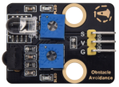 |            Obstacle Avoidance Sensor            |  1   |
|  10  |  |                 6812 RGB Module                 |  1   |
|  11  |  |              NTC-MF52AT Thermistor              |  1   |
|  12  |  |                  Photoresistor                  |  1   |
|  13  |  |                  Sound Sensor                   |  1   |
|  14  |  |              Rotary Potentiometer               |  1   |
|  15  |  |                   IR Receiver                   |  1   |
|  16  |  |               Reed Switch Sensor                |  1   |
|  17  |  |              Rotary Encoder Module              |  1   |
|  18  |  |                 Joystick Module                 |  1   |
|  19  |  |          HT16K33 8X8 Dot Matrix Module          |  1   |
|  20  |  |           TM1650 4-Digit Tube Display           |  1   |
|  21  |  |            Thin-film Pressure Sensor            |  1   |
|  22  |  |               DS1307 Clock Sensor               |  1   |
|  23  |  |             SR01 Ultrasonic Sensor              |  1   |
|  24  |  |                  9G 90° Servo                   |  1   |
|  25  |  |                Capacitive Sensor                |  1   |
|  26  |  |                Photo Interrupter                |  1   |
|  27  |  |                   Hall Sensor                   |  1   |
|  28  |  |                  Flame Sensor                   |  1   |
|  29  |  |              line Tracking Sensor               |  1   |
|  30  |  |                Analog Gas Sensor                |  1   |
|  31  |  |      XHT11 Temperature and Humidity Sensor      |  1   |
|  32  |  |            18B20 Temperature Sensor             |  1   |
|  33  |  |                    130 Motor                    |  1   |
|  34  |  |                       Fan                       |  1   |
|  35  |  |                  Laser Module                   |  1   |
|  36  |  |                  Steam Sensor                   |  1   |
|  37  |  |               Ultraviolet Sensor                |  1   |
|  38  |  |                   RFID Module                   |  1   |
|  39  |  |             Raspberry Pi Pico Board             |  1   |
|  40  |  |        Raspberry Pico IO Expansion Board        |  1   |
|  41  |  | JMFP-4 17-Key Remote Control(without batteries) |  1   |
|  42  |  |                    USB Cable                    |  1   |
|  43  |  |                 F-F Dupont Wire                 |  1   |
|  44  |  |                   White Card                    |  1   |
|  45  |  |                  ABS RFID Key                   |  1   |


## 3.Raspberry Pi Pico & Thonny


At the end of January 2021, the Raspberry Pi Foundation launched the Raspberry Pi Pico, which received a lot of attention due to its high-performance and low-cost.

The size of Pico is 21mm *51mm, which is similar to Arduino Nano.


Raspberry Pi Pico is a low-cost, high-performance microcontroller board with flexible digital interfaces. It integrates the RP2040 microcontroller chip designed by Raspberry Pi, with dual-core Arm Cortex M0+ processor running up to 133 MHz, embedded 264KB of SRAM and 2MB of on-board Flash memory, as well as 26 multi-function GPIO pins. For software development, either Raspberry Pi's C/C++ SDK, or the MicroPython is available. 

In this tutorial, we will use MicroPython.


The bare board does not come with pins and you need to solder yourself. This is a well-made board that can also be used as an SMD component and soldered directly to a printed circuit board.


The most predominant feature on the board is the microUSB connector at one end. This is used both for communication and to supply power to the Pico. An on-board LED is mounted next to the microUSB connector, it is internally connected to GPIO pin 25. It’s worthwhile to note that this is the only LED on the entire Pico board. 

The BOOTSEL pushbutton switch is mounted a bit down from the LED, it allows you to change the boot mode of the Pico so that you can load MicroPython onto it and perform drag-and-drop programming.

At the bottom of the board, you’ll see three connections, these are for a serial Debug option that we won’t be exploring here.

In the center of the board is the brains of the whole thing, the RP2040 MCU, which is capable of supporting up to 16MB of off-chip Flash memory, although in the Pico there is only 4MB.

- l Dual-core 32-bit Arm Cortex M0+ processor
- l Runs at 48MHz, but can be overclocked to 133MHz
- l 30 GPIO pins
- l Can support USB Host or Device mode
- l 8 Programmable I/O(PIO) state machines


The Pico is a 3.3V logic device, however, it can be powered with a range of power supplies thanks to a built-in voltage converter and regulator.

**GND**: Ground connection. 8 grounding wires plus an additional one on the 3-pin Debug connector. They are square as opposed to rounded like the other connections.

**VBUS**: This is the power from the microUSB bus, 5 V. If the Pico is not being powered by the microUSB connector then there will be no output here.

**VSYS**: This is the input voltage, which can range from 2 to 5V. The on-board voltage converter will change it to 3.3V for the Pico.

**3V3**: This is a 3.3V output from the Pico’s internal regulator. It can be used to power additional components, providing you keep the load under 300ma.

**3V3_EN**: You can use this input to disable the Pico’s internal voltage regulator, which will shut off the Pico and any components powered by it.

**RUN**: It can enable or disable the RP2040 microcontroller, it can also reset it.


There are 26 exposed GPIO connections on the Raspberry Pi Pico board. They are laid out pretty-well in order, with a “gap” between GP22 and GP26 (those“missing”pins are used internally). All these pins have multiple functions, and you can configure up to 16 of them for PWM. There are two I2C buses, two UARTs, and two SPI buses, these can be configured to use a wide variety of GPIO pins. 

The Pico has three Analog-to-Digital Converters, they are ADC0-GP26, ADC1-GP27, ADC2-GP28, and plus ADC-VREF converter used internally for an on-board temperature sensor. Note: The ADCs have a 12-bit resolution. 

However, the Micropython has scaled the 12-bit resolution into a 16-bit resolution, which means that we will receive ADC values from 0 to 65535. The microcontroller’s working voltage is 3.3V, indicating that 0 corresponds to 0V and 65535 corresponds to 3.3V.

You can also provide an external precision voltage-reference on the ADC_VREF pin. One of the grounds, the ADC_GND on pin 33 is used as a ground point for that reference.

| Raspberry Pi Pico Configuration                              |
| ------------------------------------------------------------ |
| Dual-core Arm Cortex-M0 + @ 133MHz                           |
| 2 × SPI, 2 × I2C, 2 × UART                                   |
| 264KB of SRAM, and 2MB of on-board Flash memory              |
| 16 PWM channels                                              |
| QSPI bus controller, supporting up to 16 MB of external Flash memory |
| USB 1.1 with host and device support                         |
| DMA controller                                               |
| 8 × Programmable I/O (PIO) state machines for custom peripheral support |
| 30 GPIO pins, 4 of which can optionally be used as analog inputs |
| Drag-and-drop programming using mass storage over USB        |

**Pin out**:


Raspberry Pi did release a ton of technical documentation, plus a great guide called **Get Started with MicroPython on Raspberry Pi Pico**.  It’s available in softcover, and as a PDF download as well. 

For more information, please refer to:

https://www.raspberrypi.com/products/raspberry-pi-pico/


3.1 MicroPython IDE-----Thonny

Programming the Pico: You could use **C/C++** or **MicroPython**. 

MicroPython is an interpreted language that is made specifically for microcontrollers. Many microcontroller users have familiarity with C/C++ as they are used on the Arduino and ESP32 boards. 

In this tutorial, we will use Thonny recommended by Raspberry Pi. Thonny bills itself as a“Python IDE for Beginners”, and it is available for Windows, Mac OSX and Linux. It was also part of the Raspberry Pi operating system(formerly Raspbian).

Boot and Install MicroPython: The first thing that we need to do is to get MicroPython installed onto the Pico.

Download and Burn Firmware

Go to the official website to download the UF2 file:

[https://www.raspberrypi.com/documentation/microcontrollers/#getting-started-with-micropython ](https://www.raspberrypi.com/documentation/microcontrollers/#getting-started-with-micropython，)

What I downloaded is . Once the download is complete, we proceed to burn the firmware.

With BOOTSEL held down, then plug the Pico into Raspberry Pi or your computer’s USB port.

Release it after the connection was finished. You should see a drive appearing on your computer with the name “**RPI-RP2**”.


Move the UF2 file into “**RPI-RP2**”, and the Raspberry Pi Pico will automatically restart. At this point, the burning is complete.


Download and Install Thonny IDE

Enter the official website to download Thonny, we should download the latest version for Windows.

Link: https://thonny.org/


After downloading, we start installing the software. Click“Next”, then click "I accept the agreement" and click“Next”again. 

After that, we choose "Create desktop icon" and click“Next”, or just click "Next" to go to the next step (you can open the file in the corresponding folder).


When we see the contents shown below, click "Install" to complete the installation.


Finally, click "Finish".


Now we run the Thonny software. First, choose the language we need and “Raspberry Pi”in“Initial settings”, then click“Let’s go!”.


Next, we will see the interface as shown below.


Click on the text in the top right of the window to switch to "Regular Mode". Then restart the program, the interface will be like this as illustrated below.


Click on the word“Python”followed by a version number at the bottom-right of the Thonny window, then choose“MicroPython (Raspberry Pi Pico)”.


The Raspberry Pi Pico interpreter is only available in the latest version of Thonny. If you’re running an older version, you can’t choose the corresponding interpreter. After choosing the interpreter, the interface will be like this as follows.


3.2 Install Drivers

Wire the Pi Pico board with the USB port of a computer via a MicroUSB. If the Pi Pico shield has installed MicroPython, and installed“Board CDC ” on the computer, then it will shows corresponding ports of “Pi Pico Serial Port（COM)” on Device Manager. If you have a Raspberry Pi, you can connect the Pico to the Raspberry Pi directly. The Raspberry Pi has a lot of built-in software that can be used directly. If wire the Pico with the computer, please follow the steps below.

**Windows 10**

When plug the Pico into the computer, the system will automatically identify serial port and install corresponding driver. You can find“USB Serial”on Device Manager. On my computer is COM4. You can find the corresponding COM port in Thonny options (Tools-Options-Interpreter). 


If it shows the following information, indicating that your Pico board is sucessfully connected to the computer.

MicroPython v1.17 on 2021-09-02; Raspberry Pi Pico with RP2040

Type “help()” for more information.

Then we input the following command behind >>>.machine.Pin(25, machine.Pin.OUT).value(1)

Press“Enter”, if the on-board LED lights up, it means that Thonny works.


3.3 Thonny User Interface

After installing the IDE and the driver, now we will introduce Thonny user interface. At the top is the main menu, there are “File”, “Edit”, “View”, “Run”, “Tools” and “Help”.


Click “File”, it shows some operations related to files.


Click“Edit”, these are some options about code, such as copying, cutting, pasting.


In the View drop-down menu, these are the tools to assist you. For example, if we do not tick Shell (the Shell is the“command line”of the Pico, and you can execute code directly here.), the result won’t be displayed. 

Click “Files”, the files we saved will be shown on the left.


We can select interpreter in the Run drop-down menu, there are also some shortcuts used in programming.


In Tools menu, we can select interpreter, font and import modules, etc.


In Help menu, we will see“Help contents”,“Version history”and more.

The icons below the main menu are our commonly used tool shortcuts.


When we open or save files, it will shows the following contents.


We can open programs saved on the computer or the Pico, or save them on This computer or Raspberry Pi Pico.

Copy the code below to the Thonny and save it to the computer as test.py.


Click  to run the code, the on-board LED will blink at 1 second intervals, then click   to stop, the LED won’t blink. 

If we unplug the MicroUSB cable and plug it in again, the LED won’t blink after powering up. This is because we did not name the file main.py and save it to the Pico. 

Click “File”, then click“Save as...”to choose Raspberry Pi Pico. After that, enter main.py as the file name (don’t forget to enter the .py file extension) and click“OK”. Run the code again, the LED will continue to blink.


When we unplug the cable again, then plug it in and power on, the LED will blink. This is because the Raspberry Pi Pico starts running the program saved on main.py after powering up.

3.4 Add Modules

Python is a powerful language due to its modules. Python scripting language with the most rich and powerful class library, enough to support the vast majority of day-to-day applications. By importing modules, this makes it easier for us when using some complex sensors.

The method is simple, just save the module that we need to the Pico, or open the file saved on our computer, click“File”to choose“Save as”, then save it to the Pico board (right click the mouse, you can delete files). 

For instance, I saved some library files required for these courses on my Pico. 

Click“View”to choose“Files”, they will be displayed on the left of the interface.


When using sensors, we can import the corresponding modules directly.


3.5 Keyestudio Raspberry Pico IO Shield

Overview

The Keyestudio Raspberry Pico IO shield is designed for Raspberry Pi Pico. No soldering required. To make the connection easier, the interfaces on the shield have silkscreen labels. 

The silkscreen labels of the 3pin interface generally are G, V, S. On the shield, G represents GND, V represents the VCC interface (3.3V), and S represents digital ports or analog ports. The pitch of the pin header on the shield is 2.54 mm. The sequence of the pin header is the same as the Pico board’s when wiring. 

The shield also comes with a reset button, a PWR power indicator and four holes.

The shield offers a variety of communication interfaces including I2C, UART, SPI, analog IO and digital IO, and provides an interface of power supply ranging from 6.5V to 12V.

Specifications

- Output current: ≦500mA
- DC input voltage: 6.5 - 12V
- Output voltage: DC 3.3V/5V
- Ambient temperature(recommended): -10°C ~ 50°C
- Dimensions: 45.339MM *83.617MM
- Pin pitch: 2.54mm


Schematic diagram


Pinout


As shown below, stack the Raspberry Pi Pico board onto the Raspberry Pi Pico shield.


## 4. Projects

There are 37 sensors and modules in this kit. Next, we will analyze and introduce how they work step by step. Interface sensors with the Raspberry Pi Pico board and the Pico shield, run test codes and observe experimental phenomenon.

**Note: please wire up components according to the given connection diagrams.**


Project 1: Lighting up LED


**Overview**

In this project, we will make an experiment to light up the white LED module. The high and low levels can be controlled by programming, then the state of the LED can be controlled.

**Working Principle**

The two circuit diagrams are given. The left one is wrong wiring-up diagram. Why? Theoretically, when the S terminal outputs high levels, LED will receive the voltage and light up. 

Due to limitation of IO ports of Pico board, weak current can’t make LED brighten.

The right one is correct wiring-up diagram. GND and VCC are powered up. When the S terminal is a high level, the triode Q1 will be connected and LED will light up(note: current passes through LED and R3 to reach GND by VCC not IO ports). Conversely, when the S terminal is a low level, the triode Q1 will be disconnected and LED will go off.

The triode Q1 is equal to a switch and R1 and R3 stand for limited resistors which can curb the size of current to prevent from burning out components


**Components**

|  |  |  |
| :----------------------------------------------------------: | :----------------------------------------------------------: | :----------------------------------------------------------: |
|                  Raspberry Pi Pico Board*1                   |             Raspberry Pi Pico Expansion Board*1              |                     Purple LED Module*1                      |
|  |  |                                                              |
|                       3P Dupont Wire*1                       |                      Micro USB Cable*1                       |                                                              |

**Wiring Diagram**


**Test Code**

**Code 1：**

```python
'''
 * Keyestudio 37 in 1 Starter Kit for Raspberry Pi Pico
 * lesson 1.1
 * turn on led
 * http://www.keyestudio.com
'''
from machine import Pin
led = Pin(0, Pin.OUT)#  create led, connect LED to pin 0，and set pin 0 to OUTPUT
led.value(1)# light up
```

**Code 2：**

```python
'''
 * Keyestudio 37 in 1 Starter Kit for Raspberry Pi Pico
 * lesson 1.2
 * Blink
 * http://www.keyestudio.com
'''
from machine import Pin
import time

led = Pin(0, Pin.OUT)# create led, connect LED to pin 0，and set pin0 to OUTPUT
while True:
    led.value(1)# led lights up
    time.sleep(1)# wait for 1s
    led.value(0)# led goes off
    time.sleep(1)# wait for 1s
```

**Code Explanation**

| CODE                      | EXPLANATION                                                  |
| ------------------------- | ------------------------------------------------------------ |
| **Machine**               | It is indispensable, we will use **import machine** or **from machine import...** to program pico with microPython. |
| **time.sleep()**          | It is used to set delayed time, as **time.sleep(0.01),** which means, the delayed time is 10ms. |
| **led = Pin(0, Pin.OUT)** | It is a created pin example and we name **led.** <br />**0** is indicative of connected pin GP0，**Pin.OUT represents output mode**, can use. **<br />value() to output high levels** (3.3V) **led.value(1) or low levels** (0V) **led.value(0)**. |
| **import machine**        | It is used to import modules. <br />When creating pins examples, it will change into **led = machine.Pin(0, machine.Pin.OUT)** |
| **while True**            | A loop function.<br />It means that sentences under this function will loop unless **True** changes into **False.** <br />For the function **while**, **led.value(1)**, outputs high levels to the pin 0; then LED lights up. <br />Then the delayed function **time.sleep(1)** will wait for 1s. <br />When **led.value(0)** output low levels to the pin 0, the LED will go off, and the function **time.sleep(1)** will wait for 1s. <br />Cyclically, and LED will flash. |
|                           |                                                              |

**Test Result**

Code 1: upload the code and power on, the purple LED on the module will light up.

Code 2: upload the code and power on, the purple LED will flash with the interval of 1s.


Project 2: Traffic Lights Module


**Overview**

In this lesson, we will learn how to control multiple LED lights and simulate the operation of traffic lights.

Traffic lights are signal devices positioned at road intersections, pedestrian crossings, and other locations to control flows of traffic.

In this kit, we will use the traffic light module to simulate the traffic light.

**Working Principle**

In previous lesson, we already know how to control an LED. In this part, we only need to control three separated LEDs. Output high levels to the signal R(3.3V), then the red LED will be on.


**Components**

|  |  |  |
| ------------------------------------------------------------ | ------------------------------------------------------------ | ------------------------------------------------------------ |
| Raspberry Pi Pico Board*1                                    | Raspberry Pi Pico Expansion Board*1                          | DIY Traffic Lights Module*1                                  |
|  |  |                                                              |
| 5P Dupont Wire*1                                             | Micro USB Cable*1                                            |                                                              |

**Connection Diagram**


**Test Code:**

```python
'''
 * Keyestudio 37 in 1 Starter Kit for Raspberry Pi Pico
 * lesson 2
 * Traffic_Light
 * http://www.keyestudio.com
'''
import machine
import time

led_red = machine.Pin(14, machine.Pin.OUT)
led_amber = machine.Pin(13, machine.Pin.OUT)
led_green = machine.Pin(12, machine.Pin.OUT)

while True:
    led_green.value(1)
    time.sleep(5)
    led_green.value(0)
    for i in range(3):
        led_amber.value(1)
        time.sleep(0.5)
        led_amber.value(0)
        time.sleep(0.5)
    led_red.value(1) 
    time.sleep(5)
    led_red.value(0)
```

**Code Explanation**

Create pins, set pins mode and delayed functions.

We use the **for** loop

The simplest form is **for i in range()**. In the code, we used range(3)，which means the variable i starts from 0，increase 1 for each time. Then the yellow light will be on 0.5s, off for 0.5s and flash three times.

**Test Result**

Upload the code, the green LED will be on for 5s then off, the yellow LED will flash for 3s then go off and the red one will be on 5s then off.


**Project 3: Laser Sensor**


**Description**

Lasers are widely used to cut, weld, surface treat, and more on specific materials. The energy of the laser is very high. The toy laser pointer may cause glare to the human eye, and it may cause retinal damage for a long time. 

**Working Principle**

The laser head sensor module is mainly composed of a laser head with a light-emitting die, a condenser lens, and a copper adjustable sleeve.

We can see the circuit schematic diagram of this module which is very similar to the LED we have learned. They are all driven by triodes. A high-level digital signal is directly input at the signal end, then the sensor will start to work; if inputting low levels, the sensor won’t work.

**Note: don’t point an laser emitter at eyes of people.**


**Components**

|  |  |  |
| ------------------------------------------------------------ | ------------------------------------------------------------ | ------------------------------------------------------------ |
| Raspberry Pi Pico Board*1                                    | Raspberry Pi Pico Expansion Board*1                          | DIY Laser Module*1                                           |
|  |  |                                                              |
| 3P Dupont Wire*1                                             | Micro USB Cable*1                                            |                                                              |

**Connection Diagram**


**Test Code**

```python
'''
 * Keyestudio 37 in 1 Starter Kit for Raspberry Pi Pico
 * lesson 3
 * Laser
 * http://www.keyestudio.com
'''
from machine import Pin
import time

laser = Pin(2, Pin.OUT)
while True:
    laser.value(1)
    time.sleep(2)
    laser.value(0)
    time.sleep(2)
```

**Test Result**

Upload the test code and power up, the laser tube on the module emits a red laser signal for 2 seconds, and stops emitting a red laser signal for 2 seconds.


Project 4: Button Sensor


**Overview**

In this kit, there is a Keyestudio single-channel button module, which mainly uses a tact switch and comes with a yellow button cap.

In previous lessons, we learned how to make the pins of our single-chip microcomputer output a high level or low level. In this experiment, we will read the high level (3.3V) and low level (0V).

We can determine whether the button on the sensor is pressed by reading the high and low level of the S terminal on the sensor.


**Working Principle**

The button module has four pins. The pin 1 is connected to the pin 3 and the pin 2 is linked with the pin 4. When the button is not pressed, they are disconnected. 

Yet, when the button is pressed, they are connected. If the button is released, the signal end is high level.


**Components**

|  |  | 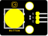 |
| ------------------------------------------------------------ | ------------------------------------------------------------ | ------------------------------------------------------------ |
| Raspberry Pi Pico Board*1                                    | Raspberry Pi Pico Expansion Board*1                          | DIY Button Module*1                                          |
|  | 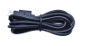 |                                                              |
| 3P Dupont Wire*1                                             | Micro USB Cable*1                                            |                                                              |


**Connection Diagram**


**Test Code**

```python
'''
 * Keyestudio 37 in 1 Starter Kit for Raspberry Pi Pico
 * lesson 4
 * button
 * http://www.keyestudio.com
'''
from machine import Pin
import time

button = Pin(15, Pin.IN, Pin.PULL_UP)

while True:
    if button.value() == 0:
        print("You pressed the button!")   
    else:
        print("You loosen the button!")
    time.sleep(0.1) 
```

**Code Explanation**

**button = Pin(15, Pin.IN, Pin.PULL\_UP),** we define the pin of the button as GP15 and set to PULL-UP mode

We can use **button = Pin(15, Pin.IN) to set INPUT mode,** at this time, the pins are in high resistance state.

1.  **button.value(),** read levels of buttons. Function returns High or Low

2.  **if..else.. sentence,** when the logic judge is TRUE, the code under the if will be activated; otherwise, the code udder the else will be activated.

3.  When pico detects the button pressed, the signal end is low level (GP 15 is low level). **button.value() is 0.** If pico detects the button unpressed, **button.value()** is 1 and else sentence will be activated.

**Test Result**

Upload the test code successfully. After powering on the USB cable, open the serial monitor and set the baud rate to 9600. The serial monitor will display the corresponding data and characters. 

When the button is pressed, val is 0，the monitor will show“Press the button”；when the button is released，val is 1，the monitor will show“Loosen the button”; as shown below


Project 5: Capacitive Sensor


**Description**

In this kit, there is a capacitive touch module which mainly uses a TTP223-BA6 chip. It is a touch detection chip, which provides a touch button, and its function is to replace the traditional button with a variable area button. 

When we power on, the sensor needs about 0.5 seconds to stabilize. Do not touch the keys during this time period. At this time, all functions are disabled, and self-calibration is always performed. The calibration period is about 4 seconds. We display the test results in the shell.

**Working Principle**


When our fingers touch the module, the signal S outputs high levels, the red LED on the module flashes. We can determine if the button is pressed or not by reading high and low levels on the sensor.

**Required Components**

|  |  |  |
| :----------------------------------------------------------: | :----------------------------------------------------------: | :----------------------------------------------------------: |
|                  Raspberry Pi Pico Board*1                   |             Raspberry Pi Pico Expansion Board*1              |              Keyestudio DIY Capacitive Module*1              |
|  |  |                                                              |
|                       3P Dupont Wire*1                       |                      Micro USB Cable*1                       |                                                              |


**Connection Diagram**


**Test Code**

```python
'''
 * Keyestudio 37 in 1 Starter Kit for Raspberry Pi Pico
 * lesson 5
 * Touch sensor
 * http://www.keyestudio.com
'''
from machine import Pin
import time

button = Pin(3, Pin.IN, Pin.PULL_UP)

while True:
    if button.value() == 1:
        print("You pressed the button!")   
    else:
        print("You loosen the button!")
    time.sleep(0.1) 
```

**Code Explanation**

When we touch the sensor, the Shell monitor will show “You pressed the button\!”, if not,“You loosen the button\!”will be shown on the monitor.

**Test Result**

The shell monitor shows corresponding data and characters. In the experiment, when the button is pressed, the red LED lights up and val is 1.Then the shell shows “You pressed the button!”; if the button is released, the red LED is off and val is 0;“You loosen the button!”will be displayed.


Project 6: Obstacle Avoidance Sensor


**Overview**

In this kit, there is a Keyestudio obstacle avoidance sensor, which mainly uses an infrared emitting and a receiving tube. 

In the experiment, we will determine whether there is an obstacle by reading the high and low level of the S terminal on the sensor.

**Working Principle**

NE555 circuit provides IR signals with frequency to the emitter TX, then the IR signals will fade with the increase of transmission distance. If encountering the obstacle, it will be reflected back.

When the receiver RX meets the weak signals reflected back, the receiving pin will output high levels, which indicates the obstacle is far away. 

On the contrary, it the reflected signals are stronger, low levels will be output, which represents the obstacle is close. There are two potentiometers on the module, and one is for adjusting emission power, another one is for receiving frequency.


**Components**

|  |  |  |
| ------------------------------------------------------------ | ------------------------------------------------------------ | ------------------------------------------------------------ |
| Raspberry Pi Pico Board*1                                    | Raspberry Pi Pico Expansion Board*1                          | DIY Obstacle Avoidance Sensor*1                              |
|  |  |                                                              |
| 3P Dupont Wire*1                                             | Micro USB Cable*1                                            |                                                              |


**Connection Diagram**


**Test Code**

```python
'''
 * Keyestudio 37 in 1 Starter Kit for Raspberry Pi Pico
 * lesson 6
 * Infrared obstacle avoidance sensor
 * http://www.keyestudio.com
'''
from machine import Pin
import time

sensor = Pin(16, Pin.IN)
while True:
    if sensor.value() == 0:
        print("There are obstacles")
    else:
        print("All going well")
    time.sleep(0.1)
```


**Note:**

Upload the test code and wire up according to the connection diagram. After powering on, we start to adjust the two potentiometers to sense distance.

1.  Adjust the potentiometer transmitting power. Make the P LED at the critical point of ON and OFF states.

2. Adjust the potentiometer receiving frequency. Rotate it clockwise, the frequency will increase. Make the S LED at the critical point of ON and OFF states, then the 38KHz square wave can be produced.

**Test Result**

Upload the code and open the Shell monitor. When the sensor detects the obstacle, the monitor will show“There are obstacles”; if the obstacle is not detected,“All going well”will be shown.


Project 7: Line Tracking Sensor


**Description**

In this kit, there is a DIY electronic building block single-channel line tracking sensor which mainly uses a TCRT5000 reflective black and white line recognition sensor element.

In the experiment, we judge the color (black and white) of the object detected by the sensor by reading the high and low levels of the S terminal on the module; and display the test results on the shell. 

**Working Principle**


When a black or no object is detected, the signal terminal will output high levels; when white object is detected, the signal terminal is low level; its detection height is 0-3cm. 

We can adjust the sensitivity by rotating the potentiometer on the sensor. When the potentiometer is rotated, the sensitivity is best when the red LED on the sensor is at the critical point between off and on. 

**Required Components**

|  |  |  |
| ------------------------------------------------------------ | ------------------------------------------------------------ | ------------------------------------------------------------ |
| Raspberry Pi Pico Board*1                                    | Raspberry Pi Pico Expansion Board*1                          | Keyestudio DIY Line Tracking Sensor*1                        |
|  |  |                                                              |
| 3P Dupont Wire*1                                             | Micro USB Cable*1                                            |                                                              |


**Connection Diagram**


**Test Code**

```python
'''
 * Keyestudio 37 in 1 Starter Kit for Raspberry Pi Pico
 * lesson 7
 * Line Tracking sensor
 * http://www.keyestudio.com
'''
from machine import Pin
import time

sensor = Pin(3, Pin.IN, Pin.PULL_UP)

while True:
    if sensor.value() == 0:
        print("0   White")
    else:
        print("1   Black")
    time.sleep(0.1) 
```


**Test Result**

Upload test code, the shell displays the corresponding data and characters. 

In the experiment, when the sensor doesn’t detect an object or detects a black object, the val is 1, and the shell will display "Black" ; when a white object (can reflect light) is detected, the val is 0, and the shell displays  "White" ;


Project 8: Photo Interrupter


**Description**

This kit contains a photo interrupter which mainly uses 1 ITR-9608 photoelectric switch. It is a photoelectric switch optical switch sensor.

**Working Principle**

When the paper is put in the slot, C is connected with VCC and the signal end S of the sensor are high levels; then the red LED will be off. Otherwise, the red LED will be on.


**Required Components**

|  |  |  |
| ------------------------------------------------------------ | ------------------------------------------------------------ | ------------------------------------------------------------ |
| Raspberry Pi Pico Board*1                                    | Raspberry Pi Pico Expansion Board*1                          | Keyestudio DIY Photo Interrupter*1                           |
|  |  |                                                              |
| 3P Dupont Wire*1                                             | Micro USB Cable*1                                            |                                                              |


**Connection Diagram**


**Test Code**

```python
'''
 * Keyestudio 37 in 1 Starter Kit for Raspberry Pi Pico
 * lesson 8
 * Photo_Interrupt
 * http://www.keyestudio.com
'''
from machine import Pin
import time

sensor = Pin(3, Pin.IN, Pin.PULL_UP)
lastState = 0
PushCounter = 0

while True:
    State = sensor.value()
    if  State != lastState:
        if State == 1:
            PushCounter += 1
            print(PushCounter)
    lastState = State
```

**Code Explanation**

Logic setting:

<table>
<tbody>
<tr class="odd">
<td>Initial Setting</td>
<td>Set PushCounter to 0</td>
<td></td>
</tr>
<tr class="even">
<td></td>
<td>Set State to 0 (value of the sensor)</td>
<td></td>
</tr>
<tr class="odd">
<td></td>
<td>Set lastState to 0</td>
<td></td>
</tr>
<tr class="even">
<td>when an object enters the slot</td>
<td>lastState is 0，State turns into 1; lastState turns into 1</td>
<td><p>Set PushCounter to PushCounter+1</p>
<p>print the value of PushCounter</p></td>
</tr>
<tr class="odd">
<td>when the object leaves the slot</td>
<td>lastState is 1，State becomes 0，two data are not equal，lastState turns into 0.</td>
<td><p>PushCounterdoesn’t change;</p>
<p>Don’t print the value of PushCounter</p></td>
</tr>
<tr class="even">
<td>When the object goes through this slot again</td>
<td>lastState is 0, State becomes 1，two data are not equal，lastState turns into 1.</td>
<td><p>Set PushCounter to PushCounter+1</p>
<p>And print the value of PushCounter</p></td>
</tr>
<tr class="odd">
<td>When the object leaves this slot again</td>
<td>lastState is 1，State turns into 0，two data are not equal lastState turns into 0</td>
<td><p>PushCounter doesn’t change;</p>
<p>Don’t print the PushCounter value</p></td>
</tr>
</tbody>
</table>
**Test Result**

Wire up, upload test code, and the shell displays the PushCounter data.

Every time when the object passes through the slot of the sensor, the PushCounter data will increase by 1 continuously, as shown below;


**Project 9: Tilt Module**


**Overview**

In this kit, there is a Keyestudio tilt sensor. The tilt switch can output signals of different levels according to whether the module is tilted. There is a ball inside. When the switch is higher than the horizontal level, the switch is turned on, and when it is lower than the horizontal level, the switch is turned off. This tilt module can be used for tilt detection, alarm or other detection. 

**Working Principle**


The working principle is pretty simple. When pin 1 and 2 of the ball switch P1 are connected, the signal S is low level and the red LED will light up; when they are disconnected, the pin will be pulled up by the 4.7K R1 and make S a high level, then LED will be off.

**Components**

|  |  |  |
| ------------------------------------------------------------ | ------------------------------------------------------------ | ------------------------------------------------------------ |
| Raspberry Pi Pico Board*1                                    | Raspberry Pi Pico Expansion Board*1                          | Tilt Sensor*1                                                |
|  |  |                                                              |
| 3P Dupont Wire*1                                             | Micro USB Cable*1                                            |                                                              |


**Connection Diagram**


**Test Code**

```python
'''
 * Keyestudio 37 in 1 Starter Kit for Raspberry Pi Pico
 * lesson 9
 * Tilt switch
 * http://www.keyestudio.com
'''
from machine import Pin
import time

TiltSensor = Pin(17, Pin.IN)

while True:
    value = TiltSensor.value()
    print(value, end = " ")
    if  value== 0:
        print("The switch is turned on")
    else:
        print("The switch is turned off")
    time.sleep(0.1)
```

**Test Result**

Upload the test code and observe Shell

When the tilt module is inclined to one side, the red LED on the module will be off and the monitor will display“1 The switch is turned off”. In contrast, if you make it incline the other side, the red LED will light up and the monitor will display“0 The switch is turned on”.


Project 10: Hall Sensor


**Description**

In this kit, there is a Hall sensor which mainly adopts a A3144 linear Hall element. The element P1 is composed of a voltage regulator, a Hall voltage generator, a differential amplifier, a Schmitt trigger, a temperature compensation circuit and an open-collector output stage.  

In the experiment, we use the Hall sensor to detect the magnetic field and display the test results on the shell.


**Working Principle**

When the sensor detects no magnetic field or a north pole magnetic field, the signal terminal will be high level; when it senses a south pole magnetic field, the signal terminal will be low levels. 

The stronger the magnetic field strength is, induction distance is longer.

**Required Components**

|  |  |  |
| ------------------------------------------------------------ | ------------------------------------------------------------ | ------------------------------------------------------------ |
| Raspberry Pi Pico Board*1                                    | Raspberry Pi Pico Expansion Board*1                          | DIY Hall Sensor*1                                            |
|  |  |                                                              |
| 3P Dupont Wire*1                                             | Micro USB Cable*1                                            |                                                              |


**Connection Diagram**


**Test Code**

```python
'''
 * Keyestudio 37 in 1 Starter Kit for Raspberry Pi Pico
 * lesson 10
 * Hall magnetic
 * http://www.keyestudio.com
'''
from machine import Pin
import time

hall = Pin(5, Pin.IN)
while True:
    value = hall.value()
    print(value, end = " ")
    if value == 0:
        print("A magnetic field")
    else:
        print("There is no magnetic field")
    time.sleep(0.1)
```

**Test Result**

Upload the test code, when the sensor detects no magnetic fields or the north pole magnetic field, Shell will show“1 There is no magnetic field”and the LED on the sensor will be off; When it detects the south pole magnetic field, the Shell will show“0 A magnetic field”and the LED on the sensor will be off.

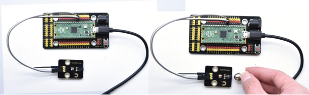


Project 11: Reed Switch Module


**Overview**

In this kit, there is a Keyestudio reed switch module, which mainly uses a MKA10110 green reed component.

The reed switch is the abbreviation of the dry reed switch. It is a passive electronic switch element with contacts.  

It has the advantages of simple structure, small size and easy control.

Its shell is a sealed glass tube with two iron elastic reed electric plates.

In the experiment, we will determine whether there is a magnetic field near the module by reading the high and low level of the S terminal on the module; and, we display the test result in the shell.


**Working Principle**


Reed switch is an abbreviation of the dry reed contacts a passive

electronic switching elements, and has the advantages of simple structure, small size and ease of control, its shell is a sealed glass tube, the tubes are installed two iron elastic reed plate, but also filling called rhodium metal inert gas. In peacetime, the glass tube in the two reeds made of special materials are separated. 

When a magnetic substance close to the glass tube, in the role of the magnetic field lines, the pipe within the two reeds are magnetized to attract each other in contact, the reed will suck together, so that the junction point of the connected circuit communication. After the disappearance of the outer magnetic reed because of their flexibility and separate, the line is disconnected. 

Therefore, as a use of the magnetic field signals to control the line switching device, reed tube can be used as a sensor for counting the number, spacing, etc., and also are widely used in a variety of communication devices.


**Components**

|  |  |  |
| ------------------------------------------------------------ | ------------------------------------------------------------ | ------------------------------------------------------------ |
| Raspberry Pi Pico Board*1                                    | Raspberry Pi Pico Expansion Board*1                          | Keyestudio DIY Reed Switch干Module*1                         |
|  |  |                                                              |
| 3P Dupont Wire*1                                             | Micro USB Cable*1                                            |                                                              |


**Connection Diagram**


**Test Code**

```python
'''
 * Keyestudio 37 in 1 Starter Kit for Raspberry Pi Pico
 * lesson 11
 * Reed Switch
 * http://www.keyestudio.com
'''
from machine import Pin
import time

ReedSensor = Pin(18, Pin.IN)
while True:
    value = ReedSensor.value()
    print(value, end = " ")
    if value == 0:
        print("A magnetic field")
    else:
        print("There is no magnetic field")
    time.sleep(0.1)
```


**Test Result**

Upload the code and observe the Shell monitor. 

When the sensor detects a magnetic field, val is 0 and the red LED of the module lights up, "A magnetic field" will be displayed; when no magnetic field is detected, val is 1, and the LED on the module goes out, "There is no magnetic field" will be shown, as shown below.


Project 12: PIR Motion Sensor


**Overview**

In this kit, there is a Keyestudio PIR motion sensor, which mainly uses an RE200B-P sensor elements. It is a human body pyroelectric motion sensor based on pyroelectric effect, which can detect infrared rays emitted by humans or animals, and the Fresnel lens can make the sensor's detection range farther and wider.

In the experiment, we determine if there is someone moving nearby by reading the high and low levels of the S terminal on the module. The detected results will be displayed on the Shell.


**Working Principle**

The upper left part is voltage conversion(VCC to 3.3V). The working voltage of sensors we use is 3.3V, therefore we can’t use 5V directly. The voltage conversion circuit is needed.

When no person is detected or no infrared signal is received, and pin 1 of the sensor outputs low level. At this time, the LED on the module will light up and the MOS tube Q1 will be connected and the signal terminal S will detect Low levels. 

When one is detected or an infrared signal is received, and pin 1 of the sensor outputs a high level. Then LED on the module will go off, the MOS tube Q1 is disconnected and the signal terminal S will detect high levels.


**Required Components**

|  |  | 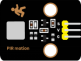 |
| ------------------------------------------------------------ | ------------------------------------------------------------ | ------------------------------------------------------------ |
| Raspberry Pi Pico Board*1                                    | Raspberry Pi Pico Expansion Board*1                          | DIY PIR Motion Sensor*1                                      |
|  |  |                                                              |
| 3P Dupont Wire*1                                             | Micro USB Cable*1                                            |                                                              |


**Connection Diagram**


**Test Code**

```python
'''
 * Keyestudio 37 in 1 Starter Kit for Raspberry Pi Pico
 * lesson 12
 * PIR motion
 * http://www.keyestudio.com
'''
from machine import Pin
import time

PIR = Pin(19, Pin.IN)
while True:
    value = PIR.value()
    print(value, end = " ")
    if value == 1:
        print("Some body is in this area!")
    else:
        print("No one!")
    time.sleep(0.1)
```

**Test Result**

Upload the code and open the Shell monitor. When the sensor detects someone nearby, value is 1, the LED will go off and the monitor will show“Somebody is in this area!”. On the contrary, the value is 0, the LED will go up and“0 No one!”will be shown.


Project 13: Active Buzzer


**Overview**

In this kit, it contains an active buzzer module and a power amplifier module (the principle is equivalent to a passive buzzer). In this experiment, we control the active buzzer to emit sounds. Since it has its own oscillating circuit, the buzzer will automatically sound if given large voltage.


**Working Principle**


From the schematic diagram, the pin of buzzer is connected to a resistor R2 and another port is linked with a NPN triode Q1. So, if this triode Q1 is powered, the buzzer will sound.

If the base electrode of the triode connected to the R1 resistor is a high level, the triode Q1 will be connected. If the base electrode is pulled down by the resistor R3, the triode is disconnected. 

When we output a high level from the IO port to the triode, the buzzer will emit sounds; if outputting low levels, the buzzer won’t emit sounds.


**Components**

|  |  |  |
| ------------------------------------------------------------ | ------------------------------------------------------------ | ------------------------------------------------------------ |
| Raspberry Pi Pico Board*1                                    | Raspberry Pi Pico Expansion Board*1                          | Active Buzzer*1                                              |
|  |  |                                                              |
| 3P Dupont Wire*1                                             | Micro USB Cable*1                                            |                                                              |


**Connection Diagram**


**Test Code**

```python
'''
 * Keyestudio 37 in 1 Starter Kit for Raspberry Pi Pico
 * lesson 13
 * Active buzzer
 * http://www.keyestudio.com
'''
from machine import Pin
import time

buzzer = Pin(20, Pin.OUT)
while True:
    buzzer.value(1)
    time.sleep(1)
    buzzer.value(0)
    time.sleep(1)
```

**Code Explanation**

In the experiment, we set the pin number to 20. When setting to high, the active buzzer will beep; when setting to low, the active buzzer will stop emitting sounds.


**Test Result**

Upload the code and power on. The active buzzer will emit sound for 1 second, and stop for 1 second.


Project 14: 8002b Audio Power Amplifier


**Overview**

In this kit, there is a Keyestudio 8002b audio power amplifier. The main components of this module are an adjustable potentiometer, a speaker, and an audio amplifier chip;

The main function of this module is: it can amplify the output audio signal, with a magnification of 8.5 times, and play sound or music through the built-in low-power speaker, as an external amplifying device for some music playing equipment.

In the experiment, we used the 8002b power amplifier speaker module to emit sounds of various frequencies. 


**Working Principle**

In fact, it is similar to a passive buzzer. The active buzzer has its own oscillation source.

Yet, the passive buzzer does not have internal oscillation. When controlling the circuit, we need to input square waves of different frequencies to the positive pole of the component and ground the negative pole to control the buzzer to chime sounds of different frequencies.


**Components**

|  |  | 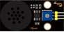 |
| ------------------------------------------------------------ | ------------------------------------------------------------ | ------------------------------------------------------------ |
| Raspberry Pi Pico Board*1                                    | Raspberry Pi Pico Expansion Board*1                          | 8002b Audio Power Amplifier*1                                |
|  |  |                                                              |
| 3P Dupont Wire*1                                             | Micro USB Cable*1                                            |                                                              |


**Connection Diagram**


**Test Code**

```python
'''
 * Keyestudio 37 in 1 Starter Kit for Raspberry Pi Pico
 * lesson 14
 * Passive buzzer
 * http://www.keyestudio.com
'''
from machine import Pin, PWM
from time import sleep
buzzer = PWM(Pin(21))

buzzer.duty_u16(1000)

buzzer.freq(523)#DO
sleep(0.5)
buzzer.freq(586)#RE
sleep(0.5)
buzzer.freq(658)#MI
sleep(0.5)
buzzer.freq(697)#FA
sleep(0.5)
buzzer.freq(783)#SO
sleep(0.5)
buzzer.freq(879)#LA
sleep(0.5)
buzzer.freq(987)#SI
sleep(0.5)
buzzer.duty_u16(0)
```

**Code Explanation**

1. In this experiment, we use the PWM class of the machine module, buzzer = PWM(Pin(21)) to create an instance of the PWM class, and the buzzer pin is connected to GP21.
2. The buzzer.duty\_u16(1000): set the duty cycle, and the duty cycle is 1000/65535. The larger the value, the louder the buzzer. When set to 0, the buzzer does not emit sound. **buzzer.freq()** is the frequency setting method.

In the experiment, we use the PWM on the machine module. 
$$
Buzzer = PWM(Pin(21))
$$


**Test Result**

Upload the test code successfully and power on. The power amplifier module will emit the sound of the corresponding frequency corresponding to the beat:

DO for 0.5s, Re for 0.5s, Mi for 0.5s, Fa for 0.5s, So for 0.5s, La 0.5s and Si for 0.5s


Project 15: 130 Motor


**Description**

The 130 motor driver module is compatible with servo motors, which has high efficiency and good quality fans. 

It adopts a HR1124S motor control chip. HR1124S is a single-channel H-bridge driver chip for DC motor solutions. In addition, this chip has low standby current and low quiescent current.

 The module is compatible with various single-chip control boards. In the experiment, we can control the rotation direction of the motor by outputting the voltage directions of the two signal terminals IN+ and IN- to make the motor rotate. 

**Working Principle**

The chip is used to help drive the motor. 

We can’t drive it with a triode or an IO port due to its a large current of need. It is very simple to make the motor rotate. Just apply voltage to both ends of the motor. The direction of the motor is different in different voltage directions. Within the rated voltage, the higher the voltage, the faster the motor rotates; on the contrary, the lower the voltage, the slower the motor rotates, or even unable to rotate. 

So we can use the PWM port to control the speed of the motor. We haven't learned PWM here, so we use the high and low levels to control the motor first.


**Required Components**

|  |  |  |
| ------------------------------------------------------------ | ------------------------------------------------------------ | ------------------------------------------------------------ |
| Raspberry Pi Pico Board*1                                    | Raspberry Pi Pico Expansion Board*1                          | DIY 130 Motor*1                                              |
|  |  |                                                              |
| 4P Dupont Wire*1                                             | Micro USB Cable*1                                            |                                                              |

Note: the motor is separated with its fan, you need to assemble it first.


**Connection Diagram**


**Test Code**

```python
'''
 * Keyestudio 37 in 1 Starter Kit for Raspberry Pi Pico
 * lesson 15
 * 130-DC Motor
 * http://www.keyestudio.com
'''
from machine import Pin
import time

#two pins of the motor
INA = Pin(14, Pin.OUT)
INB = Pin(15, Pin.OUT)

while True:
    #turn anticlockwise for 2s
    INA.value(1)
    INB.value(0)
    time.sleep(2)
    #stop 1s
    INA.value(0)
    INB.value(0)
    time.sleep(1)
    #turn clockwise for 2s
    INA.value(0)
    INB.value(1)
    time.sleep(2)
    #stop 1s
    INA.value(0)
    INB.value(0)
    time.sleep(1)
```


**Code Explanation**

Set pins to 14 and 15, when the pin 14 outputs high levels and the pin 15 outputs low levels, the motor will rotate counterclockwise; when both pins are set to low, the motor stops rotating. 


**Test Result**

Wire up, upload test code and test the 130 motor, the fan will rotate counterclockwise for 2 seconds, stop for 1 second; and rotate clockwise for 2 seconds and stop for 1 second; cycle alternately.


Project 16: RGB Module


**Overview**

Among these modules is a RGB module. It adopts a F10-full color RGB foggy common cathode LED. We connect the RGB module to the PWM port of MCU and the other pin to GND(for common anode RGB, the rest pin will be connected to VCC). So what is PWM?

PWM is a means of controlling the analog output via digital means. Digital control is used to generate square waves with different duty cycles (a signal that constantly switches between high and low levels) to control the analog output.

In general, the input voltages of ports are 0V and 5V. What if the 3V is required? Or a switch among 1V, 3V and 3.5V? We cannot change resistors constantly. For this reason, we resort to PWM. 


For Arduino digital port voltage outputs, there are only LOW and HIGH levels, which correspond to the voltage outputs of 0V and 5V respectively. You can define LOW as“0”and HIGH as“1’, and let the Arduino output five hundred ”0“ or “1” within 1 second. If output five hundred ”1“, that is 5V; if all of which is ”0“,that is 0V; if output 250 01 pattern, that is 2.5V. 

This process can be likened to showing a movie. The movie we watch are not completely continuous. Actually, it generates 25 pictures per second, which cannot be told by human eyes. 

Therefore, we mistake it as a continuous process. PWM works in the same way. To output different voltages, we need to control the ratio of 0 and 1. The more‘0’or‘1’ output per unit time, the more accurate the control.

**Working Principle**

For our experiment, we will control the RGB module to display different colors through three PWM values.


**Components**


|  |  |  |
| ------------------------------------------------------------ | ------------------------------------------------------------ | ------------------------------------------------------------ |
| Raspberry Pi Pico Board*1                                    | Raspberry Pi Pico Expansion Board*1                          | Common Cathode RGB Module *1                                 |
|  |  |                                                              |
| 4P Dupont Wire*1                                             | Micro USB Cable*1                                            |                                                              |


**Connection Diagram**


**Test **Code

**Code 1：**

```python
'''
 * Keyestudio 37 in 1 Starter Kit for Raspberry Pi Pico
 * lesson 16.1
 * RGB
 * http://www.keyestudio.com
'''
from machine import Pin
from time import sleep

red = Pin(9, Pin.OUT)
green = Pin(10, Pin.OUT)
blue = Pin(11, Pin.OUT)

while 1:
    red.value(1)
    green.value(0)
    blue.value(0)
    sleep(1)
    red.value(0)
    green.value(1)
    blue.value(0)
    sleep(1)
    red.value(0)
    green.value(0)
    blue.value(1)
    sleep(1)
```

**Code 2：**

```python
'''
 * Keyestudio 37 in 1 Starter Kit for Raspberry Pi Pico
 * lesson 16.2
 * RGB
 * http://www.keyestudio.com
'''
from machine import Pin, PWM
from time import sleep
pwm_r = PWM(Pin(9))
pwm_g = PWM(Pin(10))
pwm_b = PWM(Pin(11))

pwm_r.freq(1000)
pwm_g.freq(1000)
pwm_b.freq(1000)

def light(red, green, blue):
    pwm_r.duty_u16(red)
    pwm_g.duty_u16(green)
    pwm_b.duty_u16(blue)

while 1:
    light(65535, 0, 0)
    sleep(1)
    light(65535, 25088, 0)
    sleep(1)
    light(65535, 65535, 0)
    sleep(1)
    light(0, 65535, 0)
    sleep(1)
    light(0, 0, 65535)
    sleep(1)
    light(0, 65535, 65535)
    sleep(1)
    light(41216, 8448, 61696)
    sleep(1)
```

**Explanation**

**Code 1：**

In the code 1, red, green and blue represent the red, green and blue ports. According to the wiring diagram, we have connected to GP9, GP10 and GP11,then set to 9, 10 and 11.Use the function **value(1)** to set three LEDs.If the corresponding digital port is high level, and the corresponding LED will be on.

The RGB module displays red color for 1 second, green color for 1 second, and blue color for 1 second, cycle alternately.

**Code 2：**

In the code 2, we use PWM output, and set **frequency to .freq(1000)。.duty\_u16()**

The number in the brackets means the proportion of the color of LED. The larger the duty cycle data we set, the larger the proportion of the color.

**Note: the duty cycle above we set is maximum to .duty\_u16(65535), this value is 256\*256 - 1, that is 0\~65535. As for the following the RGB color table, you only need to make values below multiply by 256**

In the experiment, we adjust the ratio of red, green and blue colors on the RGB LED by setting the corresponding values, so as to control the RGB LED to display corresponding colors. So theoretically, there are 256*256*256 colors that can be set (for details, please refer to the common RGB color table below) 

**RGB Color Chart**

 

**Test Result**

Upload the code 1, the RGB on the module will show red, green and bluecolor with an interval of 1s.

Upload the code 2, the RGB on the module will show red, orange, yellow, green, cyan-blue, blue, purple and white color with an interval of 1s.


Project 17: Potentiometer


**Overview**

The following we will introduce is the Keyestudio rotary potentiometer which is an analog sensor.

The digital IO ports can read the voltage value between 0 and 3.3V and the module only outputs high levels. However, the analog sensor can read the voltage value through ADC analog ports(GP26~GP28) on the pico board.

In the experiment, we will display the test results on the Shell.


**Working Principle**

It uses a 10K adjustable resistor. We can change the resistance by rotating the potentiometer. The signal S can detect the voltage changes(0-3.3V) which are analog quantity.

**Components**

|  |  |  |
| ------------------------------------------------------------ | ------------------------------------------------------------ | ------------------------------------------------------------ |
| Raspberry Pi Pico Board*1                                    | Raspberry Pi Pico Expansion Board*1                          | Rotary Potentiometer*1                                       |
|  |  |                                                              |
| 3P Dupont Wire*1                                             | Micro USB Cable*1                                            |                                                              |


**Connection Diagram**


**Test Code**

```python
'''
 * Keyestudio 37 in 1 Starter Kit for Raspberry Pi Pico
 * lesson 17
 * Rotary potentiometer
 * http://www.keyestudio.com
'''
import machine
import utime

potentiometer = machine.ADC(26)

while True:
    pot_value = potentiometer.read_u16()
    print(pot_value)
    utime.sleep(0.1)
```

**Code Explanation**

In the experiment, we will create ADC example, connect GP26 ADC(26). That means ADC(0).

**.read\_u16()** is used to read analog values, in the range of 0\~65535.

**potentiometer.read\_u16()** means that reading the analog value of ADC(26) pin then assign it to the variable pot\_value

**utime.sleep()** is the delay function which works as same as the function time.sleep()


**Test Result**

Upload the code power up by a USB cable, open the serial monitor and set baud rate to 9600. 

In the experiment, rotate the potentiometer clockwise, the analog value increases, and turn the potentiometer counterclockwise, the analog value decreases(0-4095), as shown in the figure below. 


Project 18: Steam Sensor


**Description**

This is a commonly used steam sensor. Its principle is to detect the amount of water by bare printed parallel lines on the circuit board. The more the water is, the more wires will be connected. As the conductive contact area increases, the output voltage will gradually rise. It can detect water vapor in the air as well. The steam sensor can be used as a rain water detector and level switch. When the humidity on the sensor surface surges, the output voltage will increase.

In the experiment, we connect the signal terminal (S terminal) of the sensor to the analog port of the pico development board. The analog value detected will be displayed on the serial monitor.

This is a DIY electronic building block water drop sensor. It is an analog (digital) input module, also called rain, rain sensor. It can be used to monitor various weather conditions, detect whether it is raining and the amount of rain, convert it into digital signal (DO) and analog signal (AO) output, and is widely used in Arduino robot kits, raindrops, rain sensors, and can be used for various It can monitor various weather conditions, and convert it into digital signal and AO output, and can also be used for automobile automatic wiper system, intelligent lighting system and intelligent sunroof system. 

In the experiment, we input the sensor signal terminal (S terminal) to the analog port of the pico development board, sense the change of the analog value, and display the corresponding analog value on the shell.

**Working Principle**

Its principle is to detect the amount of water through the exposed printed parallel lines on the circuit board. The more water there is, the more wires will be connected, and the conductive contact area increases. The voltage output by pin 2 will gradually increase. The larger the analog value detected by the signal terminal S is.

It can also detect steam in the air. Two position holes are used to install on the other devices


**Required Components**

|  |  |  |
| ------------------------------------------------------------ | ------------------------------------------------------------ | ------------------------------------------------------------ |
| Raspberry Pi Pico Board*1                                    | Raspberry Pi Pico Expansion Board*1                          | DIY Steam Sensor *1                                          |
|  |  |                                                              |
| 3P Dupont Wire*1                                             | Micro USB Cable*1                                            |                                                              |


**Connection Diagram**


**Test Code**

```python
'''
 * Keyestudio 37 in 1 Starter Kit for Raspberry Pi Pico
 * lesson 18
 * Steam sensor
 * http://www.keyestudio.com
'''
import machine
import utime

sensor = machine.ADC(26)#ADC0

while True:
    value = sensor.read_u16()
    print(value)
    utime.sleep(0.1)
```


**Test Result**

Wire up, run the test code, then the output analog value is displayed in the shell. The more water volume, the greater the output voltage and the analog value, as shown below.


Project 19: Sound Sensor


**Overview**

In this kit, there is a sound sensor. In the experiment, we test the analog value corresponding to the sound level in the current environment with it. The louder the sound, the larger the analog value.

**Working Principle**


It uses a high-sensitive microphone component and an LM386 chip.

We build the circuit with the LM386 chip and amplify the sound through the high-sensitive microphone. In addition, we can adjust the sound volume by the potentiometer. Rotate it clockwise, the sound will get louder.


**Components**

|  |  |  |
| ------------------------------------------------------------ | ------------------------------------------------------------ | ------------------------------------------------------------ |
| Raspberry Pi Pico Board*1                                    | Raspberry Pi Pico Expansion Board*1                          | DIY Sound Sensor*1                                           |
|  |  |                                                              |
| 3P Dupont Wire*1                                             | Micro USB Cable*1                                            |                                                              |


**Connection Diagram**


**Test Code**

```python
'''
 * Keyestudio 37 in 1 Starter Kit for Raspberry Pi Pico
 * lesson 19
 * MicroPhone
 * http://www.keyestudio.com
'''
import machine
import utime

MicroPhone = machine.ADC(27)
while True:
    value = MicroPhone.read_u16()
    print(value)
    utime.sleep(0.1)
```

**Test Result**

Upload the code and observe the analog value on the Shell monitor.

Rotate clockwise the potentiometer and speak at the MIC. Then you can see the analog value get larger, as shown below


Project 20: Photoresistor


**Description**

In this kit, there is a photoresistor which consists of photosensitive resistance elements. Its resistance changes with the light intensity. 

Also, it converts the resistance change into a voltage change through the characteristic of the photosensitive resistive element. When wiring it up, we interface its signal terminal (S terminal) with the analog port of pico , so as to sense the change of the analog value, and display the corresponding analog value in the shell.


**Working Principle**

If there is no light, the resistance is 0.2MΩ and the detected voltage at the terminal 2 is close to 0. When the light intensity increases, the resistance of photoresistor and detected voltage will diminish. 


**Components**

|  |  |  |
| ------------------------------------------------------------ | ------------------------------------------------------------ | ------------------------------------------------------------ |
| Raspberry Pi Pico Board*1                                    | Raspberry Pi Pico Expansion Board*1                          | DIY Photoresistor*1                                          |
|  |  |                                                              |
| 3P Dupont Wire*1                                             | Micro USB Cable*1                                            |                                                              |


**Connection Diagram**


**Test Code**

```python
'''
 * Keyestudio 37 in 1 Starter Kit for Raspberry Pi Pico
 * lesson 20
 * Photoresistance
 * http://www.keyestudio.com
'''
import machine
import utime

photoresistance = machine.ADC(28)
while True:
    value = photoresistance.read_u16()
    print(value)
    utime.sleep(0.1)
```

**Test Result**

Wire up, run the test code, observe the Shell monitor. Then you will view the analog value of the light intensity. The brighter the light, the greater the analog value.


Project 21: NTC-MF52AT Thermistor


**Overview**

In the experiment, there is a NTC-MF52AT analog thermistor. We connect its signal terminal to the analog port of the Raspberry Pi Pico Board and read the corresponding analog value. 

We can use analog values to calculate the temperature of the current environment through specific formulas. Since the temperature calculation formula is more complicated, we only read the corresponding analog value. 


**Working Principle**


This module mainly uses NTC-MF52AT thermistor elements. The NTC-MF52AT thermistor element can sense the changes of the surrounding environment temperature. Resistance changes with the temperature, causing the voltage of the signal terminal S to change. 

This sensor uses the characteristics of NTC-MF52AT thermistor element to  convert resistance changes into voltage changes. 


**Components**

|  |  |  |
| ------------------------------------------------------------ | ------------------------------------------------------------ | ------------------------------------------------------------ |
| Raspberry Pi Pico Board*1                                    | Raspberry Pi Pico Expansion Board*1                          | NTC-MF52AT Thermistor*1                                      |
|  |  |                                                              |
| 3P Dupont Wire*1                                             | Micro USB Cable*1                                            |                                                              |


**Connection Diagram**


**Test Code**

```python
'''
 * Keyestudio 37 in 1 Starter Kit for Raspberry Pi Pico
 * lesson 21
 * Temperature sensor
 * http://www.keyestudio.com
'''
import machine
import utime
import math

sensor = machine.ADC(0)
while True:
    temp = sensor.read_u16()
    print("Temperature ADC: ", end = " ")
    print(temp)
    utime.sleep(0.1)
```


**Test Result**

Upload the code and observe the Shell monitor. The higher the temperature, the larger the analog value.


Project 22: Thin-film Pressure Sensor


**Overview**

In this kit, there is a Keyestudio thin-film pressure sensor. The thin-film pressure sensor composed of a new type of nano pressure-sensitive material and a comfortable ultra-thin film substrate, has waterproof and pressure-sensitive functions.

In the experiment, we determine the pressure by collecting the analog signal on the S end of the module. The smaller the analog value, the greater the pressure; and the displayed results will shown on the Shell.

**Working Principle**

When the sensor is pressed by external forces, the resistance value of sensor will vary. We convert the pressure signals detected by the sensor into the electric signals through a circuit. Then we can obtain the pressure changes by detecting voltage signal changes.


**Components**

|  |  |  |
| ------------------------------------------------------------ | ------------------------------------------------------------ | ------------------------------------------------------------ |
| Raspberry Pi Pico Board*1                                    | Raspberry Pi Pico Expansion Board*1                          | Thin-film Pressure Sensor*1                                  |
|  |  |                                                              |
| 3P Dupont Wire*1                                             | Micro USB Cable*1                                            |                                                              |


**Connection Diagram**


**Test Code**

```python
'''
 * Keyestudio 37 in 1 Starter Kit for Raspberry Pi Pico
 * lesson 22
 * Film pressure sensor
 * http://www.keyestudio.com
'''
import machine
import utime

film = machine.ADC(1)
while True:
    value = film.read_u16()
    print(value)
    utime.sleep(0.1)
```

**Test Result**

Upload the code and observe the Shell monitor. When the thin-film is pressed by fingers, the analog value will decrease, as shown below;


Project 23: Flame Sensor


**Description**

In daily life, it is often seen that a fire broke out without any precaution. It will cause great economic and human loss. So how can we avoid this situation? Right, install a flame sensor and a speaker in those places that easily break out a fire. When the flame sensor detects a fire, the speaker will alarm people quickly to put out the fire.

So in this project, you will learn how to use a flame sensor and an active buzzer module to simulate the fire alarm system.   

**Working Principle**

This flame sensor can be used to detect fire or other light sources with wavelength stands at 760nm ~ 1100nm. Its detection angle is about 60°. You can rotate the potentiometer on the sensor to control its sensitivity. Adjust the potentiometer to make the LED at the critical point between on and off state. The sensitivity is the best.  

From the below figure, power up. When detecting fire, the digital pin outputs low levels, the red LED2 will light up first, the digital signal terminal D0 outputs a low level, and the red LED1 will light up. The stronger the external infrared light, the smaller the value; the weaker the infrared light, the larger the value.


**Required Components**

|  |  |  |
| ------------------------------------------------------------ | ------------------------------------------------------------ | ------------------------------------------------------------ |
| Raspberry Pi Pico Board*1                                    | Raspberry Pi Pico Expansion Board*1                          | DIY Flame Sensor*1                                           |
|  |  |                                                              |
| 4P Dupont Wire*1                                             | Micro USB Cable*1                                            |                                                              |


**Connection Diagram**


**Test Code**

```python
'''
 * Keyestudio 37 in 1 Starter Kit for Raspberry Pi Pico
 * lesson 23
 * Flame sensor
 * http://www.keyestudio.com
'''
import machine
import utime

flame_D = machine.Pin(22, machine.Pin.IN)
flame_A = machine.ADC(26)

while True:
    digitalVal = flame_D.value()
    analogVal = flame_A.read_u16()
    print(digitalVal, end = "  ")
    print(analogVal)
    utime.sleep(0.1)
```


**Code Explanation**

Two pins we use are defined as 22 and 26 according to the wiring-up diagram, and print digital signals and analog signals respectively.


**Test Result**

Upload the test code and power up, LED2 is on and LED1 is off.  Open the monitor and set baud rate to 9600. When fire is detected, LED1 will be on. the digital value will change from 1 to 0, and the analog value will become smaller, as shown in the figure below.


Project 24: MQ-2 Gas Sensor


**Description**

This analog gas sensor - MQ2 is used in gas leakage detecting equipment in consumer electronics and industrial markets.

This sensor is suitable for detecting LPG, I-butane, propane, methane, alcohol, Hydrogen and smoke. It has high sensitivity and quick response.

In addition, the sensitivity can be adjusted by rotating the potentiometer. 

In the experiment, we read the analog value at the A0 port and the D0 port to determine the content of gas.

**Working Principle**


The greater the concentration of smoke, the greater the conductivity, the lower the output resistance, the greater the output analog signal. 

When in use, the A0 terminal reads the analog value of the corresponding gas; the D0 terminal is connected to an LM393 chip (voltage comparator), we can adjust the alarm threshold of the measured gas through the potentiometer, and output the digital value at D0. 

When the measured gas content exceeds the critical point, the D0 terminal outputs a low level; when the measured gas content does not exceed the critical point, the D0 terminal outputs a high level.


**Required Components**

|  |  |  |
| ------------------------------------------------------------ | ------------------------------------------------------------ | ------------------------------------------------------------ |
| Raspberry Pi Pico Board*1                                    | Raspberry Pi Pico Expansion Board*1                          | DIY Analog Gas Sensor*1                                      |
|  |  |                                                              |
| 4P Dupont Wire*1                                             | Micro USB Cable*1                                            |                                                              |


**Connection Diagram**


**Test Code**

```python
'''
 * Keyestudio 37 in 1 Starter Kit for Raspberry Pi Pico
 * lesson 24
 * Gas sensor
 * http://www.keyestudio.com
'''
import machine
import utime

mq2_D = machine.Pin(22, machine.Pin.IN)
mq2_A = machine.ADC(26)

while True:
    digitalVal = mq2_D.value()
    analogVal = mq2_A.read_u16()
    print(digitalVal, end = "  ")
    print(analogVal, end = "  ")
    if digitalVal == 0:
        print("Exceeding")
    else:
        print("Normal")
    utime.sleep(0.1)
```


**Test Result**

Run the test code, the yellow-green LED on the module lights up, observe the shell, and display the corresponding data and characters. 

In the experiment, we can see that when the simulated value of the test is less than or equal to 45627, the gas content does not exceed the critical point, and the red LED is off; when the simulated value of the test is greater than or equal to 45627, the gas content exceeds the critical point, and the red LED lights up.

Then it means that the analog value of the critical point of gas content is between 43018-45627, we can adjust the critical point by rotating the potentiometer on the sensor.


Project 25: Joystick Module


**Overview**

Game handle controllers are ubiquitous. 

It mainly uses PS2 joysticks. When controlling it, we need to connect the X and Y ports of the module to the analog port of the single-chip microcomputer, port B to the digital port of the single-chip microcomputer, VCC to the power output port(3.3-5V), and GND to the GND of the MCU. We can read the high and low levels of two analog values and one digital port) to determine the working status of the joystick on the module.

In the experiment, two analog values(x axis and y axis) will be shown on Shell.

**Working Principle**


In fact, its working principle is very simple. Its inside structure is equivalent to two adjustable potentiometers and a button. When this button is not pressed and the module is pulled down by R1, low levels will be output; on the contrary, when the button is pressed, VCC will be connected (high levels), When we move the joystick, the internal potentiometer will adjust to output different voltages, and we can read the analog value.


**Components**

|  |  |  |
| ------------------------------------------------------------ | ------------------------------------------------------------ | ------------------------------------------------------------ |
| Raspberry Pi Pico Board*1                                    | Raspberry Pi Pico Expansion Board*1                          | Joystick Module*1                                            |
|  |  |                                                              |
| 5P Dupont Wire*1                                             | Micro USB Cable*1                                            |                                                              |


**Connection Diagram**


**Test Code**

    '''
     * Keyestudio 37 in 1 Starter Kit for Raspberry Pi Pico
     * lesson 26
     * Joystick
     * http://www.keyestudio.com
    '''
    import machine
    import utime
    
    B = machine.Pin(22, machine.Pin.IN)
    X = machine.ADC(26)
    Y = machine.ADC(27)
    while True:
        B_value = B.value()
        X_value = X.read_u16()
        Y_value = Y.read_u16()
        print("button:", end = " ")
        print(B_value, end = " ")
        print("X:", end = " ")
        print(X_value, end = " ")
        print("Y:", end = " ")
        print(Y_value)
        utime.sleep(0.1)

**Code Explanation**

In the experiment, according to the wiring diagram, the x pin is set to ADC(26), the y pin is set to ADC(27) and the pin of the joystick is set to GP22.

Then print() function will print without changing lines.

**Test Result**

Run the test code and observe Shell monitor to display corresponding value. 

Move the joystick, analog values at X and Y axis will change then press the button, the digital value is 1, on the contrary, the value will be 0. as shown below;


Project 26: Ultraviolet Sensor


**Description**

There is a ultraviolet Sensor used for UV index monitoring, UV radiation dose measurement, flame detection. Suitable for measuring UV index of smart wearable devices, such as UV index detection of watches, smartphones and outdoor equipment. It can also be used to monitor the intensity of UV light, or as a UV flame detector when UV sanitizing items. 

The sensor has a specific spectral response. In the experiment, we use the purple led module to test the UV module, and then display the results on the shell.


**Working Principle**

The output current of the UV sensor is proportional to the light intensity, and the output of the product has a very high consistency. The module circuit has been set up, and we directly use the ADC to collect the analog signal.


**Required Components**

|  |  |  |
| ------------------------------------------------------------ | ------------------------------------------------------------ | ------------------------------------------------------------ |
| Raspberry Pi Pico Board*1                                    | Raspberry Pi Pico Expansion Board*1                          | Ultraviolet Sensor*1                                         |
|  |  |  |
| 3P Dupont Wire*2                                             | Micro USB Cable*1                                            | DIY Purple LED*1                                             |


**Connection Diagram**


**(V of led module is connected to VUSB(5V) to make the LED brighter)**


Test Code

```python
'''
 * Keyestudio 37 in 1 Starter Kit for Raspberry Pi Pico
 * lesson 26
 * UV_sensor
 * http://www.keyestudio.com
'''
import machine
import utime

led = machine.Pin(27, machine.Pin.OUT)
sensor = machine.ADC(26)
led.value(1)

while True:
    analogVal = sensor.read_u16()
    print(analogVal)
    utime.sleep(0.1)
```

**Test Result**

After running the test code, the Shell displays the corresponding UV value. When we make the LED close to the ultraviolet module. Then view the data on the Shell monitor, as shown below:


**Project 27: SK6812 RGB Module**


**Overview**

In previous lessons, we learned about the plug-in RGB module and used PWM signals to color the three pins of the module. 

There is a Keyestudio 6812 RGB module whose the driving principle is different from the plug-in RGB module. It can only control with one pin. This is a set. It is an intelligent externally controlled LED light source with the control circuit and the light-emitting circuit. Each LED element is the same as a 5050 LED lamp bead, and each component is a pixel. There are four lamp beads on the module, which indicates four pixels

In the experiment, we make different lights show different colors. 


**Working Principle**

From the schematic diagram, we can see that these four pixel lighting beads are all connected in series. In fact, no matter how many they are, we can use a pin to control a light and let it display any color. 

The pixel point contains a data latch signal shaping amplifier drive circuit, a high-precision internal oscillator and a 12V high-voltage programmable constant current control part, which effectively ensures the color of the pixel point light is highly consistent.

The data protocol adopts a single-wire zero-code communication method. After the pixel is powered up and reset, the S terminal receives the data transmitted from the controller. The first 24bit data sent is extracted by the first pixel and sent to the data latch of the pixel.


**Components**

|  | 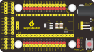 |  |
| ------------------------------------------------------------ | ------------------------------------------------------------ | ------------------------------------------------------------ |
| Raspberry Pi Pico Board*1                                    | Raspberry Pi Pico Expansion Board*1                          | 6812 RGB Module*1                                            |
|  |  |                                                              |
| 3P Dupont Wire*1                                             | Micro USB Cable*1                                            |                                                              |


**Connection Diagram**


**Test Code**

```python
'''
 * Keyestudio 37 in 1 Starter Kit for Raspberry Pi Pico
 * lesson 27
 * 6812 RGB LED
 * http://www.keyestudio.com
'''
import array, time
from machine import Pin
import rp2
 
# Configure the number of sk6812 LEDs, pins and brightness.
NUM_LEDS = 4
PIN_NUM = 16
brightness = 0.1
 
 
@rp2.asm_pio(sideset_init=rp2.PIO.OUT_LOW, out_shiftdir=rp2.PIO.SHIFT_LEFT, autopull=True, pull_thresh=24)
def sk6812():
    T1 = 2
    T2 = 5
    T3 = 3
    wrap_target()
    label("bitloop")
    out(x, 1)               .side(0)    [T3 - 1]
    jmp(not_x, "do_zero")   .side(1)    [T1 - 1]
    jmp("bitloop")          .side(1)    [T2 - 1]
    label("do_zero")
    nop()                   .side(0)    [T2 - 1]
    wrap()
 
 
# Create the StateMachine with the sk6812 program, outputting on Pin(16).
sm = rp2.StateMachine(0, sk6812, freq=8_000_000, sideset_base=Pin(PIN_NUM))
 
# Start the StateMachine, it will wait for data on its FIFO.
sm.active(1)
 
# Display a pattern on the LEDs via an array of LED RGB values.
ar = array.array("I", [0 for _ in range(NUM_LEDS)])
 
def pixels_show():
    dimmer_ar = array.array("I", [0 for _ in range(NUM_LEDS)])
    for i,c in enumerate(ar):
        r = int(((c >> 8) & 0xFF) * brightness)
        g = int(((c >> 16) & 0xFF) * brightness)
        b = int((c & 0xFF) * brightness)
        dimmer_ar[i] = (g<<16) + (r<<8) + b
    sm.put(dimmer_ar, 8)
    time.sleep_ms(10)
 
def pixels_set(i, color):
    ar[i] = (color[1]<<16) + (color[0]<<8) + color[2]
 
def pixels_fill(color):
    for i in range(len(ar)):
        pixels_set(i, color)

RED = (255, 0, 0)
GREEN = (0, 255, 0)
BLUE = (0, 0, 255)
WHITE = (255, 255, 255)
BLACK = (0, 0, 0)

pixels_set(0, RED)
pixels_set(1, GREEN)
pixels_set(2, BLUE)
pixels_set(3, WHITE)
pixels_show()
time.sleep(5)
'''
for i in range(len(ar)):
    pixels_set(i, BLACK)
pixels_show()
'''
```


**Test Result**

Run the test code, wire up and power up. Then we can see four LED beads show red, green, blue and white color; as shown below;


Project 28: Rotary Encoder


**Overview**

In this kit, there is a Keyestudio rotary encoder, dubbed as switch encoder. It is applied to automotive electronics, multimedia audio, instrumentation, household appliances, smart home, medical equipment and so on.

In the experiment, it it used for counting. When we rotate the rotary encoder clockwise, the set data falls by 1; if you rotate it anticlockwise, the set data is up 1; and when the middle button is pressed, the value will be show on Shell.


**Working Principle**


The incremental encoder converts the displacement into a periodic electric signal, and then converts this signal into a counting pulse, and the number of pulses indicates the size of the displacement.

This module mainly uses 20-pulse rotary encoder components. It can calculate the number of pulses output during clockwise and reverse rotation. There is no limit to count rotation. It resets to the initial state, that is, starts counting from 0.      


**Components**

|  |  |  |
| ------------------------------------------------------------ | ------------------------------------------------------------ | ------------------------------------------------------------ |
| Raspberry Pi Pico Board*1                                    | Raspberry Pi Pico Expansion Board*1                          | Rotary Encoder*1                                             |
|  |  |                                                              |
| 5P Dupont Wire*1                                             | Micro USB Cable*1                                            |                                                              |


**Connection Diagram**


**Test Code**

```python
'''
 * Keyestudio 37 in 1 Starter Kit for Raspberry Pi Pico
 * lesson 28
 * Encoder
 * http://www.keyestudio.com
'''
import time
from rotary_irq_rp2 import RotaryIRQ
from machine import Pin
SW=Pin(20,Pin.IN,Pin.PULL_UP)
r = RotaryIRQ(pin_num_clk=18,
              pin_num_dt=19,
              min_val=0,
              reverse=False,
              range_mode=RotaryIRQ.RANGE_UNBOUNDED)
val_old = r.value()
while True:
    try:
        val_new = r.value()
        if SW.value()==0 and n==0:
            print("Button Pressed")
            print("Selected Number is : ",val_new)
            n=1
            while SW.value()==0:
                continue
        n=0
        if val_old != val_new:
            val_old = val_new
            print('result =', val_new)
        time.sleep_ms(50)
    except KeyboardInterrupt:
        break
```

**Code Explanation**

In the experiment, we need to add the rotary encoder to pico, then import the module.

You only need to save the .py file to pico

1.  After adding the rotary encoder, click **File**


2.  We will see the file rotary.py and rotary\_irq\_rp2.py. This means the we save them in the pico successfully. Then we can use **from rotary\_irq\_rp2 import RotaryIRQ**
3.  **SW=Pin(20,Pin.IN,Pin.PULL\_UP)** indicates that the SW pin is connected to GP20, **pin\_num\_clk=18** indicates that the pin CLK is connected to GP18, and **pin\_num\_dt=19** means that the DT pin is connected to GP19. We can change these pin numbers.
4.  **try/except** is the python language exception capture processing statement, **try** executes the code, **except** executes the code when an exception occurs, and when we press Ctrl+C, the program exits.
5.  **r.value()** returns the value of the encoder


**Test Result**

Run the test code, observe the Shell below. Rotate the encoder clockwise, the displayed data decrease; rotate the encoder counterclockwise, the displayed data increase; press the button of the encoder, the displayed data is the value of the encoder, as shown in the figure below.


Project 29: Servo Control


**Overview**

Servo motor is a position control rotary actuator. It mainly consists of a housing, a circuit board, a core-less motor, a gear and a position sensor. 

Its working principle is that the servo receives the signal sent by MCU or receiver and produces a reference signal with a period of 20ms and width of 1.5ms, then compares the acquired DC bias voltage to the voltage of the potentiometer and obtain the voltage difference output.

In general, servo has three lines in brown, red and orange. The brown wire is grounded, the red one is a positive pole line and the orange one is a signal line.

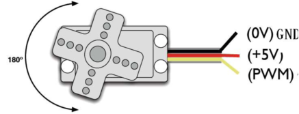


**Working Principle**

When the motor speed is constant, the potentiometer is driven to rotate through the cascade reduction gear, which leads that the voltage difference is 0, and the motor stops rotating. Generally, the angle range of servo rotation is 0° --180 °

The rotation angle of servo motor is controlled by regulating the duty cycle of PWM (Pulse-Width Modulation) signal. The standard cycle of PWM signal is 20ms (50Hz). 

Theoretically, the width is distributed between 1ms-2ms, but in fact, it's between 0.5ms-2.5ms. The width corresponds the rotation angle from 0° to 180°. 

But note that for different brand motors, the same signal may have different rotation angles.  


**Components**

|  |  |
| ------------------------------------------------------------ | ------------------------------------------------------------ |
| Raspberry Pi Pico Board*1                                    | Raspberry Pi Pico Expansion Board*1                          |
|  |  |
| Servo*1                                                      | Micro USB Cable*1                                            |


**Connection Diagram**


Test Code

**Code 1：**

```python
'''
 * Keyestudio 37 in 1 Starter Kit for Raspberry Pi Pico
 * lesson 29.1
 * Servo test 1
 * http://www.keyestudio.com
'''
from machine import Pin, PWM
import time
pwm = PWM(Pin(0))
pwm.freq(50)

'''
0°----2.5%----1638
45°----5%----3276
90°----7.5%----4915
135°----10%----6553
180°----12.5%----8192
'''
angle_0 = 1638
angle_90 = 4915
angle_180 = 8192

while True:
    pwm.duty_u16(angle_0)
    time.sleep(1)
    pwm.duty_u16(angle_90)
    time.sleep(1)
    pwm.duty_u16(angle_180)
    time.sleep(1)
```

**Code 2：**

```python
'''
 * Keyestudio 37 in 1 Starter Kit for Raspberry Pi Pico
 * lesson 29.2
 * Servo test 2
 * http://www.keyestudio.com
'''
from utime import sleep
from machine import Pin
from machine import PWM

pwm = PWM(Pin(0))
pwm.freq(50)
'''
0°----2.5%----1638
45°----5%----3276
90°----7.5%----4915
135°----10%----6553
180°----12.5%----8192
'''

def setServoCycle (position):
    pwm.duty_u16(position)
    sleep(0.01)

def convert(x, i_m, i_M, o_m, o_M):
    return max(min(o_M, (x - i_m) * (o_M - o_m) // (i_M - i_m) + o_m), o_m)

while True:
    for degree in range(0, 180, 1):
        pos = convert(degree, 0, 180, 1000, 9000)
        setServoCycle(pos)

    for degree in range(180, 0, -1):
        pos = convert(degree, 0, 180, 1000, 9000)
        setServoCycle(pos)
```

**Code Explanation**

**Code 1：**

According to the angle of the signal pulse width, it is converted into a duty cycle. The formula is: 2.5+angle/180*10. The PWM pin resolution of Pi Pico is 2^16 = 65535. When converted to 0 degree, its duty cycle is 65535 * 2.5% = 1638.375 , when the angle is 180 degrees, its duty cycle value is 65535 * 12.5% = 8191.875, these two values will be related to the program, considering the error and rotation angle, I set the duty cycle at 1000 Between 9000 and 9000, the servo can rotate smoothly 0~180 degrees.

**Code 2：**

**convert(x, i\_m, i\_M, o\_m, o\_M)**

x is the value we want to map; **i_m, i_M** are the lower and upper limits of the current value; o_m, o_M are the lower and upper limits of the target range we want to map to.


Test Result

**Test Result 1：**

Run the test code successfully, the servo rotates cyclically from 0 degrees, 90 degrees, and 180 degrees.

**Test Result 2：**

Run the test code successfully, the servo rotates back and forth from 0 to 180 degrees, one degree every 10ms.


Project 30: Ultrasonic Sensor

**Overview**

In this kit, there is a keyes HC-SR04 ultrasonic sensor, which can detect obstacles in front and the detailed distance between the sensor and the obstacle. Its principle is the same as that of bat flying. It can emit the ultrasonic signals that cannot be heard by humans. When these signals hit an obstacle and come back immediately. The distance between the sensor and the obstacle can be calculated by the time gap of emitting signals and receiving signals.

In the experiment, we use the sensor to detect the distance between the sensor and the obstacle, and print the test result.

Ultrasonic detector module can provide 2cm-450cm non-contact sensing distance, and its ranging accuracy is up to 3mm, very good to meet the normal requirements. The module includes an ultrasonic transmitter and receiver as well as the corresponding control circuit.


**Working Principle**

The most common ultrasonic ranging method is the echo detection. As shown below; when the ultrasonic emitter emits the ultrasonic waves towards certain direction, the counter will count. The ultrasonic waves travel and reflect back once encountering the obstacle. Then the counter will stop counting when the receiver receives the ultrasonic waves coming back.

The ultrasonic wave is also sound wave, and its speed of sound V is related to temperature. Generally, it travels 340m/s in the air. According to time t, we can calculate the distance s from the emitting spot to the obstacle. 

**s=340t/2**

The HC-SR04 ultrasonic ranging module can provide a non-contact distance sensing function of 2cm-400cm, and the ranging accuracy can reach as high as 3mm; the module includes an ultrasonic transmitter, receiver and control circuit. Basic working principle:

1. First pull down the TRIG, and then trigger it with at least 10us high level signal;

2. After triggering, the module will automatically transmit eight 40KHZ square waves, and automatically detect whether there is a signal to return.

3. If there is a signal returned back, through the ECHO to output a high level, the duration time of high level is actually the time from emission to reception of ultrasonic.

**Test distance = high level duration \* 340m/s \* 0.5.**


**Components**

|  |  |  |
| ------------------------------------------------------------ | ------------------------------------------------------------ | ------------------------------------------------------------ |
| Raspberry Pi Pico Board*1                                    | Raspberry Pi Pico Expansion Board*1                          | SR01 Ultrasonic Sensor*1                                     |
|  |  |                                                              |
| 4P Dupont Wire*1                                             | Micro USB Cable*1                                            |                                                              |


**Connection Diagram**


**Test Code**

```python
'''
 * Keyestudio 37 in 1 Starter Kit for Raspberry Pi Pico
 * lesson 30
 * Ultrasonic
 * http://www.keyestudio.com
'''
from machine import Pin
import utime

def getDistance(trigger, echo):
    
    trigger.low()   
    utime.sleep_us(2)
    trigger.high()
    utime.sleep_us(10)
    trigger.low()
    
    while echo.value() == 0: 
        start = utime.ticks_us()
    while echo.value() == 1: 
        end = utime.ticks_us()
    d = (end - start) * 0.0343 / 2 
    return d

trigger = Pin(14, Pin.OUT)
echo = Pin(13, Pin.IN)

while True:
    distance = getDistance(trigger, echo)
    print("The distance is ：{:.2f} cm".format(distance))
    utime.sleep(0.1)
```

**Test Result**

Run the test code and observe the Shell monitor.

Display the distance between the sensor and the obstacle, the unit is cm, as shown below;


Project 31: IR Receiver Module


**Overview**

There is no doubt that infrared remote control is ubiquitous in daily life. It is used to control various household appliances, such as TVs, stereos, video recorders and satellite signal receivers. 

Infrared remote control is composed of infrared transmitting and infrared receiving systems, that is, an infrared remote control and infrared receiving module and a single-chip microcomputer capable of decoding.   

In this experiment, we need to know how to use the infrared receiving sensor. The infrared receiving sensor mainly uses the VS1838B infrared receiving sensor element. It integrates receiving, amplifying, and demodulating. The internal IC has already completed the demodulation, and the output is a digital signal. It can receive 38KHz modulated remote control signal. 

In the experiment, we use the IR receiver to receive the infrared signal emitted by the external infrared transmitting device, and display the received signal in the shell.


**Working Principle**


The main part of the IR remote control system is modulation, transmission and reception. 

The modulated carrier frequency is generally between 30khz and 60khz, and most of them use a square wave of 38kHz and a duty ratio of 1/3. A 4.7K pull-up resistor R3 is added to the signal end of the infrared receiver. 


**Components**

|  |  |  |
| ------------------------------------------------------------ | ------------------------------------------------------------ | ------------------------------------------------------------ |
| Raspberry Pi Pico Board*1                                    | Raspberry Pi Pico Expansion Board*1                          | DIYIR Receiver*1                                             |
|  |  |  |
| 3P Dupont Wire*1                                             | Micro USB Cable*1                                            | Remote Control*1                                             |


**Connection Diagram**


**Test Code**

```python
'''
 * Keyestudio 37 in 1 Starter Kit for Raspberry Pi Pico
 * lesson 31
 * IR Receiver
 * http://www.keyestudio.com
'''
import utime
from machine import Pin

ird = Pin(16,Pin.IN)

act = {"1": "LLLLLLLLHHHHHHHHLHHLHLLLHLLHLHHH","2": "LLLLLLLLHHHHHHHHHLLHHLLLLHHLLHHH","3": "LLLLLLLLHHHHHHHHHLHHLLLLLHLLHHHH",
       "4": "LLLLLLLLHHHHHHHHLLHHLLLLHHLLHHHH","5": "LLLLLLLLHHHHHHHHLLLHHLLLHHHLLHHH","6": "LLLLLLLLHHHHHHHHLHHHHLHLHLLLLHLH",
       "7": "LLLLLLLLHHHHHHHHLLLHLLLLHHHLHHHH","8": "LLLLLLLLHHHHHHHHLLHHHLLLHHLLLHHH","9": "LLLLLLLLHHHHHHHHLHLHHLHLHLHLLHLH",
       "0": "LLLLLLLLHHHHHHHHLHLLHLHLHLHHLHLH","Up": "LLLLLLLLHHHHHHHHLHHLLLHLHLLHHHLH","Down": "LLLLLLLLHHHHHHHHHLHLHLLLLHLHLHHH",
       "Left": "LLLLLLLLHHHHHHHHLLHLLLHLHHLHHHLH","Right": "LLLLLLLLHHHHHHHHHHLLLLHLLLHHHHLH","Ok": "LLLLLLLLHHHHHHHHLLLLLLHLHHHHHHLH",
       "*": "LLLLLLLLHHHHHHHHLHLLLLHLHLHHHHLH","#": "LLLLLLLLHHHHHHHHLHLHLLHLHLHLHHLH"}

def read_ircode(ird):
    wait = 1
    complete = 0
    seq0 = []
    seq1 = []

    while wait == 1:
        if ird.value() == 0:
            wait = 0
    while wait == 0 and complete == 0:
        start = utime.ticks_us()
        while ird.value() == 0:
            ms1 = utime.ticks_us()
        diff = utime.ticks_diff(ms1,start)
        seq0.append(diff)
        while ird.value() == 1 and complete == 0:
            ms2 = utime.ticks_us()
            diff = utime.ticks_diff(ms2,ms1)
            if diff > 10000:
                complete = 1
        seq1.append(diff)

    code = ""
    for val in seq1:
        if val < 2000:
            if val < 700:
                code += "L"
            else:
                code += "H"
    # print(code)
    command = ""
    for k,v in act.items():
        if code == v:
            command = k
    if command == "":
        command = code
    return command

while True:
    command = read_ircode(ird)
    print(command)
    utime.sleep(0.5)
```

**Test Result**

Find the infrared remote control, pull out the insulating sheet, and press the button at the receiving head of the infrared receiving sensor. 

After receiving the signal, the LED on the infrared receiving sensor also starts to flash, as shown in the figure below.


Project 32: DS18B20 Temperature Sensor


**Description**

The DS18B20 is a 1-wire programmable Temperature sensor from maxim integrated. It is widely used to measure temperature in hard environments like in chemical solutions, mines or soil etc. The constriction of the sensor is rugged and also can be purchased with a waterproof option making the mounting process easy. It can measure a wide range of temperature from **-55°C to +125°** with a decent accuracy of **±5°C**. 

Each sensor has a unique address and requires only one pin of the MCU to transfer data so it a very good choice for measuring temperature at multiple points without compromising much of your digital pins on the microcontroller.


**Working Principle**


The hardware interface of the 1-Wire bus is very simple, just connect the data pin of the DS18B20 to an IO port of the microcontroller. 

The timing of the 1-Wire bus is relatively complex. Many students can’t understand the timing diagram independently here. We have encapsulated the complex timing operations in the library, and you can use the library functions directly.

**Schematic Diagram of DS18B20**

This can save up to 12-bit temperature vale. In the register, save in code complement. As shown below;


A total of 2 bytes, LSB is the low byte, MSB is the high byte, where MSb is the high byte of the byte, LSb is the low byte of the byte. 

As you can see, the binary number, the meaning of the temperature represented by each bit, is expressed. Among them, S represents the sign bit, and the lower 11 bits are all powers of 2, which are used to represent the final temperature. 

The temperature measurement range of DS18B20 is from -55 degrees to +125 degrees, and the expression form of temperature data, S represents positive and negative temperature, and the resolution is 2﹣⒋, which is 0.0625.


**Required Components**

|  |  |  |
| ------------------------------------------------------------ | ------------------------------------------------------------ | ------------------------------------------------------------ |
| Raspberry Pi Pico Board*1                                    | Raspberry Pi Pico Expansion Board*1                          | DIY 18B20 Temperature Sensor*1                               |
|  |  |                                                              |
| 3P Dupont Wire*1                                             | Micro USB Cable*1                                            |                                                              |


**Connection Diagram**


**Test Code**

```python
'''
 * Keyestudio 37 in 1 Starter Kit for Raspberry Pi Pico
 * lesson 32
 * DS18B20
 * http://www.keyestudio.com
'''
import machine, onewire, ds18x20, time

ds_pin = machine.Pin(3)

ds_sensor = ds18x20.DS18X20(onewire.OneWire(ds_pin))

roms = ds_sensor.scan()

print('Found DS devices: ', roms)

while True:

  ds_sensor.convert_temp()

  time.sleep_ms(750)

  for rom in roms:

    #print(rom)

    print(ds_sensor.read_temp(rom))

  time.sleep(1)
```

**Code Explanation**

We need to import the DS18B20 module.


Set the pin to 3.

Shell means temperature value, ds\_sensor.read\_temp(rom) is used to read temperature value.


**Test Result**

Run the test code, the shell displays the temperature of the current environment, as shown below.


Project 33: XHT11 Temperature and Humidity Sensor


**Description**

This DHT11 temperature and humidity sensor is a composite sensor which contains a calibrated digital signal output of the temperature and humidity.

DHT11 temperature and humidity sensor uses the acquisition technology  of the digital module and temperature and humidity sensing technology, ensuring high reliability and excellent long-term stability.

It includes a resistive element and a NTC temperature measuring device.


**Working Principle**

The communication and synchronization between the single-chip microcomputer and XHT11 adopts the single bus data format. The communication time is about 4ms. The data is divided into fractional part and integer part. 

Operation process: A complete data transmission is 40bit, high bit first out. Data format: 8bit humidity integer data + 8bit humidity decimal data + 8bit temperature integer data + 8bit temperature decimal data + 8bit checksum 

8-bit checksum: 8-bit humidity integer data + 8-bit humidity decimal data + 8-bit temperature integer data + 8-bit temperature decimal data "Add the last 8 bits of the result.


**Required Components**

|  |  |  |
| ------------------------------------------------------------ | ------------------------------------------------------------ | ------------------------------------------------------------ |
| Raspberry Pi Pico Board*1                                    | Raspberry Pi Pico Expansion Board*1                          | XHT11 Temperature and Humidity Sensor*1<br />（compatible with DHT11) |
|  |  |                                                              |
| 3P Dupont Wire*1                                             | Micro USB Cable*1                                            |                                                              |


**Connection Diagram**


**Test Code**

```python
'''
 * Keyestudio 37 in 1 Starter Kit for Raspberry Pi Pico
 * lesson 33
 * xht11
 * http://www.keyestudio.com
'''
import machine
import utime
import dht

pin = machine.Pin(22, machine.Pin.OUT, machine.Pin.PULL_DOWN)
sensor = dht.DHT11(pin)

while True:
    print("temperature：{} ℃  humidity：{} %".format(sensor.temperature, sensor.humidity))
    utime.sleep(1)
```

**Code Explanation**

In the experiment, we need to import the XHT11 library：


We set the pin to GP22, read the temperature data

**sensor.temperature**, read the humidity data sensor.humidity.


**Test Result**

After running the test code, the shell displays the temperature and humidity data, as shown below.


Project 34: DS1307 Clock Module


**Overview**

The DS1307 serial real-time clock (RTC) is a low-power, full binary-coded decimal (BCD) clock/calendar plus 56 bytes of NV SRAM.  Address and data are transferred serially through an I2C,  bidirectional bus. 

The clock/calendar provides seconds, minutes, hours, day, date, month,  and year information. The end of the month date is automatically  adjusted for months with fewer than 31 days, including corrections for leap year. The clock operates in either the 24-hour or 12-hour format with AM/PM indicator. The DS1307 has a built-in power-sense circuit that detects power failures and automatically switches to the backup supply. 

Timekeeping operation continues while the part operates from the backup supply.


**Working Principle**


**Detailed address and data:**

Serial real-time clock records year, month, day, hour, minute, second and week; AM and PM indicate morning and afternoon respectively; 56 bytes of NVRAM store data; 2-wire serial port; programmable square wave output; power failure detection and automatic switching circuit; battery current is less than 500nA.

Pins description: X1, 32.768kHz crystal terminal 

VBAT:X2: +3V input

SDA: serial data

SCL: serial clock

SQW/OUT: square waves/output drivers


**Components**

| 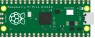 |  |  |
| ------------------------------------------------------------ | ------------------------------------------------------------ | ------------------------------------------------------------ |
| Raspberry Pi Pico Board*1                                    | Raspberry Pi Pico Expansion Board*1                          | DS1307 Clock Module*1                                        |
|  |  |                                                              |
| 4P Dupont Wire*1                                             | Micro USB Cable*1                                            |                                                              |


**Connection Diagram**


VUSB is 5V，then connect the power to VUSB.


**Test Code**

```python
'''
 * Keyestudio 37 in 1 Starter Kit for Raspberry Pi Pico
 * lesson 34
 * DS1307 Real Time Clock
 * http://www.keyestudio.com
'''
from machine import I2C, Pin
from urtc import DS1307
import utime

i2c = I2C(1,scl = Pin(15),sda = Pin(14),freq = 400000)
rtc = DS1307(i2c)

year = int(input("Year : "))
month = int(input("month (Jan --> 1 , Dec --> 12): "))
date = int(input("date : "))
day = int(input("day (1 --> monday , 2 --> Tuesday ... 0 --> Sunday): "))
hour = int(input("hour (24 Hour format): "))
minute = int(input("minute : "))
second = int(input("second : "))

now = (year,month,date,day,hour,minute,second,0)
rtc.datetime(now)

#(year,month,date,day,hour,minute,second,p1) = rtc.datetime()
while True:
    DateTimeTuple = rtc.datetime()
    print(DateTimeTuple[0], end = '-')
    print(DateTimeTuple[1], end = '-')
    print(DateTimeTuple[2], end = '  ')
    print(DateTimeTuple[4], end = ':')
    print(DateTimeTuple[5], end = ':')
    print(DateTimeTuple[6], end = '  week:')
    print(DateTimeTuple[3])
    utime.sleep(1)
```


**Code Explanation**

We need to import the urtc module, as shown below;


**rtc.datetime()：**Return a tuple of time. When the program is running, we set the "please input" program, run the code, it will prompt us to input the time and date, after the input is completed, the data will be printed every second.

**DateTimeTuple\[0\]:** save time

**DateTimeTuple\[1\]:** save months

**DateTimeTuple\[2\]**: save days

**DateTimeTuple\[3\]**: save weeks

**Rtc.GetDateTime().Month():** return months

**DateTimeTuple\[4\]:** save hours

**DateTimeTuple\[5\]**: save minutes

**DateTimeTuple\[6\]:** save seconds


**Test Result**

Upload the code and view the Shell monitor. We can see the displayed year, month, day, hour, minute, second and week, as shown below;


Project 35: TM1650 4-Digit Tube Display


**Overview**

This module is mainly composed of a 0.36 inch red common anode 4-digit digital tube, and its driver chip is TM1650. When using it, we only need two signal lines to make the single-chip microcomputer control a 4-bitdigit tube, which greatly saves the IO port resources of the control board.

TM1650 is a special circuit for LED (light emitting diode display) drive control. It integrates MCU input and output control digital interface, data latch, LED drivers, keyboard scanning, brightness adjustment and other circuits.

TM1650 has stable performance, reliable quality and strong anti-interference ability. 

It can be applied to the application of long-term continuous working for 24 hours. 

TM1650 uses 2-wire serial transmission protocol for communication (note that this data transmission protocol is not a standard I2C protocol). The chip can drive the digital tube and save MCU pin resources through two pins and MCU communication.


**Working Principle**

TM1650 adopts IIC treaty and SDA and SCL wire.

Data command setting is 0x48. This means that lighting up the tube display not perform its button scanning function.


**Data command setting**: 0x48 means that we light up the digital tube, instead of enable the function of key scanning.


**Command display setting:**

bit\[6:4\]：set the brightness of tube display, and 000 is brightest

bit\[3\]：set to show decimal points

bit\[0\]：start the display of the tube display

**Components**

|  |  |  |
| ------------------------------------------------------------ | ------------------------------------------------------------ | ------------------------------------------------------------ |
| Raspberry Pi Pico Board*1                                    | Raspberry Pi Pico Expansion Board*1                          | TM16504-Digit Segment Display*1                              |
|  |  |                                                              |
| 4P Dupont Wire*1                                             | Micro USB Cable*1                                            |                                                              |


**Connection Diagram**


**Test Code**

```python
'''
 * Keyestudio 37 in 1 Starter Kit for Raspberry Pi Pico
 * lesson 35
 * TM1650 Four digital tube
 * http://www.keyestudio.com
'''
from machine import Pin
import time

# definitions for TM1650
ADDR_DIS = 0x48  #mode command
ADDR_KEY = 0x49  #read key value command

# definitions for brightness
BRIGHT_DARKEST = 0
BRIGHT_TYPICAL = 2
BRIGHTEST      = 7

on  = 1
off = 0

# number:0~9
NUM = [0x3f,0x06,0x5b,0x4f,0x66,0x6d,0x7d,0x07,0x7f,0x6f] 
# DIG = [0x68,0x6a,0x6c,0x6e]
DIG = [0x6e,0x6c,0x6a,0x68]
DOT = [0,0,0,0]

clkPin = 15
dioPin = 14
clk = machine.Pin(clkPin, machine.Pin.OUT)
dio = machine.Pin(dioPin, machine.Pin.OUT)

DisplayCommand = 0

def writeByte(wr_data):
    global clk,dio
    for i in range(8):
        if(wr_data & 0x80 == 0x80):
            dio.value(1)
        else:
            dio.value(0)
        clk.value(0)
        time.sleep(0.0001)
        clk.value(1)
        time.sleep(0.0001)
        clk.value(0)
        wr_data <<= 1
    return

def start():
    global clk,dio
    dio.value(1)
    clk.value(1)
    time.sleep(0.0001)
    dio.value(0)
    return
    
def ack():
    global clk,dio
    dy = 0
    clk.value(0)
    time.sleep(0.0001)
    dio = Pin(dioPin, machine.Pin.IN)
    while(dio.value() == 1):
        time.sleep(0.0001)
        dy += 1
        if(dy>5000):
            break
    clk.value(1)
    time.sleep(0.0001)
    clk.value(0)
    dio = Pin(dioPin, machine.Pin.OUT)
    return
    
def stop():
    global clk,dio
    dio.value(0)
    clk.value(1)
    time.sleep(0.0001)
    dio.value(1)
    return
    
def displayBit(bit, num):
    global ADDR_DIS
    if(num > 9 and bit > 4):
        return
    start()
    writeByte(ADDR_DIS)
    ack()
    writeByte(DisplayCommand)
    ack()
    stop()
    start()
    writeByte(DIG[bit-1])
    ack()
    if(DOT[bit-1] == 1):
        writeByte(NUM[num] | 0x80)
    else:
        writeByte(NUM[num])
    ack()
    stop()
    return
    
def clearBit(bit):
    if(bit > 4):
        return
    start()
    writeByte(ADDR_DIS)
    ack()
    writeByte(DisplayCommand)
    ack()
    stop()
    start()
    writeByte(DIG[bit-1])
    ack()
    writeByte(0x00)
    ack()
    stop()
    return
    
    
def setBrightness(b = BRIGHT_TYPICAL):
    global DisplayCommand,brightness
    DisplayCommand = (DisplayCommand & 0x0f)+(b<<4)
    return

def setMode(segment = 0):
    global DisplayCommand
    DisplayCommand = (DisplayCommand & 0xf7)+(segment<<3)
    return
    
def displayOnOFF(OnOff = 1):
    global DisplayCommand
    DisplayCommand = (DisplayCommand & 0xfe)+OnOff
    return

def displayDot(bit, OnOff):
    if(bit > 4):
        return
    if(OnOff == 1): 
        DOT[bit-1] = 1;
    else:
        DOT[bit-1] = 0;
    return
        
def InitDigitalTube():
    setBrightness(2)
    setMode(0)
    displayOnOFF(1)
    for _ in range(4):
        clearBit(_)
    return

def ShowNum(num): #0~9999
    displayBit(1,num%10)
    if(num < 10):
        clearBit(2)
        clearBit(3)
        clearBit(4)
    if(num > 9 and num < 100):
        displayBit(2,num//10%10)
        clearBit(3)
        clearBit(4)
    if(num > 99 and num < 1000):
        displayBit(2,num//10%10)
        displayBit(3,num//100%10)
        clearBit(4)
    if(num > 999 and num < 10000):
        displayBit(2,num//10%10)
        displayBit(3,num//100%10)
        displayBit(4,num//1000)

InitDigitalTube()

while True:
    #displayDot(1,on)     # on or off, DigitalTube.Display(bit,number); bit=1---4  number=0---9
    for i in range(0,9999):
        ShowNum(i)
        time.sleep(0.01)
```


**Test Result**

Run the test code, wire up and power on. The 4-digit tube display will show integer from 0 to 99999, an increase of 1 for each 10ms, then start from 0 once reaching 99999.


Project 36: HT16K33\_8X8 Dot Matrix Module


**Overview**

What is the dot matrix display?

The 8X8 dot matrix is composed of 64 light-emitting diodes, and each light-emitting diode is placed at the intersection of the row line and the column line. When the corresponding row is set to 1 level, and a certain column is set to 0 level, the corresponding diode will light up.

**Working Principle**

As the schematic diagram shown, to light up the LED at the first row and column, we only need to set C1 to high level and R1 to low level. To turn on LEDs at the first row, we set R1 to low level and C1-C8 to high level.

16 IO ports are needed, which will highly waste the MCU resources.

Therefore, we designed this module, using the HT16K33 chip to drive an 8*8 dot matrix, which greatly saves the resources of the single-chip microcomputer.

There are three DIP switches on the module, all of which are set to I2C communication address. The setting method is shown below.

A0，A1and A2 are grounded, that is, the address is 0x70

<table>
<tbody>
<tr class="odd">
<td>A0（1）</td>
<td>A1（2）</td>
<td>A2（3）</td>
<td>A0（1）</td>
<td>A1（2）</td>
<td>A2（3）</td>
<td>A0（1）</td>
<td>A1（2）</td>
<td>A2（3）</td>
</tr>
<tr class="even">
<td>0（OFF）</td>
<td>0（OFF）</td>
<td>0（OFF）</td>
<td>1（ON）</td>
<td>0（OFF）</td>
<td>0（OFF）</td>
<td>0（OFF）</td>
<td>1（ON）</td>
<td>0（OFF）</td>
</tr>
<tr class="odd">
<td>OX70</td>
<td>OX71</td>
<td>OX72</td>
<td></td>
<td></td>
<td></td>
<td></td>
<td></td>
<td></td>
</tr>
<tr class="even">
<td>A0（1）</td>
<td>A1（2）</td>
<td>A2（3）</td>
<td>A0（1）</td>
<td>A1（2）</td>
<td>A2（3）</td>
<td>A0（1）</td>
<td>A1（2）</td>
<td>A2（3）</td>
</tr>
<tr class="odd">
<td>1（ON）</td>
<td>1（ON）</td>
<td>0（OFF）</td>
<td>0（OFF）</td>
<td>0（OFF）</td>
<td>1（ON）</td>
<td>1（ON）</td>
<td>0（OFF）</td>
<td>1（ON）</td>
</tr>
<tr class="even">
<td>OX73</td>
<td>OX74</td>
<td>OX75</td>
<td></td>
<td></td>
<td></td>
<td></td>
<td></td>
<td></td>
</tr>
<tr class="odd">
<td>A0（1）</td>
<td>A1（2）</td>
<td>A2（3）</td>
<td>A0（1）</td>
<td>A1（2）</td>
<td>A2（3）</td>
<td></td>
<td></td>
<td></td>
</tr>
<tr class="even">
<td>0（OFF）</td>
<td>1（ON）</td>
<td>1（ON）</td>
<td>1（ON）</td>
<td>1（ON）</td>
<td>1（ON）</td>
<td></td>
<td></td>
<td></td>
</tr>
<tr class="odd">
<td>OX76</td>
<td>OX77</td>
<td></td>
<td></td>
<td></td>
<td></td>
<td></td>
<td></td>
<td></td>
</tr>
</tbody>
</table>
**Components**

|  |  |  |
| ------------------------------------------------------------ | ------------------------------------------------------------ | ------------------------------------------------------------ |
| Raspberry Pi Pico Board*1                                    | Raspberry Pi Pico Expansion Board*1                          | HT16K33_8X8 Dot Matrix*1                                     |
|  |  |                                                              |
| 4P Dupont Wire*1                                             | Micro USB Cable*1                                            |                                                              |


**Connection Diagram**


**Test Code**

```python
'''
 * Keyestudio 37 in 1 Starter Kit for Raspberry Pi Pico
 * lesson 36
 * HT16K33 8*8 dot matrix
 * http://www.keyestudio.com
'''
import machine
import time
import json
import matrix_fonts
from ht16k33_matrix import ht16k33_matrix
## Tool To Make Sprites https://gurgleapps.com/tools/matrix
#i2c config
clock_pin = 21
data_pin = 20
bus = 0
i2c_addr_left = 0x70
use_i2c = True

def scan_for_devices():
    i2c = machine.I2C(bus,sda=machine.Pin(data_pin),scl=machine.Pin(clock_pin))
    devices = i2c.scan()
    if devices:
        for d in devices:
            print(hex(d))
    else:
        print('no i2c devices')

if use_i2c:
    scan_for_devices()
    left_eye = ht16k33_matrix(data_pin, clock_pin, bus, i2c_addr_left)

def show_char(left):
    if use_i2c:
        left_eye.show_char(left)
        
def scroll_message(font,message='hello',delay=0.05):
    left_message = '   ' + message
    right_message = message + '   '
    length=len(right_message)
    char_range=range(length-1)
    for char_pos in char_range:
      right_left_char=font[right_message[char_pos]]
      right_right_char=font[right_message[char_pos+1]]
      left_left_char=font[left_message[char_pos]]
      left_right_char=font[left_message[char_pos+1]]
      for shift in range(8):
        left_bytes=[0,0,0,0,0,0,0,0]
        right_bytes=[0,0,0,0,0,0,0,0]
        for col in range(8):
          left_bytes[col]=left_bytes[col]|left_left_char[col]<<shift
          left_bytes[col]=left_bytes[col]|left_right_char[col]>>8-shift;
          right_bytes[col]=right_bytes[col]|right_left_char[col]<<shift
          right_bytes[col]=right_bytes[col]|right_right_char[col]>>8-shift;
        if use_i2c:
                left_eye.show_char(left_bytes)
        time.sleep(delay)


while True:
    show_char(matrix_fonts.textFont1['A'])
    time.sleep(1)
    show_char(matrix_fonts.textFont1['B'])
    time.sleep(1)
    show_char(matrix_fonts.textFont1['C'])
    time.sleep(1)
    scroll_message(matrix_fonts.textFont1, ' Hello World ')
```


**Code Explanation**

We need to import the dot matrix module, matrix\_fonts is the module file for all characters.


**show\_char(): displayed characters**

for instance **show\_char(matrix\_fonts.textFont1\['A'\]) shows A**

**scroll\_message(font,message='hello',delay=0.05)**: scroll to display, 0.05 is the speed of the scroll, massage is character string and font is module file.


**Test Result**

Wire up and run the test code. The dot matrix displays "A" for one second, "B" for one second, "C" for one second, and then scroll to display the "Hello World" pattern.


Project 37: RFID Module 


**Description**

RFIDRFID-RC522 radio frequency module adopts a Philips MFRC522 original chip to design card reading circuit, easy to use and low cost, suitable for equipment development and card reader development and so on.

RFID or Radio Frequency Identification system consists of two main components, a transponder/tag attached to an object to be identified, and a Transceiver also known as interrogator/Reader.

In the experiment, the data read by the card swipe module is 4 hexadecimal numbers, and we print these four hexadecimal numbers as strings. 

For example, we read the data of the IC card below: 0x8d, 0xfe, 0x6c, 0x4d, and the information string displayed in the shell is 8dfe6c4d; the data read from the keychain is: 0xbc, 0x33, 0x76, 0x6e, and the information is displayed in the shell The string is bc33766e. Sometimes I see that there are only 7 bits because there is a 0 in the front omitted, such as 0a, it displays a.


**Working Principle**

RFID (Radio Frequency Identification)

Radio frequency identification, the card reader is composed of a radio frequency module and a high-level magnetic field. The Tag transponder is a sensing device, and this device does not contain a battery. It only contains tiny integrated circuit chips and media for storing data and antennas for receiving and transmitting signals. 

To read the data in the tag, first put it into the reading range of the card reader. The reader will generate a magnetic field, and because the magnetic energy generates electricity according to Lenz's law, the RFID tag will supply power, thereby activating the device. 


**Required Components**

|  |  |  |  |
| ------------------------------------------------------------ | ------------------------------------------------------------ | ------------------------------------------------------------ | ------------------------------------------------------------ |
| Raspberry Pi Pico Board*1                                    | Raspberry Pi Pico Expansion Board*1                          | DIY RFID Module*1                                            | 4P Dupont Wire*1                                             |
|  |  |  |                                                              |
| Micro USB Cable*1                                            | Key*1                                                        | IC Card*1                                                    |                                                              |


**Connection Diagram**


**Test Code**

```python
/* 
 * Keyestudio 37 in 1 Starter Kit for Raspberry Pi Pico
 * lesson 37
 * mfrc522
 * http://www.keyestudio.com
*/
#include <Wire.h>
#include "MFRC522_I2C.h"
MFRC522 mfrc522(0x28);
String rfid_str = "";
void setup() {
  Serial.begin(115200);
  Wire.begin();
  mfrc522.PCD_Init();
}

void loop() {
  if ( ! mfrc522.PICC_IsNewCardPresent() || ! mfrc522.PICC_ReadCardSerial() ) {
    delay(50);
    return;
  }
  rfid_str = "";
  Serial.print(F("Card UID:"));
  for (byte i = 0; i < mfrc522.uid.size; i++) {// UID
    rfid_str = rfid_str + String(mfrc522.uid.uidByte[i], HEX);
  }
  Serial.println(rfid_str);
}
```

Firstly, import the RFID522 module:


We need to import .


**Code Explanation**

**mfrc522\_config.py;** this is a configuration file that defines some parameters and commands.

**mfrc522\_i2c.py;** are some initialization, reading and writing functions

**Soft\_iic.py;** we use the io analog portI2C


**Test Result**

Run the test code and wire up, power on, open the shell and set the baud rate to 9600. When we make the RFID module close to the IC card and the blue key, the information read by the module will be printed out, as shown in the figure below.


## 5. Comprehensive Experiments

The previous projects are related to single sensor or module. In the following part, we will combine various sensors and modules to create some comprehensive experiments to perform special functions.


Project 38: Breathing LED


**Overview**

A“breathing LED”is a phenomenon where an LED's brightness smoothly changes from dark to bright and back to dark, continuing to do so and giving the illusion of an LED“breathing. This phenomenon is similar to a lung breathing in and out. So how to control LED’s brightness? We need to take advantage of PWM.


**Components**

|  |  |  |
| ------------------------------------------------------------ | ------------------------------------------------------------ | ------------------------------------------------------------ |
| Raspberry Pi Pico Board*1                                    | Raspberry Pi Pico Expansion Board*1                          | White LED Module*1                                           |
|  |  |                                                              |
| 3P Dupont Wire*1                                             | Micro USB Cable*1                                            |                                                              |


**Connection Diagram**


**Test Code**

```python
'''
 * Keyestudio 37 in 1 Starter Kit for Raspberry Pi Pico
 * lesson 38
 * Breath
 * http://www.keyestudio.com
'''
import machine
import time

pwm = machine.PWM(machine.Pin(15))
pwm.freq(1000)

duty = 0
direction = 1
while True:
    duty += direction
    if duty > 255:
        duty = 255
        direction = -1
    elif duty < 0:
        duty = 0
        direction = 1
    pwm.duty_u16(duty * duty)
    time.sleep(0.01)
```


**Code Explanation**

The larger the set duty cycle, the brighter the LED will be, with a maximum of 65535. The duty increases from 0 to 255 at the beginning, with an increase of 1, and delay in 10 milliseconds for each time, the LED on the module will gradually become brighter.

After PWM is 255*255, i starts to decrease from 255 to 0, decreasing by 1 each time, and delaying 10 milliseconds each time, the LED on the module gradually gets dark. Then it gradually becomes brighter, cycle alternately, just like the human breathes.

We can change the delayed time in the code. There are two ways: 

Change the step length or reduce the delayed time.

The step length is supposed to divided by 255, for instance direction = -2 or direction = 2.


**Test Result**

Run the test code, the LED on the module gradually gets dimmer then brighter, cyclically, like human breathe.


Project 39: Button-controlled LED


**Overview**

In this lesson, we will make an extension experiment with a button and an LED. 

When the button is pressed and low levels are output, the LED will light up; when the button is released, the LED will go off. Then we can control a module with another module. 


**Components**

|  |  |  |
| ------------------------------------------------------------ | ------------------------------------------------------------ | ------------------------------------------------------------ |
| Raspberry Pi Pico Board*1                                    | Raspberry Pi Pico Expansion Board*1                          | Purple LED Module*1                                          |
|  |  |  |
| Button Module*1                                              | 3P Dupont Wire*2                                             | Micro USB Cable*1                                            |


**Connection Diagram**


**Test Code**

```python
'''
 * Keyestudio 37 in 1 Starter Kit for Raspberry Pi Pico
 * lesson 39
 * button control LED
 * http://www.keyestudio.com
'''
from machine import Pin
import time

button = Pin(16, Pin.IN)
LED = Pin(15, Pin.OUT)
touch = False

def toggle_handle(pin):
    global touch
    touch = not touch

button.irq(trigger = Pin.IRQ_FALLING, handler = toggle_handle)

while True:
    LED.value(touch)
    time.sleep(0.01)
```

**button.irq(trigger = Pin.IRQ_FALLING, handler = toggle_handle):** trigger mode is when high levels change into low levels, the trigger interrupts

**toggle_handle**: when entering the interrupt mode, the on and off of the LED can be controlled.


**Test Result**

Upload the code wire up and power up with a USB cable. When the button is pressed, the LED will light up; when pressed again, the LED will go off.


Project 40: Alarm Experiment


**Overview**

In the previous experiment, we control an output module though an input module. In this lesson, we will make an experiment that the active buzzer will emit sounds once an obstacle appears.


**Components**

|  |  |  |
| ------------------------------------------------------------ | ------------------------------------------------------------ | ------------------------------------------------------------ |
| Raspberry Pi Pico Board*1                                    | Raspberry Pi Pico Expansion Board*1                          | Obstacle Avoidance Sensor*1                                  |
|  |  |  |
| Active Buzzer*1                                              | 3P Dupont Wire*2                                             | Micro USB Cable*1                                            |


**Connection Diagram**


**Test Code**

```python
'''
 * Keyestudio 37 in 1 Starter Kit for Raspberry Pi Pico
 * lesson 40
 * Avoiding alarm
 * http://www.keyestudio.com
'''
from machine import Pin
import time

buzzer = Pin(16, Pin.OUT)
sensor = Pin(15, Pin.IN)
while True:
    buzzer.value(not(sensor.value()))
    time.sleep(0.01)
```


**Code Explanation**

When an obstacle is detected, **sensor.value()** will return a low level signal. So when an obstacle is detected, the GP16 connected to the buzzer pin will output a high level signal, the buzzer will emit sounds.


**Test Result**

Run the test code. The active buzzer will emit sound if detecting obstacles; otherwise, it won’t emit sound.


Project 41: Ultraviolet Alarm


**Description**

We can use a UV sensor to control the buzzer to achieve the effect of UV alarm.


**Required Components**

|  |  |  |
| ------------------------------------------------------------ | ------------------------------------------------------------ | ------------------------------------------------------------ |
| Raspberry Pi Pico Board*1                                    | Raspberry Pi Pico Expansion Board*1                          | ultraviolet Sensor*1                                         |
|  |  |  |
| Active Buzzer*1                                              | 3P Dupont Wire*2                                             | Micro USB Cable*1                                            |


**Connection Diagram**


**Test Code**

```python
'''
 * Keyestudio 37 in 1 Starter Kit for Raspberry Pi Pico
 * lesson 41
 * UV_alarm
 * http://www.keyestudio.com
'''
from machine import Pin
import time

buzzer = Pin(3, Pin.OUT)
sensor = machine.ADC(26)

while True:
    analogVal = sensor.read_u16()
    print(analogVal)
    if analogVal > 1000:
        buzzer.value(1)
    else:
        buzzer.value(0)
    time.sleep(0.5)
```

**Code Explanation**

The code settings in the experiment are similar to the previous experiments. This time, the module we input is used as an analog sensor. By setting a threshold, the alarm exceeds the threshold. 

**Test Result**

Wire up and run the test code. When detecting ultraviolet rays through he ultraviolet sensor and reaching the strength we set, the active buzzer will emit sound


Project 42: Intrusion Detection


**Description**

In this experiment, we use a PIR motion sensor to control an active buzzer to emit sounds and the onboard LED to flash rapidly.


**Required Components**

|  |  | 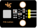 |
| ------------------------------------------------------------ | ------------------------------------------------------------ | ------------------------------------------------------------ |
| Raspberry Pi Pico Board*1                                    | Raspberry Pi Pico Expansion Board*1                          | DIY PIR Motion Sensor*1                                      |
|  |  |  |
| DIY Active Sensor*1                                          | 3P Dupont Wire*2                                             | Micro USB Cable*1                                            |


**Connection Diagram**


**Test Code**

```python
'''
 * Keyestudio 37 in 1 Starter Kit for Raspberry Pi Pico
 * lesson 42
 * PIR alarm
 * http://www.keyestudio.com
'''
import machine
import utime

sensor_pir = machine.Pin(15, machine.Pin.IN, machine.Pin.PULL_DOWN)
led = machine.Pin(25, machine.Pin.OUT)
buzzer = machine.Pin(16, machine.Pin.OUT)

def pir_handler(pin):
    utime.sleep_ms(100)
    if pin.value():
        print("Warning! Intrusion detected！")
        buzzer.value(1)
        for i in range(20):
            led.toggle()
            utime.sleep_ms(100)

sensor_pir.irq(trigger=machine.Pin.IRQ_RISING, handler=pir_handler)

while True:
    led.toggle()
    buzzer.value(0)
    utime.sleep(2)
```

**Code Explanation**

**sensor\_pir.irq(trigger=machine.Pin.IRQ\_RISING, handler=pir\_handler):** low levels change into high levels. pir\_handler is the interrupt function which can make the buzzer emit and LED flash


**Test Result**

After programming, the LED flashes slowly, the detector starts to work, and the interrupt trigger mode is IRQ_RISING. 

When there is an intrusion, the output level of the PIR changes from 0 to 1, the pir_handler() function will be called, the buzzer will emit sound, and the LED will flash quickly.


**Project 43: Speaker Module**


**Introduction**

We learned about controlling the speaker module to make sounds, play beats and adjust its volume. In fact, each song is a combination of specific beats and tones (frequencies). In this experiment, we use this speaker module to play a song.

The frequency of each tone is shown below.

**Bass:**

| Key Note | 1~#~ | 2~#~ | 3~#~ | 4~#~ | 5~#~ | 6~#~ | 7~#~ |
| -------- | ---- | ---- | ---- | ---- | ---- | ---- | ---- |
| **A**    | 221  | 248  | 278  | 294  | 330  | 371  | 416  |
| **B**    | 248  | 278  | 294  | 330  | 371  | 416  | 467  |
| **C**    | 131  | 147  | 165  | 175  | 196  | 221  | 248  |
| **D**    | 147  | 165  | 175  | 196  | 221  | 248  | 278  |
| **E**    | 165  | 175  | 196  | 221  | 248  | 278  | 312  |
| **F**    | 175  | 196  | 221  | 234  | 262  | 294  | 330  |
| **G**    | 196  | 221  | 234  | 262  | 294  | 330  | 371  |

**Midrange :**

| Key Note | 1    | 2    | 3    | 4    | 5    | 6    | 7    |
| -------- | ---- | ---- | ---- | ---- | ---- | ---- | ---- |
| **A**    | 441  | 495  | 556  | 589  | 661  | 724  | 833  |
| **B**    | 495  | 556  | 624  | 661  | 724  | 833  | 935  |
| **C**    | 262  | 294  | 330  | 350  | 393  | 441  | 495  |
| **D**    | 294  | 330  | 350  | 393  | 441  | 495  | 556  |
| **E**    | 330  | 350  | 393  | 441  | 495  | 556  | 624  |
| **F**    | 350  | 393  | 441  | 495  | 556  | 624  | 661  |
| **G**    | 393  | 441  | 495  | 556  | 624  | 661  | 724  |

**Treble:**

| KeyNote | 1^#^ | 2^#^ | 3^#^ | 4^#^ | 5^#^ | 6^#^ | 7^#^ |
| ------- | ---- | ---- | ---- | ---- | ---- | ---- | ---- |
| **A**   | 882  | 990  | 1112 | 1178 | 1322 | 1484 | 1665 |
| **B**   | 990  | 1112 | 1178 | 1322 | 1484 | 1665 | 1869 |
| **C**   | 525  | 589  | 661  | 700  | 786  | 882  | 990  |
| **D**   | 589  | 661  | 700  | 786  | 882  | 990  | 1112 |
| **E**   | 661  | 700  | 786  | 882  | 990  | 1112 | 1248 |
| **F**   | 700  | 786  | 882  | 935  | 1049 | 1178 | 1322 |
| **G**   | 786  | 882  | 990  | 1049 | 1178 | 1322 | 1484 |

Beats are the time delay for each note. The larger the number, the longer the delay time. A note without a line in the spectrum is a beat, with a delay of 1s. while a beat with an underline is 1/2 of a beat without a line, with a delay of 0.5s, and a beat with two underlines is 1/4 of a beat without a line, with a delay of 0.25s. The 1/8 of a beat is with a delay of 0.125s.

We will take Happy Birthday Song as an example.


**Components**

|  |  |  |
| ------------------------------------------------------------ | ------------------------------------------------------------ | ------------------------------------------------------------ |
| Raspberry Pi Pico Board*1                                    | Raspberry Pi Pico Expansion Board*1                          | 8002b Audio Power Amplifier*1                                |
|  |  |                                                              |
| 3P Dupont Wire*1                                             | Micro USB Cable*1                                            |                                                              |


**Connection Diagram**


**Test Code**

```python
'''
 * Keyestudio 37 in 1 Starter Kit for Raspberry Pi Pico
 * lesson 43
 * play music
 * http://www.keyestudio.com
'''
from machine import Pin, PWM
from utime import sleep
buzzer = PWM(Pin(15))

tones = {
"D1": 262,
"D2": 293,
"D3": 329,
"D4": 349,
"D5": 392,
"D6": 440,
"D7": 494,
"M1": 523,
"M2": 586,
"M3": 658,
"M4": 697,
"M5": 783,
"M6": 879,
"M7": 987,
"H1": 1045,
"H2": 1171,
"H3": 1316,
"H4": 1393,
"H5": 1563,
"H6": 1755,
"H7": 1971
}

song = ["D5","D5","D6","D5","M1","D7",
        "D5","D5","D6","D5","M2","M1",
        "D5","D5","M5","M3","M1","D7","D6",
        "M4","M4","M3","M1","M2","M1"
]

durt = [0.25, 0.25, 0.5, 0.5, 0.5, 1,
       0.25, 0.25, 0.5, 0.5, 0.5, 1,
       0.25, 0.25, 0.5, 0.5, 0.5, 0.5, 0.5,
       0.25, 0.25, 0.5, 0.5, 0.5, 1
]

def playtone(frequency):
    buzzer.duty_u16(1000)
    buzzer.freq(frequency)

def bequiet():
    buzzer.duty_u16(0)

def playsong(mysong):
    for i in range(len(mysong)):
        playtone(tones[mysong[i]])
        sleep(durt[i])
    bequiet()
playsong(song)
```

**Code Explanation**

We list frequencies of all D keys. Then list the frequencies and beats according to the musical notation. The beat we use is 500ms and can be adjusted. The corresponding beat are looped to become a song.

**Test Result**

Connect the components according to the connection diagram and run the test code, the audio power amplifier module will play a birthday song.


**Project** **44: Rotary Encoder**


**Introduction**

In this lesson, we will control the LED on the RGB module to show different colors through a rotary encoder.

When designing the code, we need to divide the obtained values by 3 to get the remainders. The remainder is 0 and the LED will become red. The remainder is 1, the LED will become green. The remainder is 2, the LED will turn blue.


**Components**

|  |  |  |  |
| ------------------------------------------------------------ | ------------------------------------------------------------ | ------------------------------------------------------------ | ------------------------------------------------------------ |
| Raspberry Pi Pico Board*1                                    | Raspberry Pi Pico Expansion Board*1                          | Common Cathode RGB Module*1                                  | Rotary Encoder Module*1                                      |
|  |  |  |                                                              |
| 5P Dupont Wire*1                                             | 4P Dupont Wire*1                                             | Micro USB Cable*1                                            |                                                              |


**Connection Diagram**


**Test Code**

```python
'''
 * Keyestudio 37 in 1 Starter Kit for Raspberry Pi Pico
 * lesson 44
 * Encoder control RGB
 * http://www.keyestudio.com
'''
import time
from rotary_irq_rp2 import RotaryIRQ
from machine import Pin, PWM

pwm_r = PWM(Pin(9))
pwm_g = PWM(Pin(10))
pwm_b = PWM(Pin(11))

pwm_r.freq(1000)
pwm_g.freq(1000)
pwm_b.freq(1000)

def light(red, green, blue):
    pwm_r.duty_u16(red)
    pwm_g.duty_u16(green)
    pwm_b.duty_u16(blue)

SW=Pin(20,Pin.IN,Pin.PULL_UP)
r = RotaryIRQ(pin_num_clk=18,
              pin_num_dt=19,
              min_val=0,
              reverse=False,
              range_mode=RotaryIRQ.RANGE_UNBOUNDED)

while True:
    val = r.value()
    print(val%3)
    if val%3 == 0:
        light(65535, 0, 0)
    elif val%3 == 1:
        light(0, 65535, 0)
    elif val%3 == 2:
        light(0, 0, 65535)
    time.sleep(0.1)
```


**Code Explanation**

In the experiment, we set the val to the remainder of Encoder_Count divided by 3. Encoder_Count is the value of the encoder. Then we can set pin 9(red), 10(green) and 11(blue) according to remainders.

Colors of LED can be controlled by remainders.

**Test Result**

Wire up, run the code and open the serial monitor. Rotate the knob of the rotary encoder to display the reminders, which can control colors of LED.


**Project 45: Rotary Potentiometer**


**Introduction**

In the previous courses, we did experiments of breathing light and controlling LED with button. 

In this course, we do these two experiments by controlling the brightness of LED through an adjustable potentiometer. The brightness of LED is controlled by PWM values, and the range of analog values is the same as the PWM’s, from 0 to 65535.

After the code is set successfully, we can control the brightness of the LED on the module by rotating the potentiometer.

**Required Components**

|  |  |  |
| ------------------------------------------------------------ | ------------------------------------------------------------ | ------------------------------------------------------------ |
| Raspberry Pi Pico Board*1                                    | Raspberry Pi Pico Expansion Board*1                          | Purple LED*1                                                 |
|  |  |  |
| Rotary Potentiometer*1                                       | 3P Dupont Wire*2                                             | Micro USB Cable*1                                            |


**Connection Diagram**


**Test Code**

```python
'''
 * Keyestudio 37 in 1 Starter Kit for Raspberry Pi Pico
 * lesson 45
 * adjust the light
 * http://www.keyestudio.com
'''
import machine
import utime

potentiometer = machine.ADC(26)

pwm = machine.PWM(machine.Pin(15))
pwm.freq(1000)

while True:
    pot_value = potentiometer.read_u16()
    pwm.duty_u16(pot_value)
    utime.sleep(0.1)
```

**Code Explanation**

It is easy to control the brightness of the LED light by a potentiometer. Here we can find that MicroPython unifies the value range of the ADC between 0 and 65535, and assigns values directly, which is simple and convenient. 


**Test Result**

Run the test code and turn the potentiometer on the module to adjust the brightness of the LED on the LED module.


Project 46: Smart Windows


**Description**

In life, we can see all kinds of smart products, such as smart home. Smart homes include smart curtains, smart windows, smart TVs, smart lights, and more. 

In this experiment, we use a steam sensor to detect rainwater, and then achieve the effect of closing and opening the window by a servo.


**Required Components**

|  |  |  |
| ------------------------------------------------------------ | ------------------------------------------------------------ | ------------------------------------------------------------ |
| Raspberry Pi Pico Board*1                                    | Raspberry Pi Pico Expansion Board*1                          | Steam Sensor*1                                               |
|  |  |  |
| Servo*1                                                      | 3P Dupont Wire*1                                             | Micro USB Cable*1                                            |


**Connection Diagram**


**Test Code**

```python
'''
 * Keyestudio 37 in 1 Starter Kit for Raspberry Pi Pico
 * lesson 46
 * Smart_window
 * http://www.keyestudio.com
'''
import utime
from machine import Pin
from machine import PWM

pwm = PWM(Pin(9))
pwm.freq(50)
sensor = machine.ADC(26)
'''
0°----2.5%----1638
45°----5%----3276
90°----7.5%----4915
135°----10%----6553
180°----12.5%----8192
'''
angle_0 = 1638
angle_90 = 4915
angle_180 = 8192
    
while True:
    value = sensor.read_u16()
    print(value)
    if value > 2000:
        pwm.duty_u16(angle_0)
        utime.sleep(0.5)
    else:
        pwm.duty_u16(angle_180)
        utime.sleep(0.5)
```

We can control a servo to rotate by a threshold


**Test Result**

Wire up and run the test code. When the sensor detects a certain amount of water, the servo rotates to achieve the effect of closing or opening windows.


**Project** **47: Sound Activated Light**


**Introduction**

In this lesson, we will make a smart sound activated light using a sound sensor and an LED module. When we make a sound, the light will automatically turn on; when there is no sound, the lights will automatically turn off. 

How it works? 

The sound-controlled light is equipped with a sound sensor, and this sensor converts the intensity of external sound into a corresponding value. Then set a threshold, when the threshold is exceeded, the light will turn on, and when it is not exceeded, the light will go out.

**Components**

|  |  |  |
| ------------------------------------------------------------ | ------------------------------------------------------------ | ------------------------------------------------------------ |
| Raspberry Pi Pico Board*1                                    | Raspberry Pi Pico Shield*1                                   | Sound Sensor*1                                               |
|  |  |  |
| White LED Module*1                                           | 3P Dupont Wire*2                                             | MicroUSBCable*1                                              |


**Connection Diagram**


**Test Code**

```python
'''
 * Keyestudio 37 in 1 Starter Kit for Raspberry Pi Pico
 * lesson 47
 * sound-controlled lights
 * http://www.keyestudio.com
'''
import machine
import time

MicroPhone = machine.ADC(26)

led = machine.Pin(15,machine.Pin.OUT)

while True:
    value = MicroPhone.read_u16()
    print(value)
    if value > 5000:
        led.value(1)
        time.sleep(3)
    else:
        led.value(0)
    time.sleep(0.1)
```

**Code Explanation**

We set the analog threshold value to 5000. If more than 5000, LED will be on 3s; on the contrary, it will be off.


**Test Result**

Run the test code, the shell monitor displays the corresponding volume value. When the analog value of sound is greater than 5000, the LED on the LED module will light up, otherwise it will go off.


Project 48: Fire Alarm


**Description**

In this experiment, we will make a fire alarm system. Just use a flame sensor to control an active buzzer to emit sounds.

**Required Components**

|  |  |  |  |
| ------------------------------------------------------------ | ------------------------------------------------------------ | ------------------------------------------------------------ | ------------------------------------------------------------ |
| Raspberry Pi Pico Board*1                                    | Raspberry Pi Pico Expansion Board*1                          | Active Buzzer*1                                              | DIY Flame Sensor*1                                           |
|  |  |  |                                                              |
| Micro USB Cable*1                                            | 3P Dupont Wire*1                                             | 4P Dupont Wire*1                                             |                                                              |


**Connection Diagram**


**Test Code**

```python
'''
 * Keyestudio 37 in 1 Starter Kit for Raspberry Pi Pico
 * lesson 48
 * Flame_alarm
 * http://www.keyestudio.com
'''
from machine import Pin
import time

buzzer = Pin(3, Pin.OUT)
sensor = Pin(22, Pin.IN)

while True:
    analogVal = sensor.value()
    print(analogVal)
    if analogVal == 0:
        buzzer.value(1)
    else:
        buzzer.value(0)
    time.sleep(0.5)
```

**Code Explanation**

This flame sensor uses an analog pin and a digital pin. When a flame is detected, the digital pin outputs a low level. In this experiment we will use the digital port.


**Test Result**

Wire up, run the test code and power on. The sensor detects the flame, and the external active buzzer will emit sounds, otherwise the active buzzer will not emit sounds.


Project 49: Smoke Alarm


**Description**

In this experiment, we will make a smoke alarm by a TM16504-Digit segment module, a gas sensor and an active buzzer.


**Required Components**

|  |  |  |  |
| ------------------------------------------------------------ | ------------------------------------------------------------ | ------------------------------------------------------------ | ------------------------------------------------------------ |
| Raspberry Pi Pico Board*1                                    | Raspberry Pi Pico Expansion Board*1                          | Active Buzzer*1                                              | TM16504-Digit Segment Module*1                               |
|  |  |  |  |
| Analog Gas Sensor*1                                          | 3P Dupont Wire*1                                             | 4P Dupont Wire*2                                             | Micro USB Cable*1                                            |


**Connection Diagram**


**Test Code**

```python
'''
 * Keyestudio 37 in 1 Starter Kit for Raspberry Pi Pico
 * lesson 49
 * smoke_alarm
 * http://www.keyestudio.com
'''
from machine import Pin
import time

mq2 = machine.ADC(26)
buzzer = Pin(3, Pin.OUT)
# definitions for TM1650
ADDR_DIS = 0x48  #mode command
ADDR_KEY = 0x49  #read key value command

# definitions for brightness
BRIGHT_DARKEST = 0
BRIGHT_TYPICAL = 2
BRIGHTEST      = 7

on  = 1
off = 0

# number:0~9
NUM = [0x3f,0x06,0x5b,0x4f,0x66,0x6d,0x7d,0x07,0x7f,0x6f] 
# DIG = [0x68,0x6a,0x6c,0x6e]
DIG = [0x6e,0x6c,0x6a,0x68]
DOT = [0,0,0,0]

clkPin = 15
dioPin = 14
clk = machine.Pin(clkPin, machine.Pin.OUT)
dio = machine.Pin(dioPin, machine.Pin.OUT)

DisplayCommand = 0

def writeByte(wr_data):
    global clk,dio
    for i in range(8):
        if(wr_data & 0x80 == 0x80):
            dio.value(1)
        else:
            dio.value(0)
        clk.value(0)
        time.sleep(0.0001)
        clk.value(1)
        time.sleep(0.0001)
        clk.value(0)
        wr_data <<= 1
    return

def start():
    global clk,dio
    dio.value(1)
    clk.value(1)
    time.sleep(0.0001)
    dio.value(0)
    return
    
def ack():
    global clk,dio
    dy = 0
    clk.value(0)
    time.sleep(0.0001)
    dio = Pin(dioPin, machine.Pin.IN)
    while(dio.value() == 1):
        time.sleep(0.0001)
        dy += 1
        if(dy>5000):
            break
    clk.value(1)
    time.sleep(0.0001)
    clk.value(0)
    dio = Pin(dioPin, machine.Pin.OUT)
    return
    
def stop():
    global clk,dio
    dio.value(0)
    clk.value(1)
    time.sleep(0.0001)
    dio.value(1)
    return
    
def displayBit(bit, num):
    global ADDR_DIS
    if(num > 9 and bit > 4):
        return
    start()
    writeByte(ADDR_DIS)
    ack()
    writeByte(DisplayCommand)
    ack()
    stop()
    start()
    writeByte(DIG[bit-1])
    ack()
    if(DOT[bit-1] == 1):
        writeByte(NUM[num] | 0x80)
    else:
        writeByte(NUM[num])
    ack()
    stop()
    return
    
def clearBit(bit):
    if(bit > 4):
        return
    start()
    writeByte(ADDR_DIS)
    ack()
    writeByte(DisplayCommand)
    ack()
    stop()
    start()
    writeByte(DIG[bit-1])
    ack()
    writeByte(0x00)
    ack()
    stop()
    return
    
    
def setBrightness(b = BRIGHT_TYPICAL):
    global DisplayCommand,brightness
    DisplayCommand = (DisplayCommand & 0x0f)+(b<<4)
    return

def setMode(segment = 0):
    global DisplayCommand
    DisplayCommand = (DisplayCommand & 0xf7)+(segment<<3)
    return
    
def displayOnOFF(OnOff = 1):
    global DisplayCommand
    DisplayCommand = (DisplayCommand & 0xfe)+OnOff
    return

def displayDot(bit, OnOff):
    if(bit > 4):
        return
    if(OnOff == 1): 
        DOT[bit-1] = 1;
    else:
        DOT[bit-1] = 0;
    return
        
def InitDigitalTube():
    setBrightness(2)
    setMode(0)
    displayOnOFF(1)
    for _ in range(4):
        clearBit(_)
    return

def ShowNum(num): #0~9999
    displayBit(1,num%10)
    if(num < 10):
        clearBit(2)
        clearBit(3)
        clearBit(4)
    if(num > 9 and num < 100):
        displayBit(2,num//10%10)
        clearBit(3)
        clearBit(4)
    if(num > 99 and num < 1000):
        displayBit(2,num//10%10)
        displayBit(3,num//100%10)
        clearBit(4)
    if(num > 999 and num < 10000):
        displayBit(2,num//10%10)
        displayBit(3,num//100%10)
        displayBit(4,num//1000)

InitDigitalTube()

while True:
    value = mq2.read_u16()//16
    print(value)
    ShowNum(value)
    if value > 1000:
        buzzer.value(1)
    else:
        buzzer.value(0)
    time.sleep(0.1)
```

**Code Explanation**

Define an integer variable val to store the analog value of the smoke sensor, and then we display the analog value in the four-digit digital tube, and then set a threshold, and when the threshold is reached, the buzzer will sound. 


**Test Result**

Run the test code, wire up and power on. When the concentration of combustible gas exceeds the standard, the active buzzer module will give an alarm, and the four-digit digital tube will display the concentration value.


Project 50: 6812 Colorful LED


**Description**

We learned how to use the 6812 RGB module, we knew that this module can light up each LED through a pin. In this experiment, we will control the RGB module to display different colors. (Note: do not look directly at the LED for a long time to avoid damage to our eyes.)

**Required Components**

|  |  |  |
| ------------------------------------------------------------ | ------------------------------------------------------------ | ------------------------------------------------------------ |
| Raspberry Pi Pico Board*1                                    | Raspberry Pi Pico Shield*1                                   | 6812 RGB Module*1                                            |
|  |  |                                                              |
| 3P Dupont Wire*1                                             | Micro USB Cable*1                                            |                                                              |


**Connection Diagram**


**Test Code**

```python
'''
 * Keyestudio 37 in 1 Starter Kit for Raspberry Pi Pico
 * lesson 50
 * SK6812 RGB
 * http://www.keyestudio.com
'''
# Example using PIO to drive a set of WS2812 LEDs.

import array, time
from machine import Pin
import rp2

# Configure the number of WS2812 LEDs.
NUM_LEDS = 4
PIN_NUM = 15
brightness = 0.2

@rp2.asm_pio(sideset_init=rp2.PIO.OUT_LOW, out_shiftdir=rp2.PIO.SHIFT_LEFT, autopull=True, pull_thresh=24)
def ws2812():
    T1 = 2
    T2 = 5
    T3 = 3
    wrap_target()
    label("bitloop")
    out(x, 1)               .side(0)    [T3 - 1]
    jmp(not_x, "do_zero")   .side(1)    [T1 - 1]
    jmp("bitloop")          .side(1)    [T2 - 1]
    label("do_zero")
    nop()                   .side(0)    [T2 - 1]
    wrap()


# Create the StateMachine with the ws2812 program, outputting on pin
sm = rp2.StateMachine(0, ws2812, freq=8_000_000, sideset_base=Pin(PIN_NUM))

# Start the StateMachine, it will wait for data on its FIFO.
sm.active(1)

# Display a pattern on the LEDs via an array of LED RGB values.
ar = array.array("I", [0 for _ in range(NUM_LEDS)])


def pixels_show():
    dimmer_ar = array.array("I", [0 for _ in range(NUM_LEDS)])
    for i,c in enumerate(ar):
        r = int(((c >> 8) & 0xFF) * brightness)
        g = int(((c >> 16) & 0xFF) * brightness)
        b = int((c & 0xFF) * brightness)
        dimmer_ar[i] = (g<<16) + (r<<8) + b
    sm.put(dimmer_ar, 8)
    time.sleep_ms(10)

def pixels_set(i, color):
    ar[i] = (color[1]<<16) + (color[0]<<8) + color[2]

def color_chase(color, wait):
    for i in range(NUM_LEDS):
        pixels_set(i, color)
        time.sleep(wait)
        pixels_show()
    time.sleep(0.2)
 
def wheel(pos):
    # Input a value 0 to 255 to get a color value.
    # The colours are a transition r - g - b - back to r.
    if pos < 0 or pos > 255:
        return (0, 0, 0)
    if pos < 85:
        return (255 - pos * 3, pos * 3, 0)
    if pos < 170:
        pos -= 85
        return (0, 255 - pos * 3, pos * 3)
    pos -= 170
    return (pos * 3, 0, 255 - pos * 3)
 
 
def rainbow_cycle(wait):
    for j in range(255):
        for i in range(NUM_LEDS):
            rc_index = (i * 256 // NUM_LEDS) + j
            pixels_set(i, wheel(rc_index & 255))
        pixels_show()
        time.sleep(wait)

BLACK = (0, 0, 0)
RED = (255, 0, 0)
YELLOW = (255, 150, 0)
GREEN = (0, 255, 0)
CYAN = (0, 255, 255)
BLUE = (0, 0, 255)
PURPLE = (180, 0, 255)
WHITE = (255, 255, 255)
COLORS = (BLACK, RED, YELLOW, GREEN, CYAN, BLUE, PURPLE, WHITE)

print("chases")
for color in COLORS:       
    color_chase(color, 0.05)

print("rainbow")
rainbow_cycle(0)
```


**Test Result**

Wire up, run the test code. Then the four lamp beads will display flowing lights, showing black, red, yellow, green, blue, blue, purple and white and  a rainbow light effect. 


**Project 51: Ultrasonic Sensor**


**Description**


We know that bats use echoes to determine the direction and the location of their preys. In real life, sonar is used to detect sounds in the water. 

Since the attenuation rate of electromagnetic waves in water is very high, it cannot be used to detect signals, however, the attenuation rate of sound waves in the water is much smaller, so sound waves are most commonly used underwater for observation and measurement.

In this experiment, we will use a speaker module, an RGB module and a 4-digit tube display to make a device for detection through ultrasonic.


**Required Components**

|  |  |  |
| ------------------------------------------------------------ | ------------------------------------------------------------ | ------------------------------------------------------------ |
| Raspberry Pi Pico Board*1                                    | Raspberry Pi Pico Expansion Board*1                          | Keyes brick HC-SR04 Ultrasonic Sensor*1                      |
|  |  |  |
| Audio Power Amplifier*1                                      | Common Cathode RGB Module *1                                 | TM1650 4-Digit Segment Display*1                             |
|  |  |  |
| 4P Dupont Wire*3                                             | 3P Dupont Wire*1                                             | Micro USB Cable*1                                            |


**Connection Diagram**


**Test Code**

```python
'''
 * Keyestudio 37 in 1 Starter Kit for Raspberry Pi Pico
 * lesson 51
 * Ultrasonic radar
 * http://www.keyestudio.com
'''
from machine import Pin, PWM
import utime

# definitions for TM1650
ADDR_DIS = 0x48  #mode command
ADDR_KEY = 0x49  #read key value command

# definitions for brightness
BRIGHT_DARKEST = 0
BRIGHT_TYPICAL = 2
BRIGHTEST      = 7

on  = 1
off = 0

# number:0~9
NUM = [0x3f,0x06,0x5b,0x4f,0x66,0x6d,0x7d,0x07,0x7f,0x6f] 
# DIG = [0x68,0x6a,0x6c,0x6e]
DIG = [0x6e,0x6c,0x6a,0x68]
DOT = [0,0,0,0]

clkPin = 15
dioPin = 14
clk = machine.Pin(clkPin, machine.Pin.OUT)
dio = machine.Pin(dioPin, machine.Pin.OUT)

DisplayCommand = 0

def writeByte(wr_data):
    global clk,dio
    for i in range(8):
        if(wr_data & 0x80 == 0x80):
            dio.value(1)
        else:
            dio.value(0)
        clk.value(0)
        utime.sleep(0.0001)
        clk.value(1)
        utime.sleep(0.0001)
        clk.value(0)
        wr_data <<= 1
    return

def start():
    global clk,dio
    dio.value(1)
    clk.value(1)
    utime.sleep(0.0001)
    dio.value(0)
    return
    
def ack():
    global clk,dio
    dy = 0
    clk.value(0)
    utime.sleep(0.0001)
    dio = Pin(dioPin, machine.Pin.IN)
    while(dio.value() == 1):
        utime.sleep(0.0001)
        dy += 1
        if(dy>5000):
            break
    clk.value(1)
    utime.sleep(0.0001)
    clk.value(0)
    dio = Pin(dioPin, machine.Pin.OUT)
    return
    
def stop():
    global clk,dio
    dio.value(0)
    clk.value(1)
    utime.sleep(0.0001)
    dio.value(1)
    return
    
def displayBit(bit, num):
    global ADDR_DIS
    if(num > 9 and bit > 4):
        return
    start()
    writeByte(ADDR_DIS)
    ack()
    writeByte(DisplayCommand)
    ack()
    stop()
    start()
    writeByte(DIG[bit-1])
    ack()
    if(DOT[bit-1] == 1):
        writeByte(NUM[num] | 0x80)
    else:
        writeByte(NUM[num])
    ack()
    stop()
    return
    
def clearBit(bit):
    if(bit > 4):
        return
    start()
    writeByte(ADDR_DIS)
    ack()
    writeByte(DisplayCommand)
    ack()
    stop()
    start()
    writeByte(DIG[bit-1])
    ack()
    writeByte(0x00)
    ack()
    stop()
    return
    
    
def setBrightness(b = BRIGHT_TYPICAL):
    global DisplayCommand,brightness
    DisplayCommand = (DisplayCommand & 0x0f)+(b<<4)
    return

def setMode(segment = 0):
    global DisplayCommand
    DisplayCommand = (DisplayCommand & 0xf7)+(segment<<3)
    return
    
def displayOnOFF(OnOff = 1):
    global DisplayCommand
    DisplayCommand = (DisplayCommand & 0xfe)+OnOff
    return

def displayDot(bit, OnOff):
    if(bit > 4):
        return
    if(OnOff == 1): 
        DOT[bit-1] = 1;
    else:
        DOT[bit-1] = 0;
    return
        
def InitDigitalTube():
    setBrightness(2)
    setMode(0)
    displayOnOFF(1)
    for _ in range(4):
        clearBit(_)
    return

def ShowNum(num): #0~9999
    displayBit(1,num%10)
    if(num < 10):
        clearBit(2)
        clearBit(3)
        clearBit(4)
    if(num > 9 and num < 100):
        displayBit(2,num//10%10)
        clearBit(3)
        clearBit(4)
    if(num > 99 and num < 1000):
        displayBit(2,num//10%10)
        displayBit(3,num//100%10)
        clearBit(4)
    if(num > 999 and num < 10000):
        displayBit(2,num//10%10)
        displayBit(3,num//100%10)
        displayBit(4,num//1000)

pwm_r = PWM(Pin(9))
pwm_g = PWM(Pin(10))
pwm_b = PWM(Pin(11))

pwm_r.freq(1000)
pwm_g.freq(1000)
pwm_b.freq(1000)

def light(red, green, blue):
    pwm_r.duty_u16(red)
    pwm_g.duty_u16(green)
    pwm_b.duty_u16(blue)

# ultrasonic ranging，unit: cm
def getDistance(trigger, echo):
    # produce 10us square waves
    trigger.low()   #preserve a short a low level to secure a high level:
    utime.sleep_us(2)
    trigger.high()
    utime.sleep_us(10)#pull up high levels, wait for 10ms and set low levels
    trigger.low()
    
    while echo.value() == 0: #build a while loop to detect pins are 0 or not, record the current time
        start = utime.ticks_us()
    while echo.value() == 1: #build a while loop to detect pins are 1 or not, record the current time
        end = utime.ticks_us()
    d = (end - start) * 0.0343 / 2 #travelling time x sound speed(343.2 m/s，0.0343cm for each ms)，double distance is divided by 2
    return d

# set pins
trigger = Pin(20, Pin.OUT)
echo = Pin(19, Pin.IN)

buzzer = PWM(Pin(16))

def playtone(frequency):
    buzzer.duty_u16(1000)
    buzzer.freq(frequency)

def bequiet():
    buzzer.duty_u16(0)
    
# main program
InitDigitalTube()
while True:
    distance = int(getDistance(trigger, echo))
    ShowNum(distance)
    if distance <= 10:
        playtone(880)
        utime.sleep(0.1)
        bequiet()
        light(65535, 0, 0)
    elif distance <= 20:
        playtone(532)
        utime.sleep(0.2)
        bequiet()
        light(0, 0, 65535)
    else:
        light(0, 65535, 0)
```

**Code Explanation**

We set sound frequency and light color by adjusting different distance range.

We can adjust the distance range in the code.


**Test Result**

Wire up according to the connection diagram upload the run the code and power up. 

When the ultrasonic sensor detects different distances, the buzzer will produce different frequencies of sound, the RGB will show different colors, and the measured distances are displayed on the 4-digit tube display.


**Project 52: IR Remote Control**


**Introduction**

In the previous experiments, we learned to turn on or turn off the LED, adjust the brightness of a light through PWM, and how to use the infrared receiver module. So in this experiment, we use an infrared remote control to control an LED module.

When we receive a value, we set the PWM value by the corresponding button value, thus you can adjust the brightness. Control the LED to turn on or turn off is in the same way. If we want to use the same button to control the LED to turn on or turn off, we can achieve it through the code.


**Components**

|  |  |  |  |
| ------------------------------------------------------------ | ------------------------------------------------------------ | ------------------------------------------------------------ | ------------------------------------------------------------ |
| Raspberry Pi Pico Board*1                                    | Raspberry Pi Pico Expansion Board*1                          | DIY Purple LED Module*1                                      | DIY IR Receiver*1                                            |
|  |  |  |                                                              |
| Micro USB Cable*1                                            | IR Remote Control*1                                          | 3P Dupont Wire*2                                             |                                                              |


**Connection Diagram**


**Test Code**

```python
'''
 * Keyestudio 37 in 1 Starter Kit for Raspberry Pi Pico
 * lesson 52
 * IR control LED
 * http://www.keyestudio.com
'''
import time
from machine import Pin

led = Pin(14, Pin.OUT)
ird = Pin(16,Pin.IN)

act = {"1": "LLLLLLLLHHHHHHHHLHHLHLLLHLLHLHHH","2": "LLLLLLLLHHHHHHHHHLLHHLLLLHHLLHHH","3": "LLLLLLLLHHHHHHHHHLHHLLLLLHLLHHHH",
       "4": "LLLLLLLLHHHHHHHHLLHHLLLLHHLLHHHH","5": "LLLLLLLLHHHHHHHHLLLHHLLLHHHLLHHH","6": "LLLLLLLLHHHHHHHHLHHHHLHLHLLLLHLH",
       "7": "LLLLLLLLHHHHHHHHLLLHLLLLHHHLHHHH","8": "LLLLLLLLHHHHHHHHLLHHHLLLHHLLLHHH","9": "LLLLLLLLHHHHHHHHLHLHHLHLHLHLLHLH",
       "0": "LLLLLLLLHHHHHHHHLHLLHLHLHLHHLHLH","Up": "LLLLLLLLHHHHHHHHLHHLLLHLHLLHHHLH","Down": "LLLLLLLLHHHHHHHHHLHLHLLLLHLHLHHH",
       "Left": "LLLLLLLLHHHHHHHHLLHLLLHLHHLHHHLH","Right": "LLLLLLLLHHHHHHHHHHLLLLHLLLHHHHLH","Ok": "LLLLLLLLHHHHHHHHLLLLLLHLHHHHHHLH",
       "*": "LLLLLLLLHHHHHHHHLHLLLLHLHLHHHHLH","#": "LLLLLLLLHHHHHHHHLHLHLLHLHLHLHHLH"}

def read_ircode(ird):
    wait = 1
    complete = 0
    seq0 = []
    seq1 = []

    while wait == 1:
        if ird.value() == 0:
            wait = 0
    while wait == 0 and complete == 0:
        start = time.ticks_us()
        while ird.value() == 0:
            ms1 = time.ticks_us()
        diff = time.ticks_diff(ms1,start)
        seq0.append(diff)
        while ird.value() == 1 and complete == 0:
            ms2 = time.ticks_us()
            diff = time.ticks_diff(ms2,ms1)
            if diff > 10000:
                complete = 1
        seq1.append(diff)

    code = ""
    for val in seq1:
        if val < 2000:
            if val < 700:
                code += "L"
            else:
                code += "H"
    # print(code)
    command = ""
    for k,v in act.items():
        if code == v:
            command = k
    if command == "":
        command = code
    return command

flag = False
while True:
#     global flag
    command = read_ircode(ird)
    print(command, end = "  ")
    print(flag, end = "  ")
    if command == "Ok":
        if flag == True:
            led.value(1)
            flag = False
            print("led on")
        else:
            led.value(0)
            flag = True
            print("led off")
    time.sleep(0.1)
```

**Code Explanation**

We define a Boolean variable. 

There are two Boolean variables. true(true) or false (false), **boolean flag = true.**

When we press the OK button, the value of infrared reception is 64. At this time, we need to set a Boolean variable flag. 

When the flag is true (true), the LED is turned on, and when it is false (false), the LED is turned off and turned on. After the LED is on and set it to false. We press the OK key, the LED will be off.


**Test Result**

Wire up, upload the test code and open the Shell monitor. Press the OK button of the remote, the LED will be on; press it again, the LED will be off.


Project 53: Heat Dissipation Device


**Description**

We will use a temperature sensor and some modules to make a smart cooling device in this experiment. 

When the ambient temperature is higher than a certain value, the motor is turned on, thereby reducing the ambient temperature and achieving the heat dissipation effect. Then display the temperature value in the four-digit segment display.


**Required Components**

|  |  |  |  |
| ------------------------------------------------------------ | ------------------------------------------------------------ | ------------------------------------------------------------ | ------------------------------------------------------------ |
| Raspberry Pi Pico Board*1                                    | Raspberry Pi Pico Expansion Board*1                          | 130 Motor*1                                                  | TM1650 4-Digit Segment Display*1                             |
|  |  |  |  |
| 18B20 Temperature Sensor*1                                   | 3P Dupont Wire*1                                             | 4P Dupont Wire*2                                             | Micro USB Cable*1                                            |


**Connection Diagram**


**Test Code**

```python
'''
 * Keyestudio 37 in 1 Starter Kit for Raspberry Pi Pico
 * lesson 53
 * heat_abstractor
 * http://www.keyestudio.com
'''
import machine, onewire, ds18x20, time

ds_pin = machine.Pin(3)

ds_sensor = ds18x20.DS18X20(onewire.OneWire(ds_pin))

roms = ds_sensor.scan()

#two pins of the motor
INA = machine.Pin(20, machine.Pin.OUT)
INB = machine.Pin(21, machine.Pin.OUT)
# definitions for TM1650
ADDR_DIS = 0x48  #mode command
ADDR_KEY = 0x49  #read key value command

# definitions for brightness
BRIGHT_DARKEST = 0
BRIGHT_TYPICAL = 2
BRIGHTEST      = 7

on  = 1
off = 0

# number:0~9
NUM = [0x3f,0x06,0x5b,0x4f,0x66,0x6d,0x7d,0x07,0x7f,0x6f] 
# DIG = [0x68,0x6a,0x6c,0x6e]
DIG = [0x6e,0x6c,0x6a,0x68]
DOT = [0,0,0,0]

clkPin = 15
dioPin = 14
clk = machine.Pin(clkPin, machine.Pin.OUT)
dio = machine.Pin(dioPin, machine.Pin.OUT)

DisplayCommand = 0

def writeByte(wr_data):
    global clk,dio
    for i in range(8):
        if(wr_data & 0x80 == 0x80):
            dio.value(1)
        else:
            dio.value(0)
        clk.value(0)
        time.sleep(0.0001)
        clk.value(1)
        time.sleep(0.0001)
        clk.value(0)
        wr_data <<= 1
    return

def start():
    global clk,dio
    dio.value(1)
    clk.value(1)
    time.sleep(0.0001)
    dio.value(0)
    return
    
def ack():
    global clk,dio
    dy = 0
    clk.value(0)
    time.sleep(0.0001)
    dio = machine.Pin(dioPin, machine.Pin.IN)
    while(dio.value() == 1):
        time.sleep(0.0001)
        dy += 1
        if(dy>5000):
            break
    clk.value(1)
    time.sleep(0.0001)
    clk.value(0)
    dio = machine.Pin(dioPin, machine.Pin.OUT)
    return
    
def stop():
    global clk,dio
    dio.value(0)
    clk.value(1)
    time.sleep(0.0001)
    dio.value(1)
    return
    
def displayBit(bit, num):
    global ADDR_DIS
    if(num > 9 and bit > 4):
        return
    start()
    writeByte(ADDR_DIS)
    ack()
    writeByte(DisplayCommand)
    ack()
    stop()
    start()
    writeByte(DIG[bit-1])
    ack()
    if(DOT[bit-1] == 1):
        writeByte(NUM[num] | 0x80)
    else:
        writeByte(NUM[num])
    ack()
    stop()
    return
    
def clearBit(bit):
    if(bit > 4):
        return
    start()
    writeByte(ADDR_DIS)
    ack()
    writeByte(DisplayCommand)
    ack()
    stop()
    start()
    writeByte(DIG[bit-1])
    ack()
    writeByte(0x00)
    ack()
    stop()
    return
    
    
def setBrightness(b = BRIGHT_TYPICAL):
    global DisplayCommand,brightness
    DisplayCommand = (DisplayCommand & 0x0f)+(b<<4)
    return

def setMode(segment = 0):
    global DisplayCommand
    DisplayCommand = (DisplayCommand & 0xf7)+(segment<<3)
    return
    
def displayOnOFF(OnOff = 1):
    global DisplayCommand
    DisplayCommand = (DisplayCommand & 0xfe)+OnOff
    return

def displayDot(bit, OnOff):
    if(bit > 4):
        return
    if(OnOff == 1): 
        DOT[bit-1] = 1;
    else:
        DOT[bit-1] = 0;
    return
        
def InitDigitalTube():
    setBrightness(2)
    setMode(0)
    displayOnOFF(1)
    for _ in range(4):
        clearBit(_)
    return

def ShowNum(num): #0~9999
    displayBit(1,num%10)
    if(num < 10):
        clearBit(2)
        clearBit(3)
        clearBit(4)
    if(num > 9 and num < 100):
        displayBit(2,num//10%10)
        clearBit(3)
        clearBit(4)
    if(num > 99 and num < 1000):
        displayBit(2,num//10%10)
        displayBit(3,num//100%10)
        clearBit(4)
    if(num > 999 and num < 10000):
        displayBit(2,num//10%10)
        displayBit(3,num//100%10)
        displayBit(4,num//1000)

InitDigitalTube()
print('Found DS devices: ', roms)

while True:
    ds_sensor.convert_temp()
    time.sleep_ms(750)
    for rom in roms:
        value = ds_sensor.read_temp(rom)
        print(value)
        ShowNum(int(value))
        if value > 28:
            INA.value(0)
            INB.value(1)
        else:
            INA.value(0)
            INB.value(0)
```

**Code Explanation**

The setting of variables and the storage of detection values are the same as what we learned earlier. We also set a temperature threshold and control the rotation of the motor when the threshold is exceeded, and then we use the digital tube to display the temperature value.


**Test Result**

Wire up and run the test code. We can see the temperature of the current environment (unit is Celsius) on the four-digit segment display, as shown in the figure below. If this value exceeds the value we set, the fan will rotate to dissipate heat.


Project 54: Intelligent Entrance Guard System


**Description**

In this project, we use the RFID522 card swiping module and the servo to set up an intelligent access control system. The principle is very simple.

We use RFID522 swipe card module, an IC card or key card to unlock.


**Required Components**

|  |  |  |  |
| ------------------------------------------------------------ | ------------------------------------------------------------ | ------------------------------------------------------------ | ------------------------------------------------------------ |
| Raspberry Pi Pico Board*1                                    | Raspberry Pi Pico Expansion Board*1                          | Key*1                                                        | IC Card*1                                                    |
|  |  |  |  |
| RFID Module*1                                                | Servo*1                                                      | 4P Dupont Wire*1                                             | Micro USB Cable*1                                            |


**Connection Diagram**


**Test Code**

```python
/* 
 * Keyestudio 37 in 1 Starter Kit for Raspberry Pi Pico
 * lesson 54
 * Intelligent access control
 * http://www.keyestudio.com
*/
#include <Servo.h>
#include <Wire.h>
#include <MFRC522_I2C.h>
MFRC522 mfrc522(0x28);
Servo myservo;
String rfid_str = "";

void setup() {
  Serial.begin(9600);
  Wire.begin();
  mfrc522.PCD_Init();
  myservo.attach(10);
  myservo.write(0);
  delay(500);
}

void loop() {
  if ( ! mfrc522.PICC_IsNewCardPresent() || ! mfrc522.PICC_ReadCardSerial() ) {
    delay(50);
    return;
  }
  rfid_str = "";
  Serial.print(F("Card UID:"));
  for (byte i = 0; i < mfrc522.uid.size; i++) {
    rfid_str = rfid_str + String(mfrc522.uid.uidByte[i], HEX);
    //        Serial.print(mfrc522.uid.uidByte[i] < 0x10 ? " 0" : " ");
    //        Serial.print(mfrc522.uid.uidByte[i], HEX);
  }
  Serial.println(rfid_str);
  if (rfid_str == "8dfe6c4d" || rfid_str == "bc33766e") {
    myservo.write(180);
    delay(500);
    Serial.println("  open the door!");
  }

}
```


**Code Explanation**

In the previous experiment, our card swipe module has tested the information of IC card and key. Then we use this corresponding information to control the door.


**Test Result**

Upload the test code, wire up and power up with a USB cable, open the shell and set the baud rate to 9600; the shell displays information. 

When we use the IC card or blue key to swipe the card, the shell displays the card information and "open the door", as shown in the figure below, the servo rotates to the corresponding angle to simulate opening the door.


**Project 55: Comprehensive Experiment**


**Introduction**

We did a lot of experiments, and for each one we needed to re-upload the code, so can we achieve different functions through an experiment? 

In this experiment, we will use an external button module to achieve different functions.


**Required Components**

|  |  |  |  |
| ------------------------------------------------------------ | ------------------------------------------------------------ | ------------------------------------------------------------ | ------------------------------------------------------------ |
| Raspberry Pi Pico Board*1                                    | Raspberry Pi Pico Expansion Board*1                          | White LED*1                                                  | Button Module*1                                              |
|  | 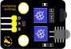 |  |  |
| Rotary Encoder*1                                             | DIY Obstacle Avoidance Sensor*1                              | XHT11 Temperature and Humidity Sensor*1                      | Micro USB Cable*1                                            |
|  |  |  |  |
| DIYIR Receiver*1                                             | DIY Joystick Sensor*1                                        | brick HC-SR04Ultrasonic Sensor*1                             | Common Cathode RGB Module*1                                  |
|  |  |  |  |
| 3P Dupont Wire*6                                             | 4P Dupont Wire*2                                             | 5P Dupont Wire*1                                             | Remote Control*1                                             |


**Connection Diagram**


**Test Code**

```python
'''
 * Keyestudio 37 in 1 Starter Kit for Raspberry Pi Pico
 * lesson 55
 * Comprehensive experiment
 * http://www.keyestudio.com
'''
from machine import Pin, PWM
import array, time
import random
import rp2

potentiometer = machine.ADC(28)
button = Pin(16, Pin.IN)
led = PWM(Pin(14))
led.freq(1000)
ird = Pin(11,Pin.IN)
B = machine.Pin(22, machine.Pin.IN)
X = machine.ADC(26)
Y = machine.ADC(27)
# Set pins of ultrasonic sensor
trigger = Pin(6, Pin.OUT)
echo = Pin(7, Pin.IN)
# Configure the number of sk6812 LEDs, pins and brightness.
NUM_LEDS = 4
PIN_NUM = 15
brightness = 0.2

act = {"1": "LLLLLLLLHHHHHHHHLHHLHLLLHLLHLHHH","2": "LLLLLLLLHHHHHHHHHLLHHLLLLHHLLHHH","3": "LLLLLLLLHHHHHHHHHLHHLLLLLHLLHHHH",
       "4": "LLLLLLLLHHHHHHHHLLHHLLLLHHLLHHHH","5": "LLLLLLLLHHHHHHHHLLLHHLLLHHHLLHHH","6": "LLLLLLLLHHHHHHHHLHHHHLHLHLLLLHLH",
       "7": "LLLLLLLLHHHHHHHHLLLHLLLLHHHLHHHH","8": "LLLLLLLLHHHHHHHHLLHHHLLLHHLLLHHH","9": "LLLLLLLLHHHHHHHHLHLHHLHLHLHLLHLH",
       "0": "LLLLLLLLHHHHHHHHLHLLHLHLHLHHLHLH","Up": "LLLLLLLLHHHHHHHHLHHLLLHLHLLHHHLH","Down": "LLLLLLLLHHHHHHHHHLHLHLLLLHLHLHHH",
       "Left": "LLLLLLLLHHHHHHHHLLHLLLHLHHLHHHLH","Right": "LLLLLLLLHHHHHHHHHHLLLLHLLLHHHHLH","Ok": "LLLLLLLLHHHHHHHHLLLLLLHLHHHHHHLH",
       "*": "LLLLLLLLHHHHHHHHLHLLLLHLHLHHHHLH","#": "LLLLLLLLHHHHHHHHLHLHLLHLHLHLHHLH"}

def read_ircode(ird):
    wait = 1
    complete = 0
    seq0 = []
    seq1 = []

    while wait == 1:
        if ird.value() == 0:
            wait = 0
    while wait == 0 and complete == 0:
        start = time.ticks_us()
        while ird.value() == 0:
            ms1 = time.ticks_us()
        diff = time.ticks_diff(ms1,start)
        seq0.append(diff)
        while ird.value() == 1 and complete == 0:
            ms2 = time.ticks_us()
            diff = time.ticks_diff(ms2,ms1)
            if diff > 10000:
                complete = 1
        seq1.append(diff)

    code = ""
    for val in seq1:
        if val < 2000:
            if val < 700:
                code += "L"
            else:
                code += "H"
    # print(code)
    command = ""
    for k,v in act.items():
        if code == v:
            command = k
    if command == "":
        command = code
    return command

@rp2.asm_pio(sideset_init=rp2.PIO.OUT_LOW, out_shiftdir=rp2.PIO.SHIFT_LEFT, autopull=True, pull_thresh=24)
def sk6812():
    T1 = 2
    T2 = 5
    T3 = 3
    wrap_target()
    label("bitloop")
    out(x, 1)               .side(0)    [T3 - 1]
    jmp(not_x, "do_zero")   .side(1)    [T1 - 1]
    jmp("bitloop")          .side(1)    [T2 - 1]
    label("do_zero")
    nop()                   .side(0)    [T2 - 1]
    wrap()
 
 
# Create the StateMachine with the sk6812 program, outputting on Pin(16).
sm = rp2.StateMachine(0, sk6812, freq=8_000_000, sideset_base=Pin(PIN_NUM))
 
# Start the StateMachine, it will wait for data on its FIFO.
sm.active(1)
 
# Display a pattern on the LEDs via an array of LED RGB values.
ar = array.array("I", [0 for _ in range(NUM_LEDS)])
 
def pixels_show():
    dimmer_ar = array.array("I", [0 for _ in range(NUM_LEDS)])
    for i,c in enumerate(ar):
        r = int(((c >> 8) & 0xFF) * brightness)
        g = int(((c >> 16) & 0xFF) * brightness)
        b = int((c & 0xFF) * brightness)
        dimmer_ar[i] = (g<<16) + (r<<8) + b
    sm.put(dimmer_ar, 8)
    time.sleep_ms(10)
 
def pixels_set(i, color):
    ar[i] = (color[1]<<16) + (color[0]<<8) + color[2]

# ultrasonic ranging，unit: cm
def getDistance(trigger, echo):
    # produce 10us square waves
    trigger.low()   #preserve a short a low level to secure a high level:
    time.sleep_us(2)
    trigger.high()
    time.sleep_us(10)#pull up high levels, wait for 10ms and set low levels
    trigger.low()
    
    while echo.value() == 0: #build a while loop to detect pins are 0 or not, record the current time

        start = time.ticks_us()
    while echo.value() == 1: #build a while loop to detect pins are 1 or not, record the current time
        end = time.ticks_us()
    d = (end - start) * 0.0343 / 2 #travelling time x sound speed(343.2 m/s，0.0343cm for each ms)，double distance is divided by 2
    return d


keys = 0
nums = 0

def toggle_handle(pin):
    global keys
    keys += 1

button.irq(trigger = Pin.IRQ_FALLING, handler = toggle_handle)

def show6812():
    R = random.randint(0,255)
    G = random.randint(0,255)
    B = random.randint(0,255)
    for i in range(NUM_LEDS):
        pixels_set(i, (R, G, B))
        pixels_show()
    time.sleep(0.3)

def IRreceive():
    command = read_ircode(ird)
    print(command)

def showJoystick():
    B_value = B.value()
    X_value = X.read_u16()
    Y_value = Y.read_u16()
    print("button:", end = " ")
    print(B_value, end = " ")
    print("X:", end = " ")
    print(X_value, end = " ")
    print("Y:", end = " ")
    print(Y_value)
    time.sleep(0.1)

def adjustLight():
    pot_value = potentiometer.read_u16()
    print(pot_value)
    led.duty_u16(pot_value)
    time.sleep(0.1)

def showDistance():
    distance = getDistance(trigger, echo)
    print("The distance is ：{:.2f} cm".format(distance))
    time.sleep(0.1)

while True:
    nums = keys % 5
    print(nums)
    if nums == 0:
        show6812()
    elif nums == 1:
        IRreceive()
    elif nums == 2:
        showJoystick()
    elif nums == 3:
        adjustLight()
    elif nums == 4:
        showDistance()
```


**Code Explanation**

Calculate how many times the button is pressed, divide it by 7, and get the remainder which is 0, 1 2, 3, 4, 5 and 6. According to different remainders, construct seven unique functions to control the experiment and realize different functions.


**Test Result**

Connect the wires according to the wiring diagram, use the USB to power on, and run the test code. At the beginning, the number of keys is 0, the remainder is 0, and the four lamp beads on the RGB module flash with random colors.


Press the button, 6812 stops flashing, press once, the remainder is 1. If we point at IR receiver with the infrared remote control and press the button,the serial monitor will display as follows.


Press a key twice, the time of pressing buttons is 2 and the remainder is 2. Read temperature and humidity values. As shown below;

Note: we need to press any a key, because the IR reception function waits for signals


Press a key again, the time of pressing buttons is 3 and the remainder is 3. Read digital values at x, y and z axis of the joystick module. As shown below;


Press the key for the fourth time, the remainder is 4. Then the potentiometer can adjust the PWM value at the GP14 port to control LED brightness of the purple LED


Press the key for the fifth time, the remainder is 5. Then the obstacle avoidance sensor can detect obstacles, as shown below;


Press the key for the sixth time, the remainder is 6. Then the ultrasonic sensor can detect distance away from obstacles, as shown below;


Press the key for seventh time and the remainder is 0. Then the RGB will flash. If you press keys incessantly, remainders will change in loop way. So does functions.


## 6.Resources

[https://fs.keyestudio.com/KS3023](https://fs.keyestudio.com/KS30)

